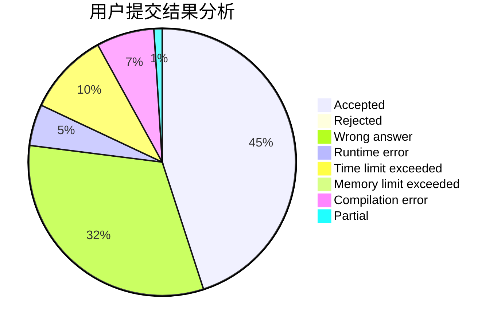
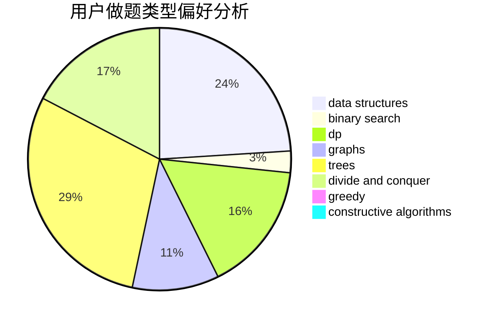
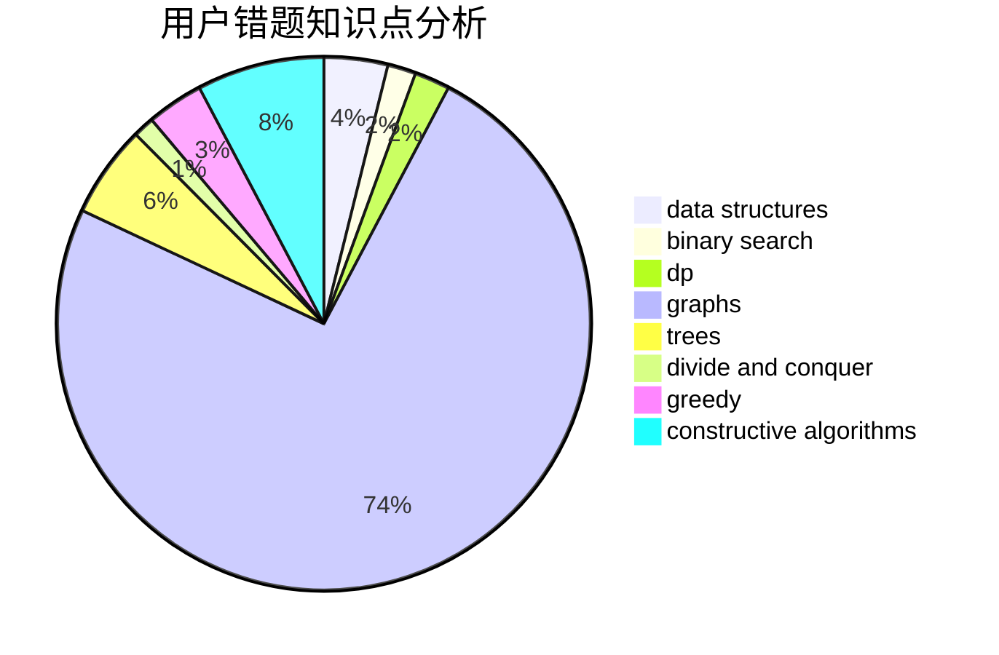

# AThousandMoon

<!-- tabs:start -->

#### **用户提交结果分析**

#### **用户做题类型偏好分析**

#### **用户错题知识点分析**

<!-- tabs:end -->
# 推荐题目
[1063B](https://codeforces.com/contest/1063/problem/B)		graphs,
                        shortest paths		  
[1062D](https://codeforces.com/contest/1062/problem/D)		dfs and similar,
                        graphs,
                        implementation,
                        math		  
[1063F](https://codeforces.com/contest/1063/problem/F)		data structures,
                        dp,
                        string suffix structures		  
[1064B](https://codeforces.com/contest/1064/problem/B)		math		  
[1062F](https://codeforces.com/contest/1062/problem/F)		dfs and similar,
                        graphs		  
[1510H](https://codeforces.com/contest/1510/problem/H)		dp		  
[1245F](https://codeforces.com/contest/1245/problem/F)		bitmasks,
                        brute force,
                        combinatorics,
                        dp		  
[1064D](https://codeforces.com/contest/1064/problem/D)		dsu,graphs,sortings,trees		  
[1064E](https://codeforces.com/contest/1064/problem/E)		dsu,graphs,sortings,trees		  
[1510J](https://codeforces.com/contest/1510/problem/J)		constructive algorithms,
                        math		  
