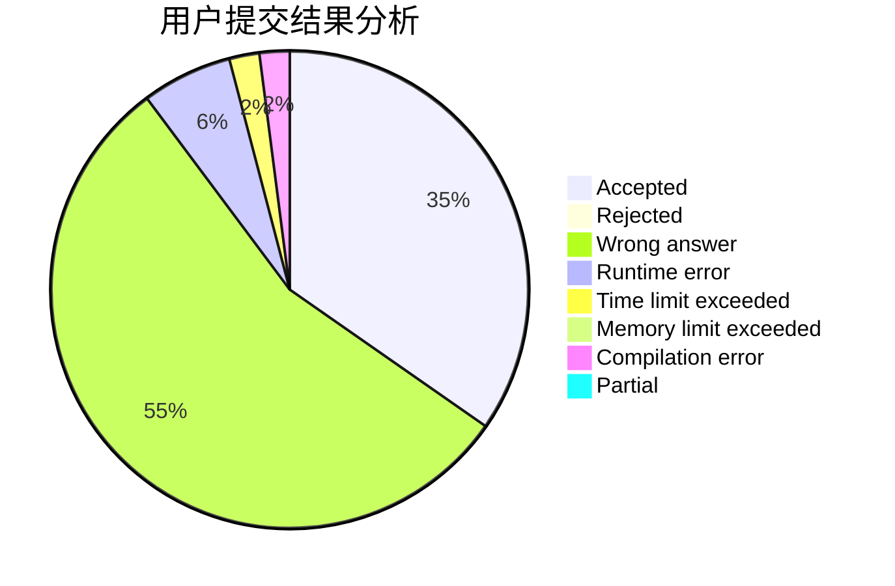
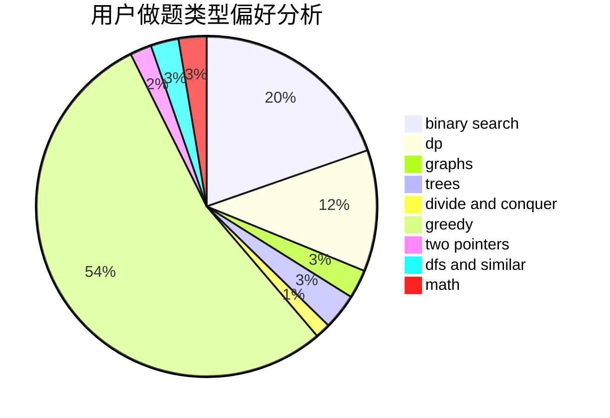

# SandInMyHand

<!-- tabs:start -->

#### **用户提交结果分析**

#### **用户做题类型偏好分析**

<!-- tabs:end -->
# 推荐题目
[526A](https://codeforces.com/contest/526/problem/A)
[1003E](https://codeforces.com/contest/1003/problem/E)
[1215B](https://codeforces.com/contest/1215/problem/B)
[779D](https://codeforces.com/contest/779/problem/D)
[566G](https://codeforces.com/contest/566/problem/G)
[216A](https://codeforces.com/contest/216/problem/A)
[956D](https://codeforces.com/contest/956/problem/D)
[5131](https://codeforces.com/contest/513/problem/1)
[835D](https://codeforces.com/contest/835/problem/D)
[219A](https://codeforces.com/contest/219/problem/A)
