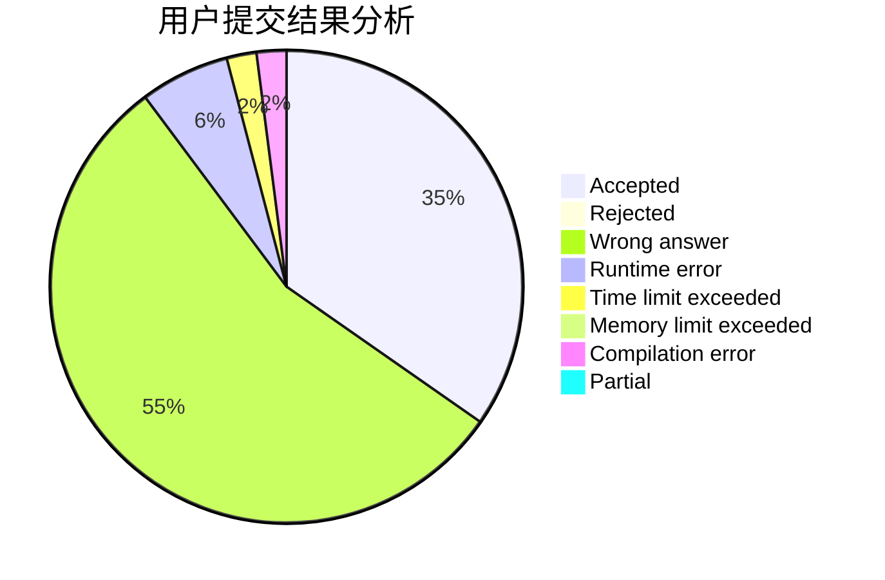
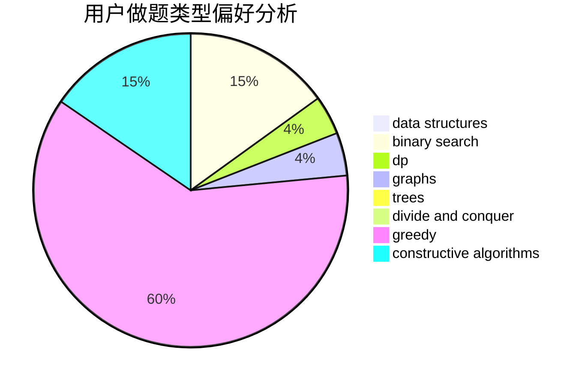
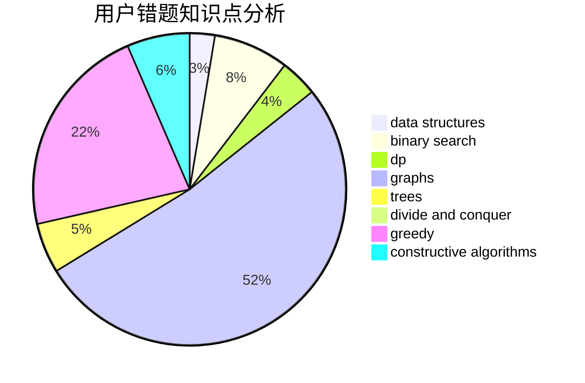

# SandInMyHand

<!-- tabs:start -->

#### **用户提交结果分析**

#### **用户做题类型偏好分析**

#### **用户错题知识点分析**

<!-- tabs:end -->
# 推荐题目
[505D](https://codeforces.com/contest/505/problem/D)		dfs and similar		  
[1003B](https://codeforces.com/contest/1003/problem/B)		constructive algorithms		  
[1209E2](https://codeforces.com/contest/1209E/problem/2)		bitmasks,
                        dp,
                        greedy,
                        sortings		  
[75A](https://codeforces.com/contest/75/problem/A)		implementation		  
[542D](https://codeforces.com/contest/542/problem/D)		dfs and similar,
                        dp,
                        hashing,
                        math,
                        number theory		  
[191C](https://codeforces.com/contest/191/problem/C)		data structures,
                        dfs and similar,
                        trees		  
[934E](https://codeforces.com/contest/934/problem/E)		dsu,graphs,sortings,trees		  
[492D](https://codeforces.com/contest/492/problem/D)		binary search,
                        implementation,
                        math,
                        sortings		  
[816C](https://codeforces.com/contest/816/problem/C)		dsu,graphs,sortings,trees		  
[197A](https://codeforces.com/contest/197/problem/A)		constructive algorithms,
                        games,
                        math		  
