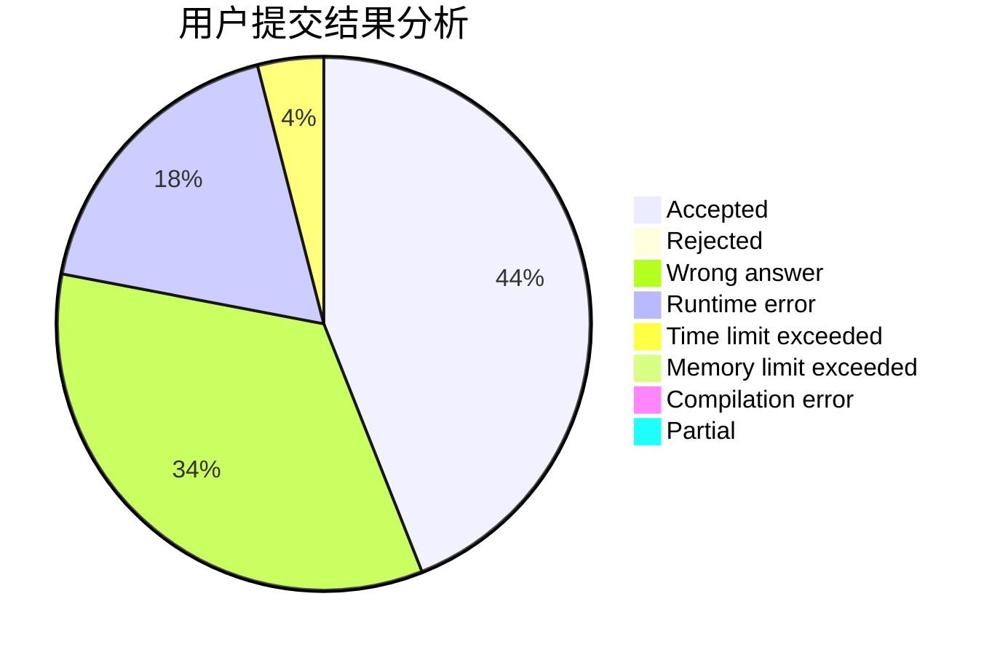
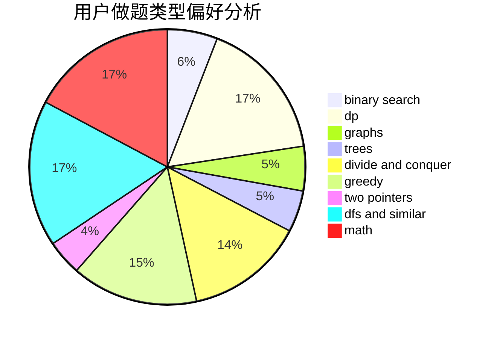

# Sand_Tripper

<!-- tabs:start -->

#### **用户提交结果分析**

#### **用户做题类型偏好分析**

<!-- tabs:end -->
# 推荐题目
[11843](https://codeforces.com/contest/1184/problem/3)
[1417C](https://codeforces.com/contest/1417/problem/C)
[382E](https://codeforces.com/contest/382/problem/E)
[1191C](https://codeforces.com/contest/1191/problem/C)
[920A](https://codeforces.com/contest/920/problem/A)
[850D](https://codeforces.com/contest/850/problem/D)
[815B](https://codeforces.com/contest/815/problem/B)
[1045J](https://codeforces.com/contest/1045/problem/J)
[1362C](https://codeforces.com/contest/1362/problem/C)
[841A](https://codeforces.com/contest/841/problem/A)
