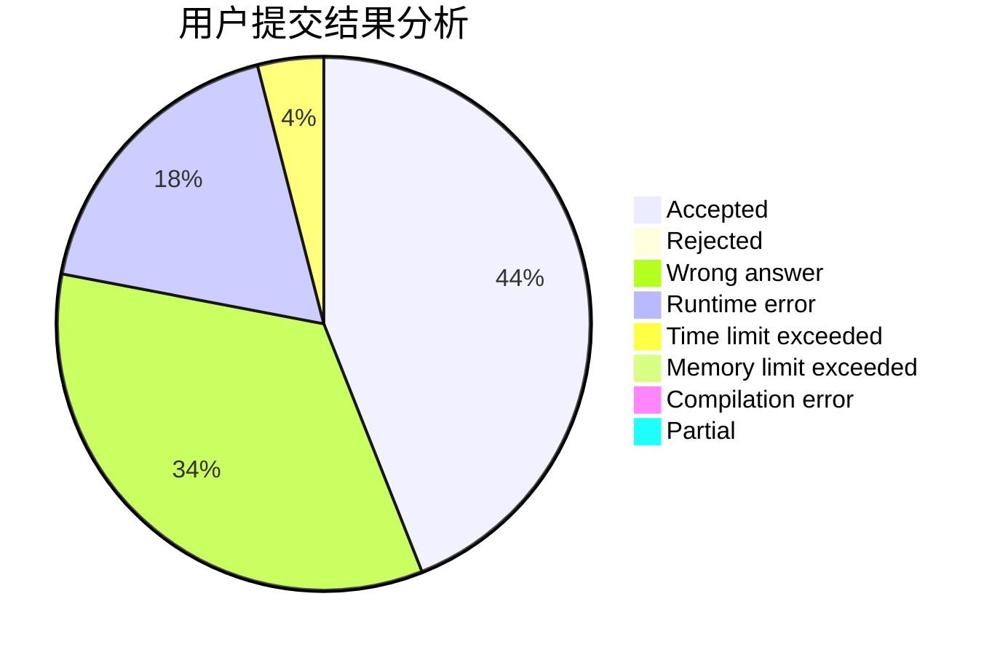
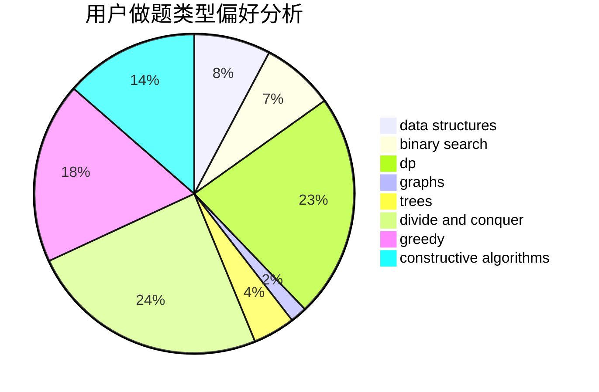
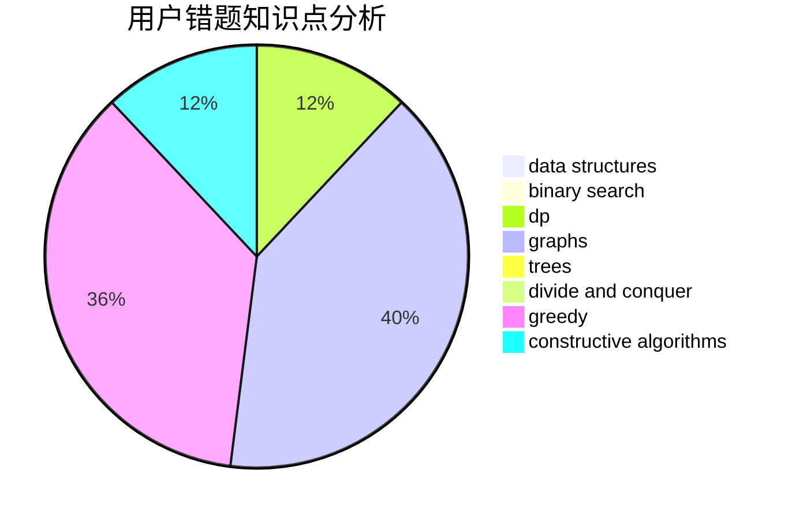

# Sand_Tripper

<!-- tabs:start -->

#### **用户提交结果分析**

#### **用户做题类型偏好分析**

#### **用户错题知识点分析**

<!-- tabs:end -->
# 推荐题目
[11843](https://codeforces.com/contest/1184/problem/3)		dsu,graphs,sortings,trees		  
[1417C](https://codeforces.com/contest/1417/problem/C)		dsu,graphs,sortings,trees		  
[382E](https://codeforces.com/contest/382/problem/E)		combinatorics,
                        dp		  
[1191C](https://codeforces.com/contest/1191/problem/C)		dsu,graphs,sortings,trees		  
[920A](https://codeforces.com/contest/920/problem/A)		implementation		  
[850D](https://codeforces.com/contest/850/problem/D)		constructive algorithms,
                        dp,
                        graphs,
                        greedy,
                        math		  
[815B](https://codeforces.com/contest/815/problem/B)		brute force,
                        combinatorics,
                        constructive algorithms,
                        math		  
[1045J](https://codeforces.com/contest/1045/problem/J)		data structures,
                        strings,
                        trees		  
[1362C](https://codeforces.com/contest/1362/problem/C)		bitmasks,
                        greedy,
                        math		  
[841A](https://codeforces.com/contest/841/problem/A)		brute force,
                        implementation		  
