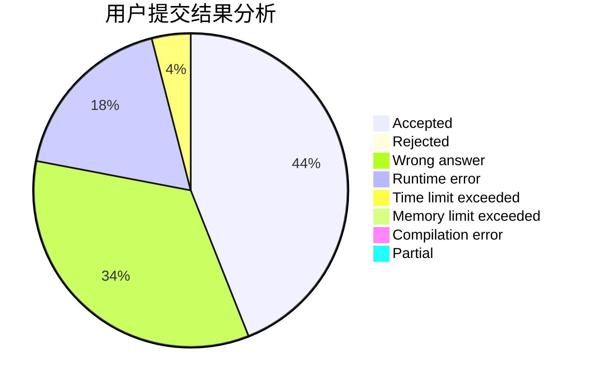
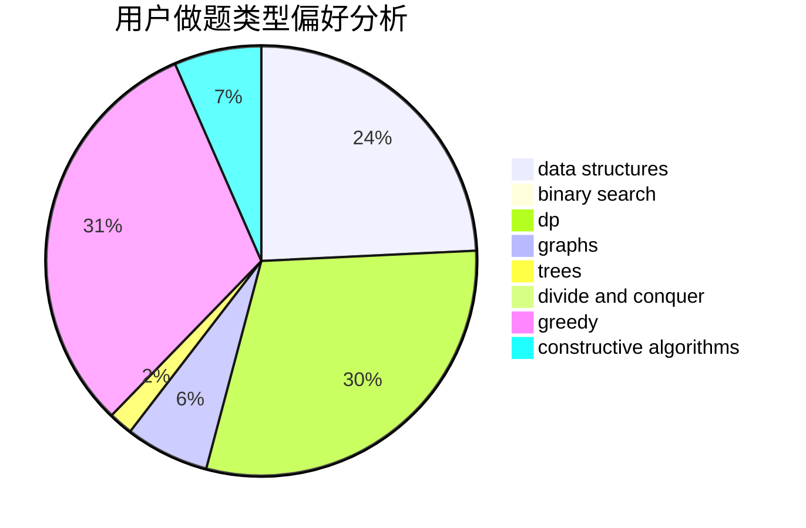
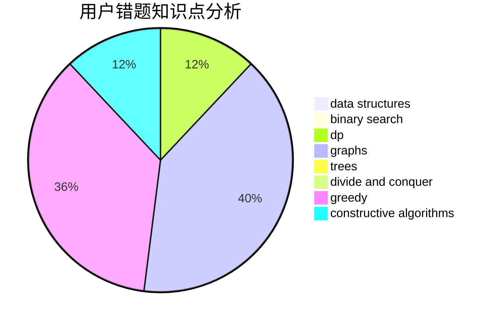

# Sand_Tripper

<!-- tabs:start -->

#### **用户提交结果分析**

#### **用户做题类型偏好分析**

#### **用户错题知识点分析**

<!-- tabs:end -->
# 推荐题目
[1182B](https://codeforces.com/contest/1182/problem/B)		dfs and similar,
                        implementation,
                        strings		  
[1406C](https://codeforces.com/contest/1406/problem/C)		constructive algorithms,
                        dfs and similar,
                        graphs,
                        trees		  
[356D](https://codeforces.com/contest/356/problem/D)		bitmasks,
                        constructive algorithms,
                        dp,
                        greedy		  
[1187F](https://codeforces.com/contest/1187/problem/F)		dp,
                        math,
                        probabilities		  
[906C](https://codeforces.com/contest/906/problem/C)		bitmasks,
                        brute force,
                        dp,
                        graphs		  
[832B](https://codeforces.com/contest/832/problem/B)		implementation,
                        strings		  
[800A](https://codeforces.com/contest/800/problem/A)		dsu,graphs,sortings,trees		  
[1045G](https://codeforces.com/contest/1045/problem/G)		data structures		  
[1355D](https://codeforces.com/contest/1355/problem/D)		constructive algorithms,
                        math		  
[821B](https://codeforces.com/contest/821/problem/B)		brute force,
                        math		  
