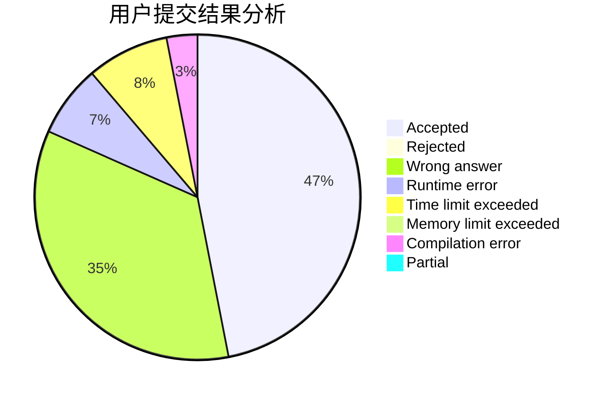
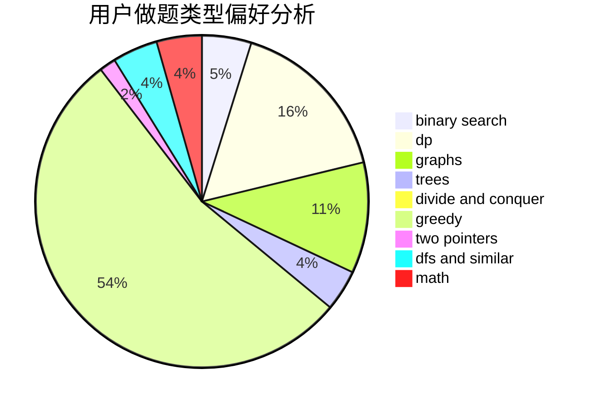

# Scarlet_Climax

<!-- tabs:start -->

#### **用户提交结果分析**

#### **用户做题类型偏好分析**

<!-- tabs:end -->
# 推荐题目
[569A](https://codeforces.com/contest/569/problem/A)
[1088B](https://codeforces.com/contest/1088/problem/B)
[44C](https://codeforces.com/contest/44/problem/C)
[55C](https://codeforces.com/contest/55/problem/C)
[112A](https://codeforces.com/contest/112/problem/A)
[1104E](https://codeforces.com/contest/1104/problem/E)
[263E](https://codeforces.com/contest/263/problem/E)
[604C](https://codeforces.com/contest/604/problem/C)
[41E](https://codeforces.com/contest/41/problem/E)
[948C](https://codeforces.com/contest/948/problem/C)
