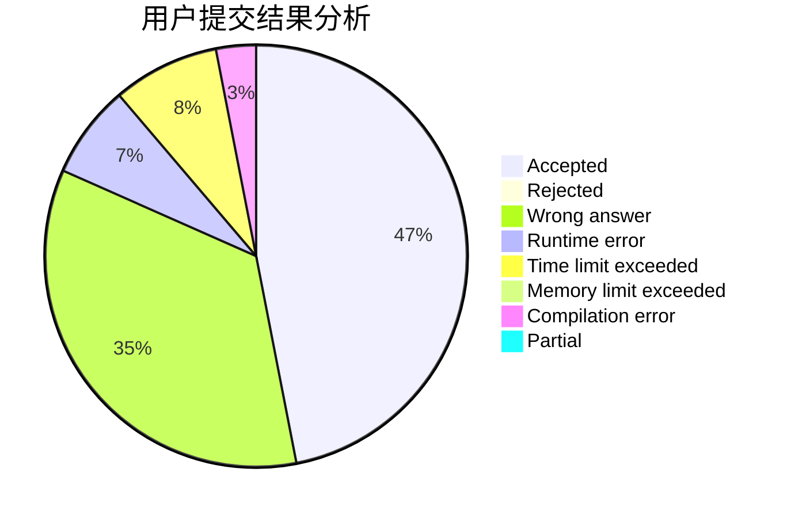
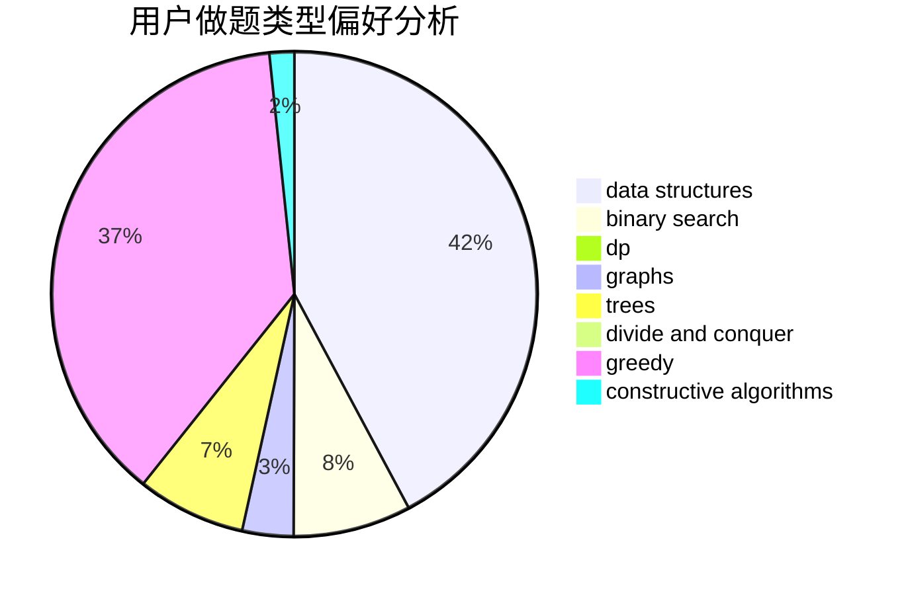

# Scarlet_Climax

<!-- tabs:start -->

#### **用户提交结果分析**

#### **用户做题类型偏好分析**

#### **用户错题知识点分析**

<!-- tabs:end -->
# 推荐题目
[544D](https://codeforces.com/contest/544/problem/D)		dsu,graphs,sortings,trees		  
[1087E](https://codeforces.com/contest/1087/problem/E)		dsu,graphs,sortings,trees		  
[427D](https://codeforces.com/contest/427/problem/D)		dp,
                        string suffix structures,
                        strings		  
[538H](https://codeforces.com/contest/538/problem/H)		2-sat,
                        data structures,
                        dfs and similar,
                        greedy		  
[1120B](https://codeforces.com/contest/1120/problem/B)		constructive algorithms,
                        greedy,
                        implementation,
                        math		  
[1104B](https://codeforces.com/contest/1104/problem/B)		data structures,
                        implementation,
                        math		  
[242E](https://codeforces.com/contest/242/problem/E)		bitmasks,
                        data structures		  
[584C](https://codeforces.com/contest/584/problem/C)		constructive algorithms,
                        greedy,
                        strings		  
[38G](https://codeforces.com/contest/38/problem/G)		data structures		  
[924E](https://codeforces.com/contest/924/problem/E)		nan		  
