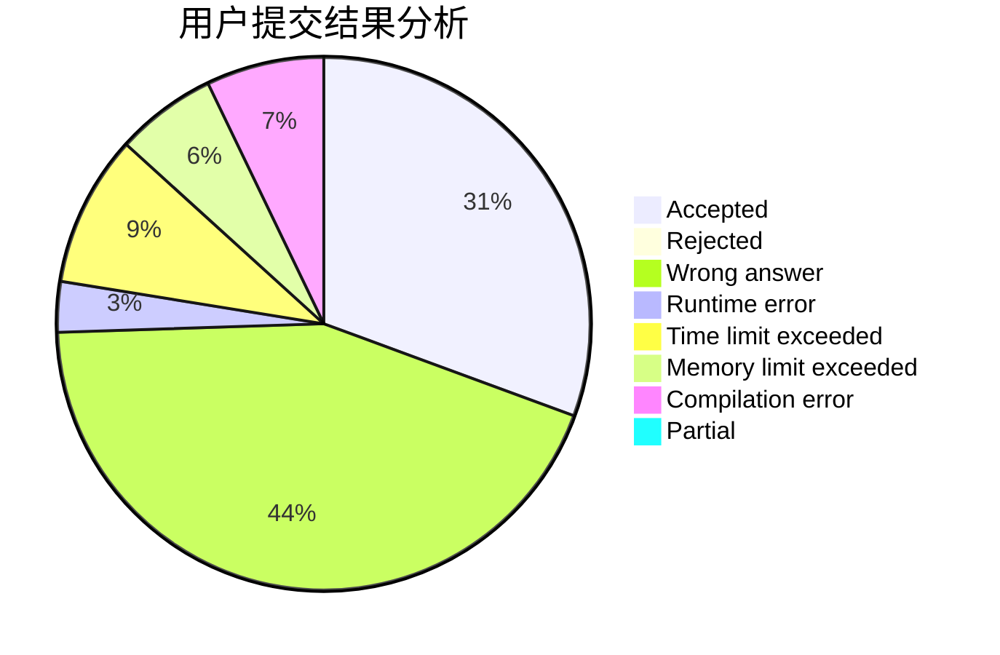
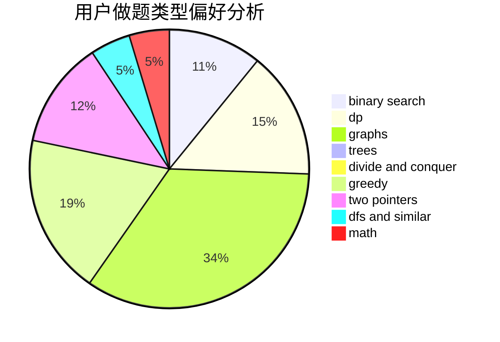

# Schwarzkopf_Henkal

<!-- tabs:start -->

#### **用户提交结果分析**

#### **用户做题类型偏好分析**

<!-- tabs:end -->
# 推荐题目
[11651](https://codeforces.com/contest/1165/problem/1)
[441C](https://codeforces.com/contest/441/problem/C)
[793A](https://codeforces.com/contest/793/problem/A)
[208C](https://codeforces.com/contest/208/problem/C)
[150A](https://codeforces.com/contest/150/problem/A)
[172A](https://codeforces.com/contest/172/problem/A)
[476D](https://codeforces.com/contest/476/problem/D)
[629A](https://codeforces.com/contest/629/problem/A)
[890A](https://codeforces.com/contest/890/problem/A)
[873C](https://codeforces.com/contest/873/problem/C)
