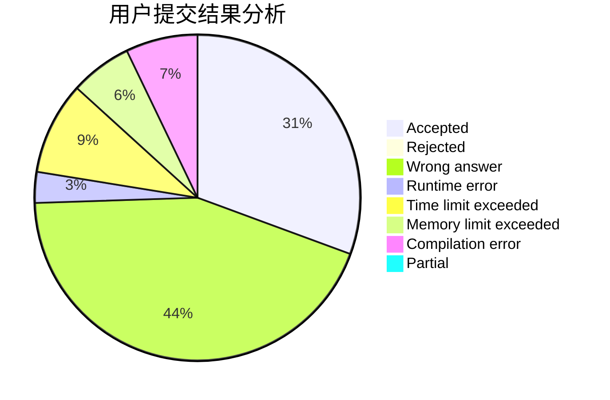
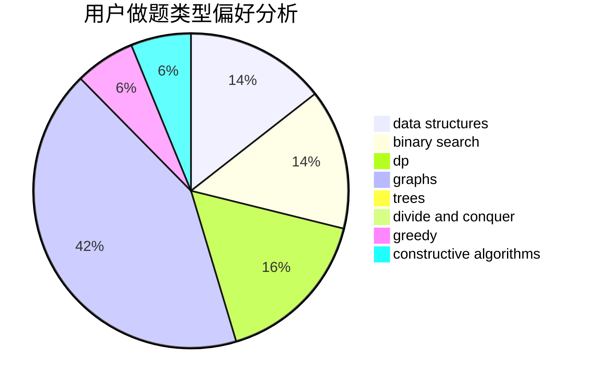
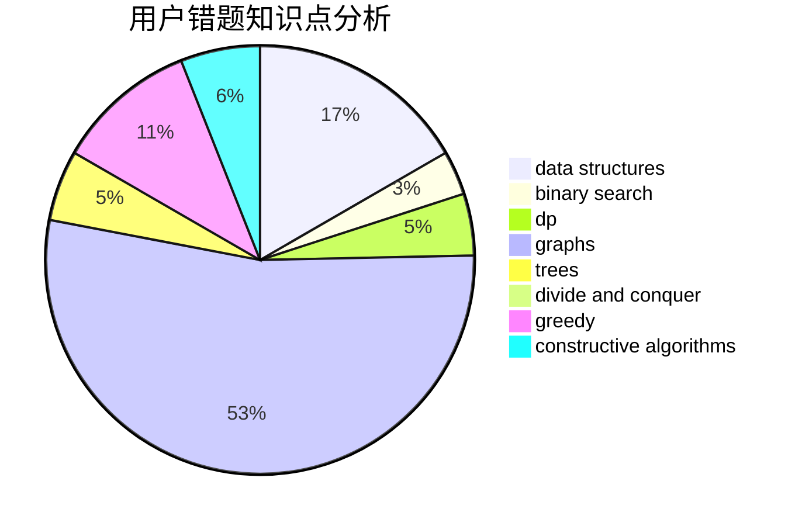

# Schwarzkopf_Henkal

<!-- tabs:start -->

#### **用户提交结果分析**

#### **用户做题类型偏好分析**

#### **用户错题知识点分析**

<!-- tabs:end -->
# 推荐题目
[11651](https://codeforces.com/contest/1165/problem/1)		dsu,graphs,sortings,trees		  
[441C](https://codeforces.com/contest/441/problem/C)		constructive algorithms,
                        dfs and similar,
                        implementation		  
[793A](https://codeforces.com/contest/793/problem/A)		implementation,
                        math		  
[208C](https://codeforces.com/contest/208/problem/C)		dp,
                        graphs,
                        shortest paths		  
[150A](https://codeforces.com/contest/150/problem/A)		games,
                        math,
                        number theory		  
[172A](https://codeforces.com/contest/172/problem/A)		*special problem,
                        brute force,
                        implementation		  
[476D](https://codeforces.com/contest/476/problem/D)		constructive algorithms,
                        greedy,
                        math		  
[629A](https://codeforces.com/contest/629/problem/A)		brute force,
                        combinatorics,
                        constructive algorithms,
                        implementation		  
[890A](https://codeforces.com/contest/890/problem/A)		dsu,graphs,sortings,trees		  
[873C](https://codeforces.com/contest/873/problem/C)		greedy,
                        two pointers		  
