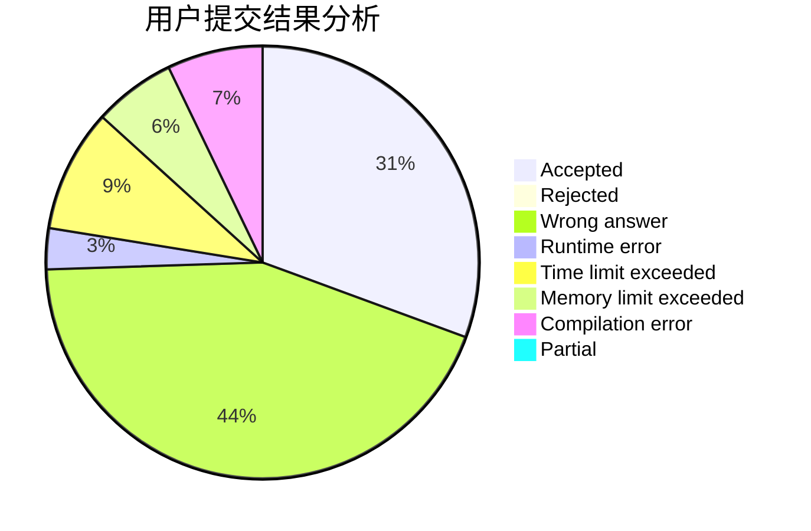
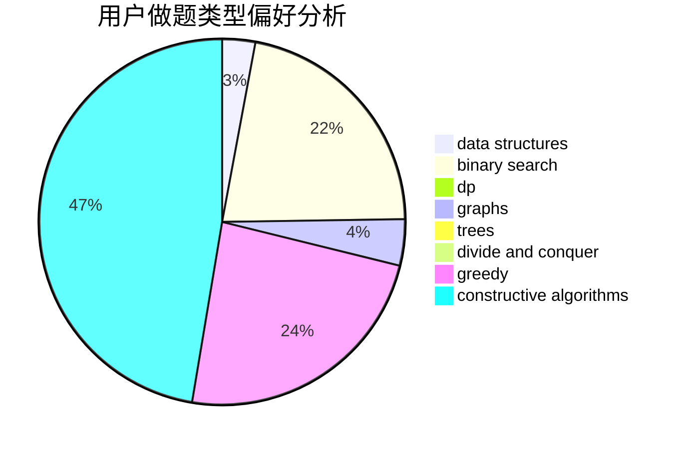
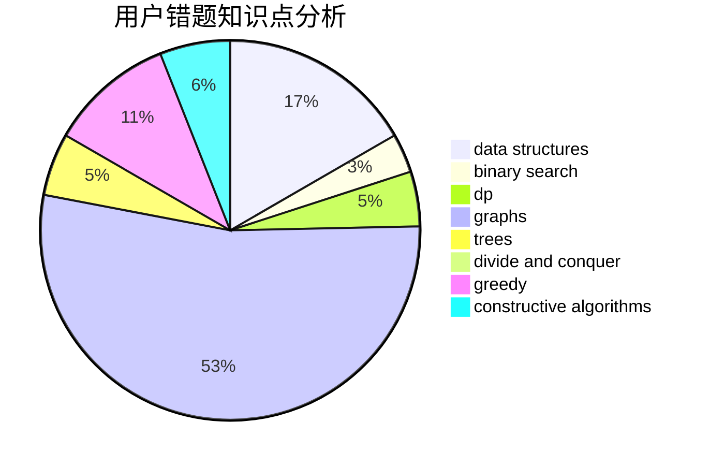

# Schwarzkopf_Henkal

<!-- tabs:start -->

#### **用户提交结果分析**

#### **用户做题类型偏好分析**

#### **用户错题知识点分析**

<!-- tabs:end -->
# 推荐题目
[1163C2](https://codeforces.com/contest/1163C/problem/2)		data structures,
                        geometry,
                        implementation,
                        math		  
[416C](https://codeforces.com/contest/416/problem/C)		binary search,
                        dp,
                        greedy,
                        implementation		  
[773F](https://codeforces.com/contest/773/problem/F)		combinatorics,
                        divide and conquer,
                        dp,
                        fft,
                        math,
                        number theory		  
[181A](https://codeforces.com/contest/181/problem/A)		brute force,
                        geometry,
                        implementation		  
[1499G](https://codeforces.com/contest/1499/problem/G)		data structures,
                        graphs,
                        interactive		  
[1513B](https://codeforces.com/contest/1513/problem/B)		bitmasks,
                        combinatorics,
                        constructive algorithms,
                        math		  
[455C](https://codeforces.com/contest/455/problem/C)		dfs and similar,
                        dp,
                        dsu,
                        ternary search,
                        trees		  
[609F](https://codeforces.com/contest/609/problem/F)		data structures,
                        greedy		  
[86D](https://codeforces.com/contest/86/problem/D)		data structures,
                        implementation,
                        math,
                        two pointers		  
[855B](https://codeforces.com/contest/855/problem/B)		brute force,
                        data structures,
                        dp		  
