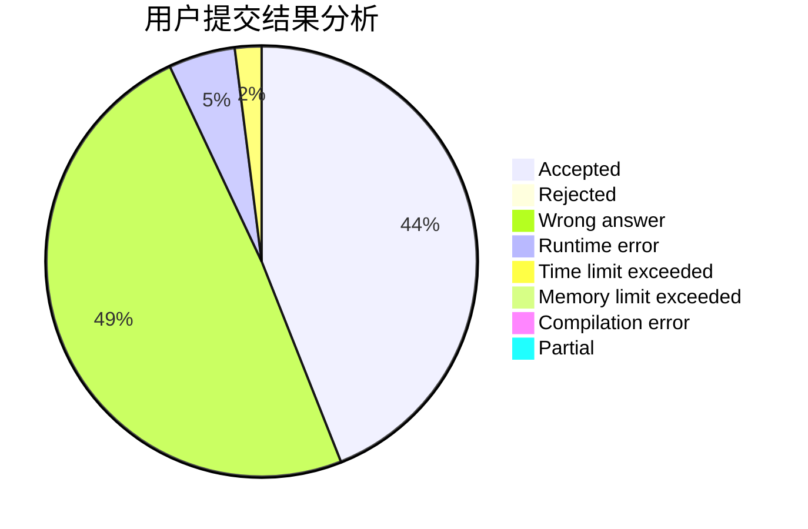
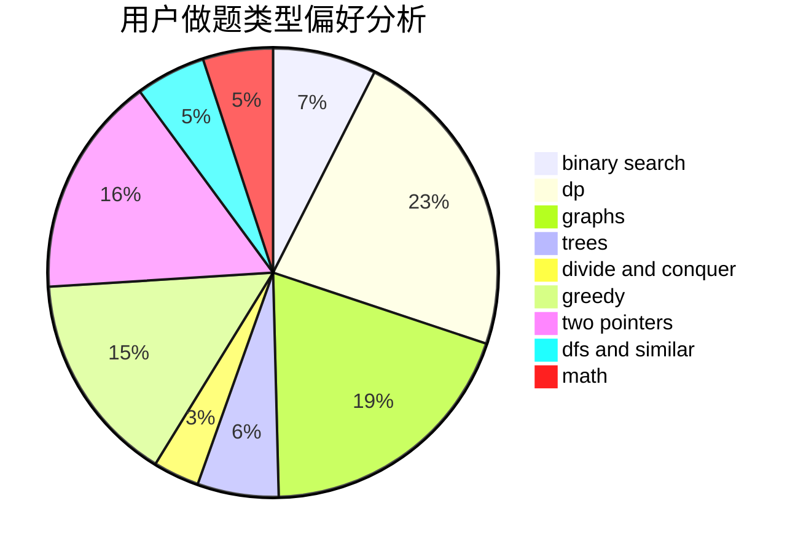

# Sdchr

<!-- tabs:start -->

#### **用户提交结果分析**

#### **用户做题类型偏好分析**

<!-- tabs:end -->
# 推荐题目
[1475G](https://codeforces.com/contest/1475/problem/G)
[1252K](https://codeforces.com/contest/1252/problem/K)
[1351A](https://codeforces.com/contest/1351/problem/A)
[519D](https://codeforces.com/contest/519/problem/D)
[899D](https://codeforces.com/contest/899/problem/D)
[1141D](https://codeforces.com/contest/1141/problem/D)
[689D](https://codeforces.com/contest/689/problem/D)
[599B](https://codeforces.com/contest/599/problem/B)
[689B](https://codeforces.com/contest/689/problem/B)
[357B](https://codeforces.com/contest/357/problem/B)
