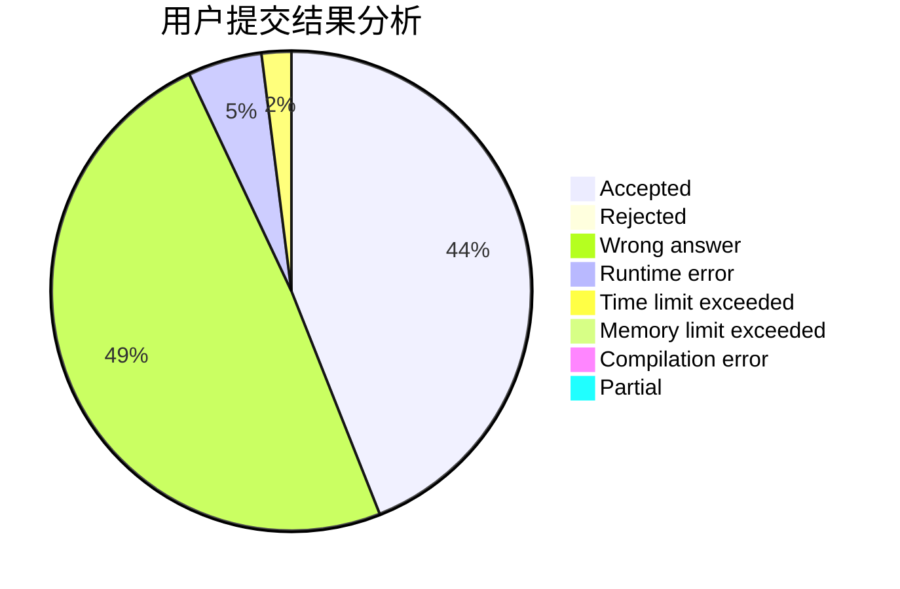
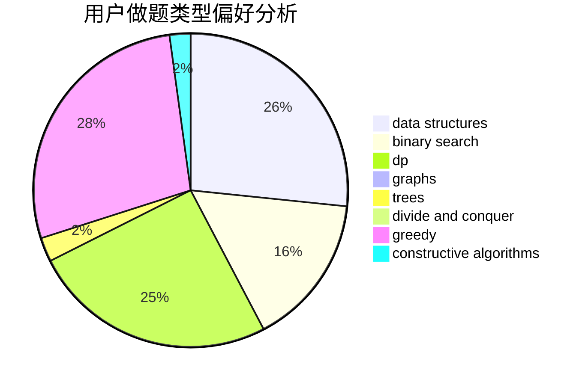

# Sdchr

<!-- tabs:start -->

#### **用户提交结果分析**

#### **用户做题类型偏好分析**

#### **用户错题知识点分析**

<!-- tabs:end -->
# 推荐题目
[1468F](https://codeforces.com/contest/1468/problem/F)		geometry,
                        hashing,
                        number theory		  
[1249B2](https://codeforces.com/contest/1249B/problem/2)		dfs and similar,
                        dsu,
                        math		  
[1344B](https://codeforces.com/contest/1344/problem/B)		constructive algorithms,
                        dfs and similar,
                        dsu,
                        graphs		  
[498D](https://codeforces.com/contest/498/problem/D)		data structures,
                        dp,
                        number theory		  
[878E](https://codeforces.com/contest/878/problem/E)		combinatorics,
                        dp		  
[113D](https://codeforces.com/contest/113/problem/D)		math,
                        matrices,
                        probabilities		  
[667C](https://codeforces.com/contest/667/problem/C)		dsu,graphs,sortings,trees		  
[577E](https://codeforces.com/contest/577/problem/E)		dsu,graphs,sortings,trees		  
[667B](https://codeforces.com/contest/667/problem/B)		constructive algorithms,
                        geometry		  
[329E](https://codeforces.com/contest/329/problem/E)		math		  
