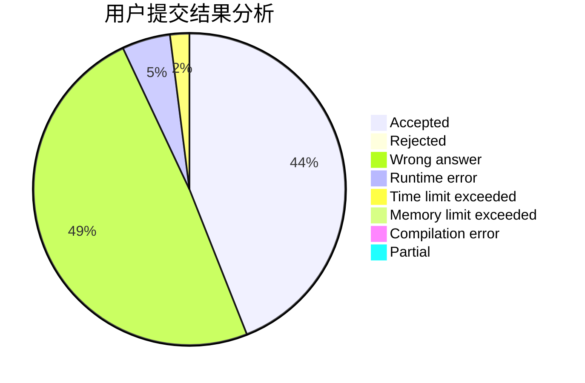
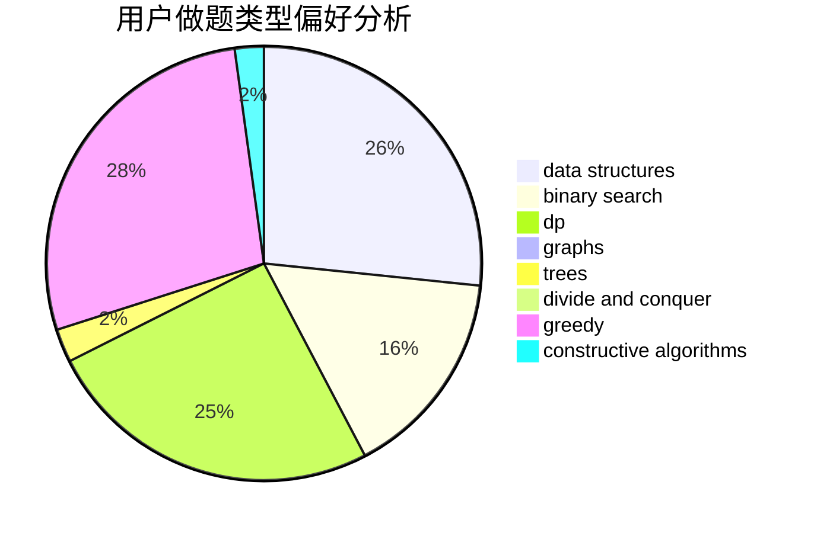

# Sdchr
<!-- tabs:start -->
#### **用户提交结果分析**

#### **用户做题类型偏好分析**

#### **用户错题知识点分析**

<!-- tabs:end -->
# 推荐题目
[Full Turn](http://codeforces.com/problemset/problem/1468/F)		geometry,
                        hashing,
                        number theory		  
[Numbers on the blackboard](http://codeforces.com/problemset/problem/878/E)		combinatorics,
                        dp		  
[The Thorny Path](http://codeforces.com/problemset/problem/1411/F)		greedy,
                        math		  
[Optimal Subsequences (Easy Version)](http://codeforces.com/problemset/problem/1227/D1)		data structures,
                        greedy		  
[Alyona and towers](http://codeforces.com/problemset/problem/739/C)		data structures		  
[Museum](http://codeforces.com/problemset/problem/113/D)		math,
                        matrices,
                        probabilities		  
[Roads not only in Berland](http://codeforces.com/problemset/problem/25/D)		dsu,
                        graphs,
                        trees		  
[Subsequences Return](http://codeforces.com/problemset/problem/497/E)		dp,
                        matrices		  
[Sandy and Nuts](http://codeforces.com/problemset/problem/599/E)		bitmasks,
                        dp,
                        trees		  
[Hiring Staff](http://codeforces.com/problemset/problem/216/C)		greedy		  
<!-- tabs:start -->
#### **data structures**
[Full Turn](http://codeforces.com/problemset/problem/1227/D1)		data structures,
                        greedy		  
[Numbers on the blackboard](http://codeforces.com/problemset/problem/739/C)		data structures		  
[The Thorny Path](http://codeforces.com/problemset/problem/498/D)		data structures,
                        dp,
                        number theory		  
[Optimal Subsequences (Easy Version)](http://codeforces.com/problemset/problem/1420/D)		combinatorics,
                        data structures,
                        sortings		  
[Alyona and towers](http://codeforces.com/problemset/problem/915/F)		data structures,
                        dsu,
                        graphs,
                        trees		  
[Museum](https://codeforces.com/contest/1314/problem/E)		binary search,
                        data structures,
                        dp,
                        greedy		  
[Roads not only in Berland](http://codeforces.com/problemset/problem/1278/D)		data structures,
                        dsu,
                        graphs,
                        trees		  
[Subsequences Return](http://codeforces.com/problemset/problem/342/E)		data structures,
                        divide and conquer,
                        trees		  
[Sandy and Nuts](http://codeforces.com/problemset/problem/1492/C)		binary search,
                        data structures,
                        dp,
                        greedy,
                        two pointers		  
[Hiring Staff](http://codeforces.com/problemset/problem/1490/G)		binary search,
                        data structures,
                        math		  
#### **binary search**
[Full Turn](http://codeforces.com/problemset/problem/1348/D)		binary search,
                        constructive algorithms,
                        greedy,
                        implementation,
                        math		  
[Numbers on the blackboard](https://codeforces.com/contest/1314/problem/E)		binary search,
                        data structures,
                        dp,
                        greedy		  
[The Thorny Path](http://codeforces.com/problemset/problem/1492/C)		binary search,
                        data structures,
                        dp,
                        greedy,
                        two pointers		  
[Optimal Subsequences (Easy Version)](http://codeforces.com/problemset/problem/1463/D)		binary search,
                        constructive algorithms,
                        greedy,
                        two pointers		  
[Alyona and towers](http://codeforces.com/problemset/problem/1490/G)		binary search,
                        data structures,
                        math		  
[Museum](http://codeforces.com/problemset/problem/1479/D)		binary search,
                        bitmasks,
                        brute force,
                        data structures,
                        probabilities,
                        trees		  
[Roads not only in Berland](http://codeforces.com/problemset/problem/1436/E)		binary search,
                        data structures,
                        two pointers		  
[Subsequences Return](http://codeforces.com/problemset/problem/1461/D)		binary search,
                        brute force,
                        data structures,
                        divide and conquer,
                        implementation,
                        sortings		  
[Sandy and Nuts](http://codeforces.com/problemset/problem/1493/C)		binary search,
                        brute force,
                        constructive algorithms,
                        greedy,
                        strings		  
[Hiring Staff](http://codeforces.com/problemset/problem/1487/D)		binary search,
                        brute force,
                        math,
                        number theory		  
#### **dp**
[Full Turn](http://codeforces.com/problemset/problem/878/E)		combinatorics,
                        dp		  
[Numbers on the blackboard](http://codeforces.com/problemset/problem/497/E)		dp,
                        matrices		  
[The Thorny Path](http://codeforces.com/problemset/problem/599/E)		bitmasks,
                        dp,
                        trees		  
[Optimal Subsequences (Easy Version)](http://codeforces.com/problemset/problem/232/B)		bitmasks,
                        combinatorics,
                        dp,
                        math		  
[Alyona and towers](http://codeforces.com/problemset/problem/498/D)		data structures,
                        dp,
                        number theory		  
[Museum](https://codeforces.com/contest/1078/problem/B)		dp,
                        math		  
[Roads not only in Berland](https://codeforces.com/contest/667/problem/C)		dp,
                        implementation,
                        strings		  
[Subsequences Return](http://codeforces.com/problemset/problem/1183/H)		dp,
                        strings		  
[Sandy and Nuts](https://codeforces.com/contest/1314/problem/E)		binary search,
                        data structures,
                        dp,
                        greedy		  
[Hiring Staff](http://codeforces.com/problemset/problem/1466/B)		dp,
                        greedy		  
#### **graph**
[Full Turn](http://codeforces.com/problemset/problem/25/D)		dsu,
                        graphs,
                        trees		  
[Numbers on the blackboard](https://codeforces.com/contest/197/problem/D)		dfs and similar,
                        graphs		  
[The Thorny Path](http://codeforces.com/problemset/problem/97/E)		dfs and similar,
                        dsu,
                        graphs,
                        trees		  
[Optimal Subsequences (Easy Version)](http://codeforces.com/problemset/problem/1344/B)		constructive algorithms,
                        dfs and similar,
                        dsu,
                        graphs		  
[Alyona and towers](http://codeforces.com/problemset/problem/915/F)		data structures,
                        dsu,
                        graphs,
                        trees		  
[Museum](http://codeforces.com/problemset/problem/1278/D)		data structures,
                        dsu,
                        graphs,
                        trees		  
[Roads not only in Berland](http://codeforces.com/problemset/problem/1487/C)		brute force,
                        constructive algorithms,
                        dfs and similar,
                        graphs,
                        greedy,
                        implementation,
                        math		  
[Subsequences Return](http://codeforces.com/problemset/problem/1437/C)		dp,
                        flows,
                        graph matchings,
                        greedy,
                        math,
                        sortings		  
[Sandy and Nuts](http://codeforces.com/problemset/problem/1470/D)		constructive algorithms,
                        dfs and similar,
                        graph matchings,
                        graphs,
                        greedy		  
[Hiring Staff](http://codeforces.com/problemset/problem/1476/C)		dp,
                        graphs,
                        greedy		  
#### **trees**
[Full Turn](http://codeforces.com/problemset/problem/25/D)		dsu,
                        graphs,
                        trees		  
[Numbers on the blackboard](http://codeforces.com/problemset/problem/599/E)		bitmasks,
                        dp,
                        trees		  
[The Thorny Path](http://codeforces.com/problemset/problem/97/E)		dfs and similar,
                        dsu,
                        graphs,
                        trees		  
[Optimal Subsequences (Easy Version)](http://codeforces.com/problemset/problem/915/F)		data structures,
                        dsu,
                        graphs,
                        trees		  
[Alyona and towers](http://codeforces.com/problemset/problem/1278/D)		data structures,
                        dsu,
                        graphs,
                        trees		  
[Museum](http://codeforces.com/problemset/problem/342/E)		data structures,
                        divide and conquer,
                        trees		  
[Roads not only in Berland](http://codeforces.com/problemset/problem/1479/D)		binary search,
                        bitmasks,
                        brute force,
                        data structures,
                        probabilities,
                        trees		  
[Subsequences Return](http://codeforces.com/problemset/problem/1511/C)		brute force,
                        data structures,
                        implementation,
                        trees		  
[Sandy and Nuts](http://codeforces.com/problemset/problem/1499/F)		combinatorics,
                        dfs and similar,
                        dp,
                        trees		  
[Hiring Staff](http://codeforces.com/problemset/problem/1491/E)		brute force,
                        dfs and similar,
                        divide and conquer,
                        number theory,
                        trees		  
#### **divide and conquer**
[Full Turn](https://codeforces.com/contest/577/problem/E)		constructive algorithms,
                        divide and conquer,
                        geometry,
                        greedy,
                        sortings		  
[Numbers on the blackboard](http://codeforces.com/problemset/problem/342/E)		data structures,
                        divide and conquer,
                        trees		  
[The Thorny Path](http://codeforces.com/problemset/problem/1461/D)		binary search,
                        brute force,
                        data structures,
                        divide and conquer,
                        implementation,
                        sortings		  
[Optimal Subsequences (Easy Version)](http://codeforces.com/problemset/problem/1466/G)		combinatorics,
                        divide and conquer,
                        hashing,
                        math,
                        string suffix structures,
                        strings		  
[Alyona and towers](http://codeforces.com/problemset/problem/1490/D)		dfs and similar,
                        divide and conquer,
                        implementation		  
[Museum](https://codeforces.com/contest/1483/problem/C)		data structures,
                        divide and conquer,
                        dp		  
[Roads not only in Berland](http://codeforces.com/problemset/problem/1491/E)		brute force,
                        dfs and similar,
                        divide and conquer,
                        number theory,
                        trees		  
[Subsequences Return](http://codeforces.com/problemset/problem/1303/G)		data structures,
                        divide and conquer,
                        geometry,
                        trees		  
[Sandy and Nuts](http://codeforces.com/problemset/problem/1494/D)		constructive algorithms,
                        data structures,
                        dfs and similar,
                        divide and conquer,
                        dsu,
                        greedy,
                        sortings,
                        trees		  
[Hiring Staff](http://codeforces.com/problemset/problem/1482/E)		data structures,
                        divide and conquer,
                        dp		  
#### **greedy**
[Full Turn](http://codeforces.com/problemset/problem/1411/F)		greedy,
                        math		  
[Numbers on the blackboard](http://codeforces.com/problemset/problem/1227/D1)		data structures,
                        greedy		  
[The Thorny Path](http://codeforces.com/problemset/problem/216/C)		greedy		  
[Optimal Subsequences (Easy Version)](https://codeforces.com/contest/577/problem/E)		constructive algorithms,
                        divide and conquer,
                        geometry,
                        greedy,
                        sortings		  
[Alyona and towers](http://codeforces.com/problemset/problem/1348/D)		binary search,
                        constructive algorithms,
                        greedy,
                        implementation,
                        math		  
[Museum](https://codeforces.com/contest/1314/problem/E)		binary search,
                        data structures,
                        dp,
                        greedy		  
[Roads not only in Berland](http://codeforces.com/problemset/problem/1466/B)		dp,
                        greedy		  
[Subsequences Return](http://codeforces.com/problemset/problem/1492/C)		binary search,
                        data structures,
                        dp,
                        greedy,
                        two pointers		  
[Sandy and Nuts](https://codeforces.com/contest/1496/problem/C)		geometry,
                        greedy,
                        math,
                        sortings		  
[Hiring Staff](http://codeforces.com/problemset/problem/1493/A)		constructive algorithms,
                        greedy		  
#### **constructive algorithms**
[Full Turn](https://codeforces.com/contest/577/problem/E)		constructive algorithms,
                        divide and conquer,
                        geometry,
                        greedy,
                        sortings		  
[Numbers on the blackboard](http://codeforces.com/problemset/problem/667/B)		constructive algorithms,
                        geometry		  
[The Thorny Path](http://codeforces.com/problemset/problem/1344/B)		constructive algorithms,
                        dfs and similar,
                        dsu,
                        graphs		  
[Optimal Subsequences (Easy Version)](http://codeforces.com/problemset/problem/1348/D)		binary search,
                        constructive algorithms,
                        greedy,
                        implementation,
                        math		  
[Alyona and towers](http://codeforces.com/problemset/problem/1493/A)		constructive algorithms,
                        greedy		  
[Museum](http://codeforces.com/problemset/problem/1463/D)		binary search,
                        constructive algorithms,
                        greedy,
                        two pointers		  
[Roads not only in Berland](https://codeforces.com/contest/1456/problem/B)		bitmasks,
                        brute force,
                        constructive algorithms		  
[Subsequences Return](http://codeforces.com/problemset/problem/1492/D)		bitmasks,
                        constructive algorithms,
                        greedy,
                        math		  
[Sandy and Nuts](https://codeforces.com/contest/1504/problem/D)		constructive algorithms,
                        games,
                        interactive		  
[Hiring Staff](https://codeforces.com/contest/1483/problem/A)		brute force,
                        constructive algorithms,
                        greedy,
                        implementation		  
#### **sortings**
[Full Turn](https://codeforces.com/contest/577/problem/E)		constructive algorithms,
                        divide and conquer,
                        geometry,
                        greedy,
                        sortings		  
[Numbers on the blackboard](http://codeforces.com/problemset/problem/1420/D)		combinatorics,
                        data structures,
                        sortings		  
[The Thorny Path](http://codeforces.com/problemset/problem/1213/D2)		brute force,
                        math,
                        sortings		  
[Optimal Subsequences (Easy Version)](https://codeforces.com/contest/1496/problem/C)		geometry,
                        greedy,
                        math,
                        sortings		  
[Alyona and towers](http://codeforces.com/problemset/problem/1495/A)		geometry,
                        greedy,
                        math,
                        sortings		  
[Museum](http://codeforces.com/problemset/problem/1497/A)		brute force,
                        data structures,
                        greedy,
                        sortings		  
[Roads not only in Berland](http://codeforces.com/problemset/problem/1427/A)		math,
                        sortings		  
[Subsequences Return](http://codeforces.com/problemset/problem/1461/D)		binary search,
                        brute force,
                        data structures,
                        divide and conquer,
                        implementation,
                        sortings		  
[Sandy and Nuts](http://codeforces.com/problemset/problem/1437/C)		dp,
                        flows,
                        graph matchings,
                        greedy,
                        math,
                        sortings		  
[Hiring Staff](http://codeforces.com/problemset/problem/1473/A)		greedy,
                        implementation,
                        math,
                        sortings		  
<!-- tabs:end -->
