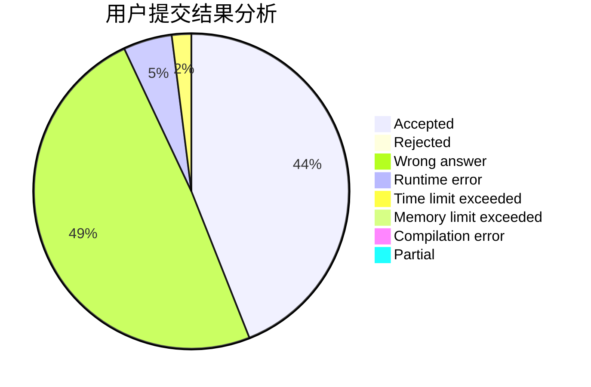
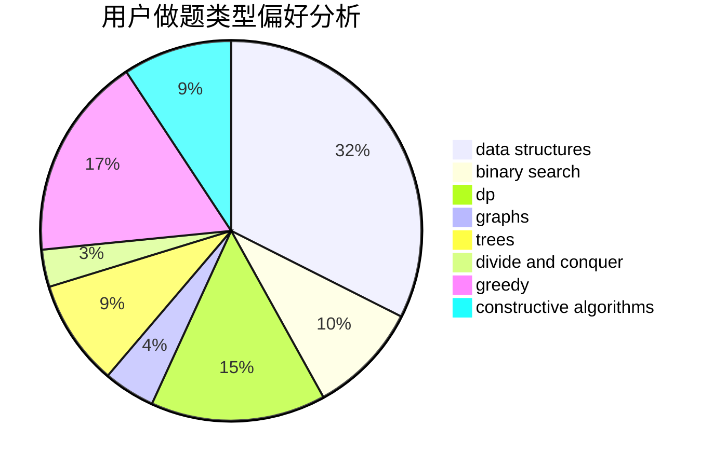

# Sdchr

<!-- tabs:start -->

#### **用户提交结果分析**

#### **用户做题类型偏好分析**

#### **用户错题知识点分析**

<!-- tabs:end -->
# 推荐题目
[1475G](https://codeforces.com/contest/1475/problem/G)		dp,
                        math,
                        number theory,
                        sortings		  
[1252K](https://codeforces.com/contest/1252/problem/K)		data structures,
                        math,
                        matrices		  
[1351A](https://codeforces.com/contest/1351/problem/A)		implementation		  
[519D](https://codeforces.com/contest/519/problem/D)		data structures,
                        dp,
                        two pointers		  
[899D](https://codeforces.com/contest/899/problem/D)		constructive algorithms,
                        math		  
[1141D](https://codeforces.com/contest/1141/problem/D)		greedy,
                        implementation		  
[689D](https://codeforces.com/contest/689/problem/D)		binary search,
                        data structures		  
[599B](https://codeforces.com/contest/599/problem/B)		implementation		  
[689B](https://codeforces.com/contest/689/problem/B)		dfs and similar,
                        graphs,
                        greedy,
                        shortest paths		  
[357B](https://codeforces.com/contest/357/problem/B)		constructive algorithms,
                        implementation		  
