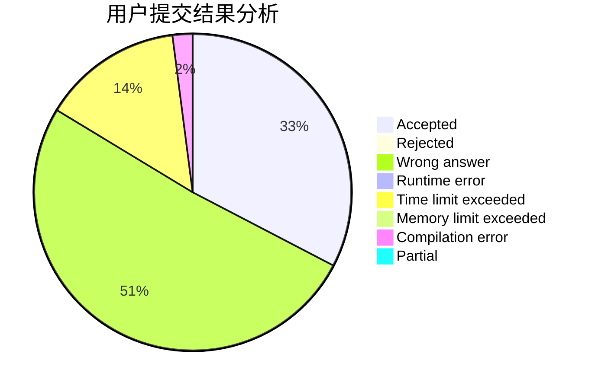
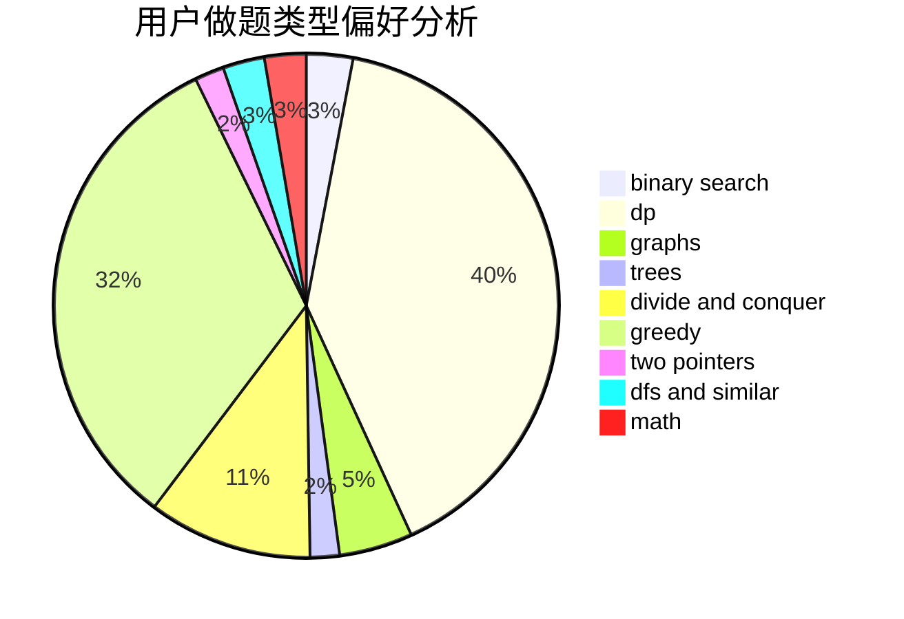

# Second_Draper

<!-- tabs:start -->

#### **用户提交结果分析**

#### **用户做题类型偏好分析**

<!-- tabs:end -->
# 推荐题目
[1255A](https://codeforces.com/contest/1255/problem/A)
[1423C](https://codeforces.com/contest/1423/problem/C)
[327A](https://codeforces.com/contest/327/problem/A)
[710D](https://codeforces.com/contest/710/problem/D)
[346E](https://codeforces.com/contest/346/problem/E)
[295B](https://codeforces.com/contest/295/problem/B)
[454A](https://codeforces.com/contest/454/problem/A)
[1015B](https://codeforces.com/contest/1015/problem/B)
[689B](https://codeforces.com/contest/689/problem/B)
[669C](https://codeforces.com/contest/669/problem/C)
