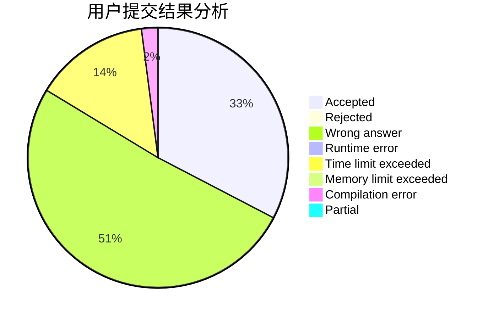
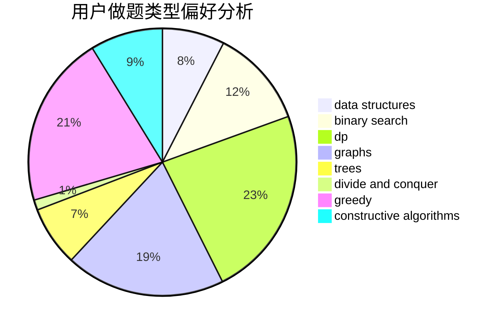
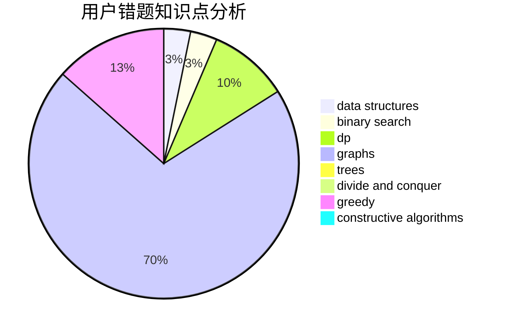

# Second_Draper

<!-- tabs:start -->

#### **用户提交结果分析**

#### **用户做题类型偏好分析**

#### **用户错题知识点分析**

<!-- tabs:end -->
# 推荐题目
[1250I](https://codeforces.com/contest/1250/problem/I)		binary search,
                        brute force,
                        greedy,
                        shortest paths		  
[1413F](https://codeforces.com/contest/1413/problem/F)		data structures,
                        trees		  
[305D](https://codeforces.com/contest/305/problem/D)		combinatorics,
                        math		  
[690D1](https://codeforces.com/contest/690D/problem/1)		nan		  
[317C](https://codeforces.com/contest/317/problem/C)		constructive algorithms,
                        dfs and similar,
                        graphs,
                        trees		  
[27C](https://codeforces.com/contest/27/problem/C)		constructive algorithms,
                        greedy		  
[434A](https://codeforces.com/contest/434/problem/A)		dsu,graphs,sortings,trees		  
[1015A](https://codeforces.com/contest/1015/problem/A)		implementation		  
[667B](https://codeforces.com/contest/667/problem/B)		constructive algorithms,
                        geometry		  
[639E](https://codeforces.com/contest/639/problem/E)		binary search,
                        greedy,
                        math,
                        sortings		  
