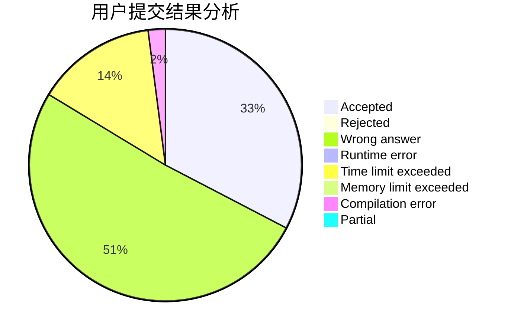
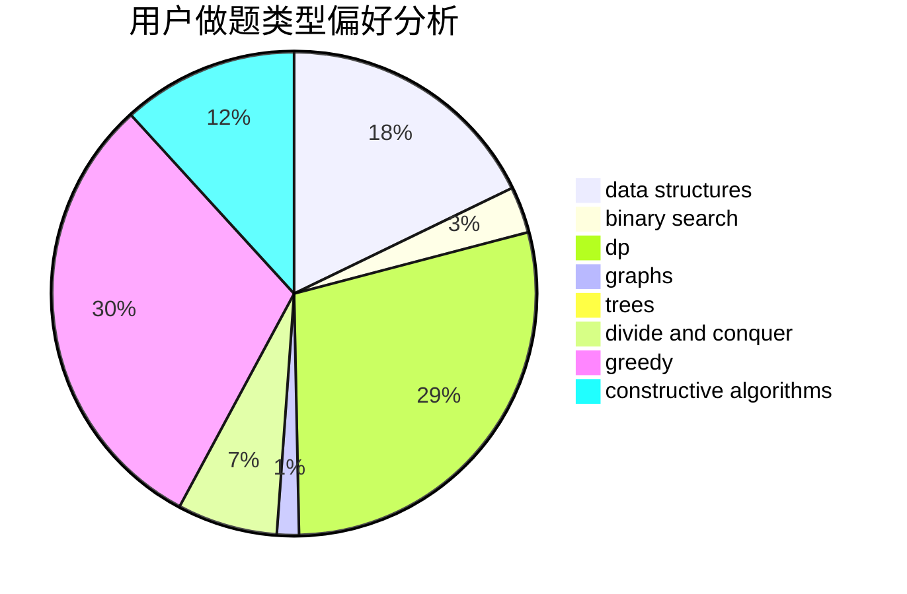
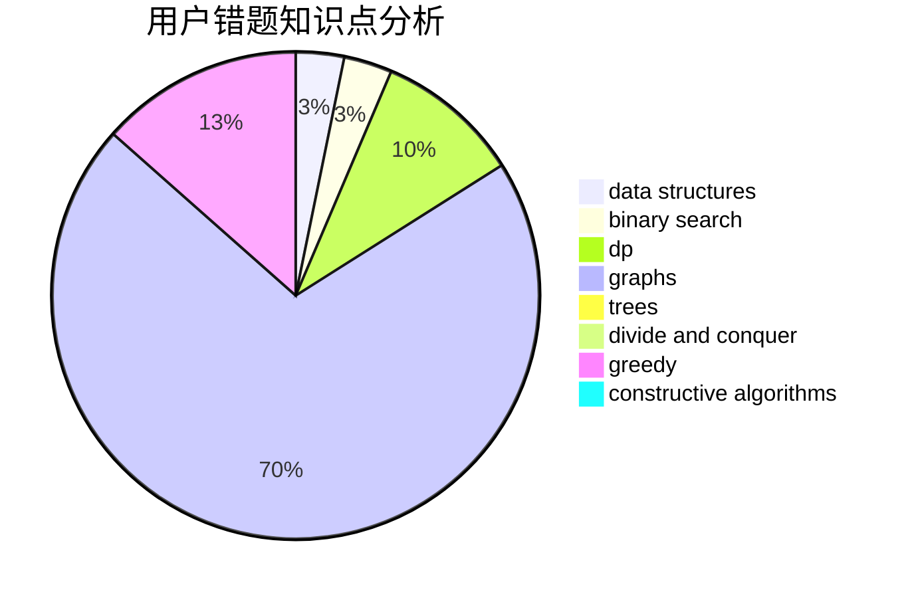

# Second_Draper

<!-- tabs:start -->

#### **用户提交结果分析**

#### **用户做题类型偏好分析**

#### **用户错题知识点分析**

<!-- tabs:end -->
# 推荐题目
[1255A](https://codeforces.com/contest/1255/problem/A)		math		  
[1423C](https://codeforces.com/contest/1423/problem/C)		divide and conquer,
                        graphs,
                        trees		  
[327A](https://codeforces.com/contest/327/problem/A)		brute force,
                        dp,
                        implementation		  
[710D](https://codeforces.com/contest/710/problem/D)		math,
                        number theory		  
[346E](https://codeforces.com/contest/346/problem/E)		math,
                        number theory		  
[295B](https://codeforces.com/contest/295/problem/B)		dp,
                        graphs,
                        shortest paths		  
[454A](https://codeforces.com/contest/454/problem/A)		implementation		  
[1015B](https://codeforces.com/contest/1015/problem/B)		implementation		  
[689B](https://codeforces.com/contest/689/problem/B)		dfs and similar,
                        graphs,
                        greedy,
                        shortest paths		  
[669C](https://codeforces.com/contest/669/problem/C)		dsu,graphs,sortings,trees		  
