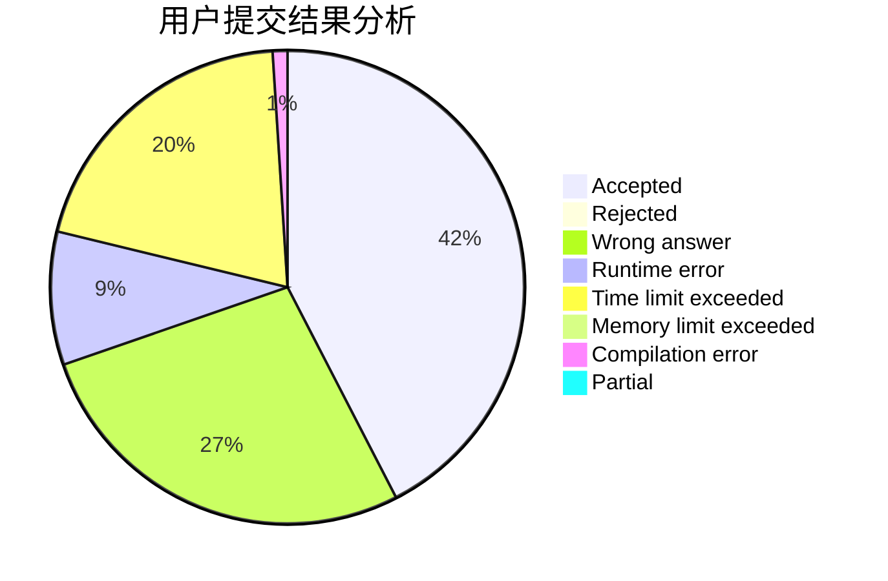
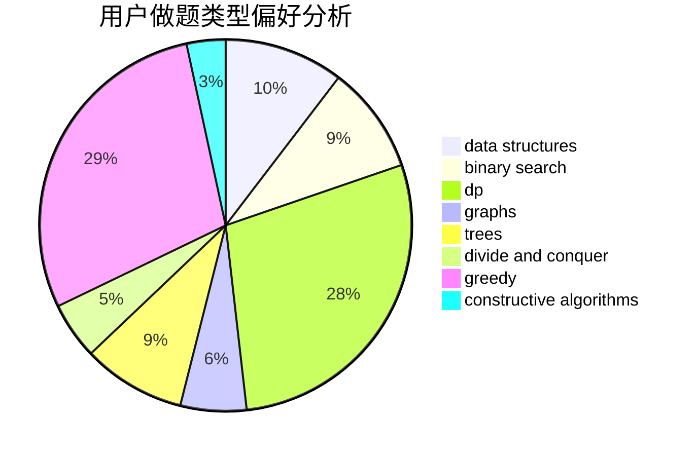
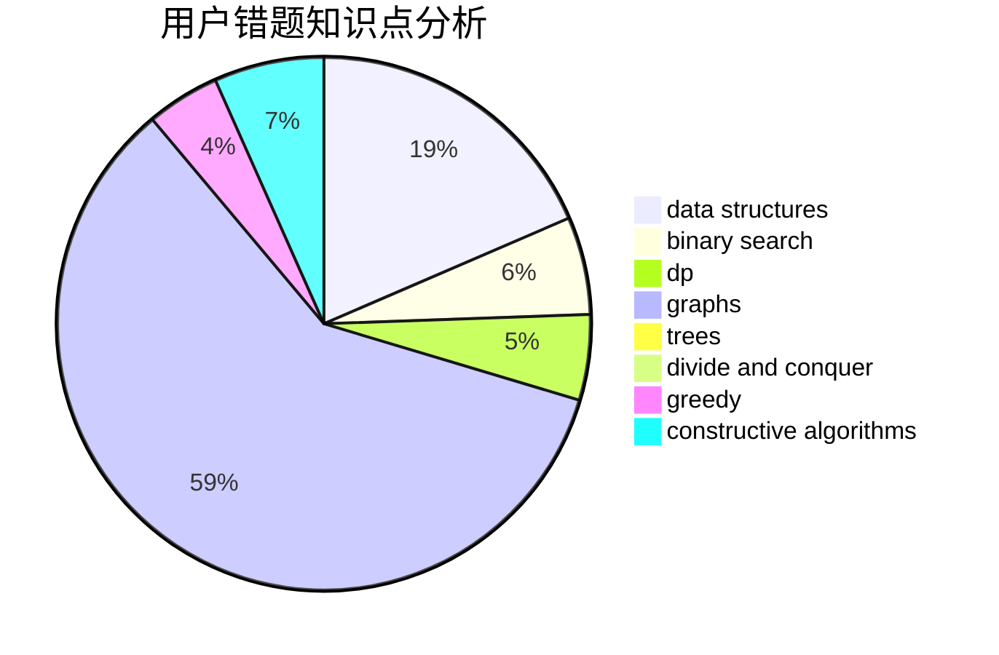

# SevenDawns

<!-- tabs:start -->

#### **用户提交结果分析**

#### **用户做题类型偏好分析**

#### **用户错题知识点分析**

<!-- tabs:end -->
# 推荐题目
[1023B](https://codeforces.com/contest/1023/problem/B)		math		  
[1037C](https://codeforces.com/contest/1037/problem/C)		dp,
                        greedy,
                        strings		  
[383D](https://codeforces.com/contest/383/problem/D)		dp		  
[108C](https://codeforces.com/contest/108/problem/C)		dsu,graphs,sortings,trees		  
[280D](https://codeforces.com/contest/280/problem/D)		data structures,
                        flows,
                        graphs,
                        implementation		  
[466A](https://codeforces.com/contest/466/problem/A)		implementation		  
[665C](https://codeforces.com/contest/665/problem/C)		dp,
                        greedy,
                        strings		  
[964C](https://codeforces.com/contest/964/problem/C)		dsu,graphs,sortings,trees		  
[1345B](https://codeforces.com/contest/1345/problem/B)		binary search,
                        brute force,
                        dp,
                        math		  
[767D](https://codeforces.com/contest/767/problem/D)		binary search,
                        data structures,
                        greedy,
                        sortings,
                        two pointers		  
