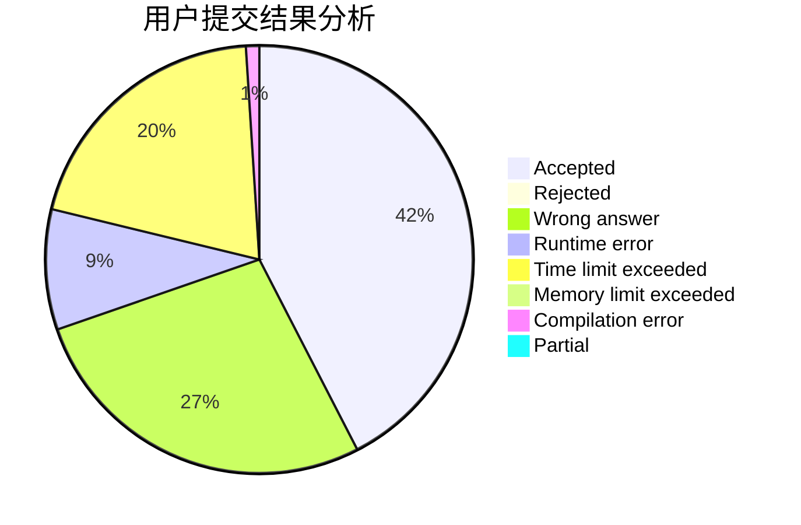
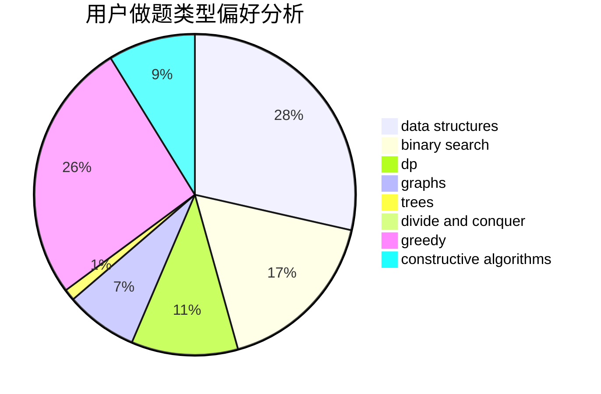

# SevenDawns

<!-- tabs:start -->

#### **用户提交结果分析**

#### **用户做题类型偏好分析**

#### **用户错题知识点分析**

<!-- tabs:end -->
# 推荐题目
[1020D](https://codeforces.com/contest/1020/problem/D)		dsu,graphs,sortings,trees		  
[1036F](https://codeforces.com/contest/1036/problem/F)		combinatorics,
                        math,
                        number theory		  
[358B](https://codeforces.com/contest/358/problem/B)		brute force,
                        strings		  
[1089K](https://codeforces.com/contest/1089/problem/K)		data structures		  
[264D](https://codeforces.com/contest/264/problem/D)		dp,
                        two pointers		  
[445C](https://codeforces.com/contest/445/problem/C)		dsu,graphs,sortings,trees		  
[633A](https://codeforces.com/contest/633/problem/A)		brute force,
                        math,
                        number theory		  
[947D](https://codeforces.com/contest/947/problem/D)		dsu,graphs,sortings,trees		  
[1338A](https://codeforces.com/contest/1338/problem/A)		greedy,
                        math		  
[748C](https://codeforces.com/contest/748/problem/C)		constructive algorithms,
                        math		  
