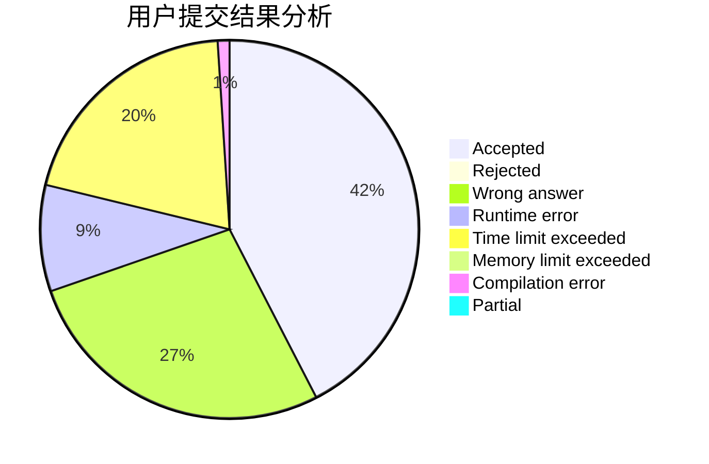
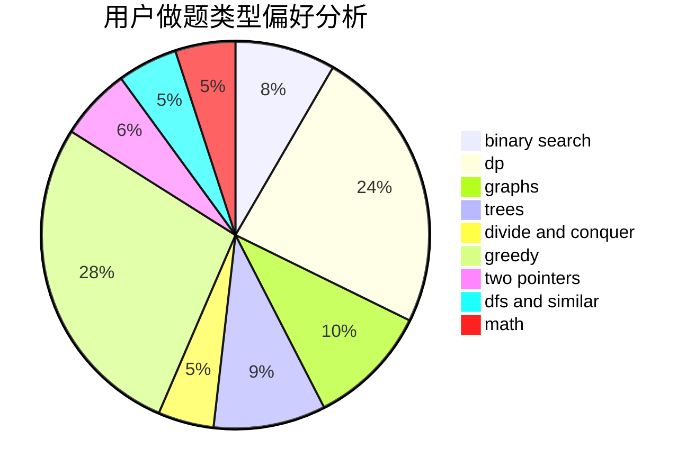

# SevenDawns

<!-- tabs:start -->

#### **用户提交结果分析**

#### **用户做题类型偏好分析**

<!-- tabs:end -->
# 推荐题目
[1023B](https://codeforces.com/contest/1023/problem/B)
[1037C](https://codeforces.com/contest/1037/problem/C)
[383D](https://codeforces.com/contest/383/problem/D)
[108C](https://codeforces.com/contest/108/problem/C)
[280D](https://codeforces.com/contest/280/problem/D)
[466A](https://codeforces.com/contest/466/problem/A)
[665C](https://codeforces.com/contest/665/problem/C)
[964C](https://codeforces.com/contest/964/problem/C)
[1345B](https://codeforces.com/contest/1345/problem/B)
[767D](https://codeforces.com/contest/767/problem/D)
