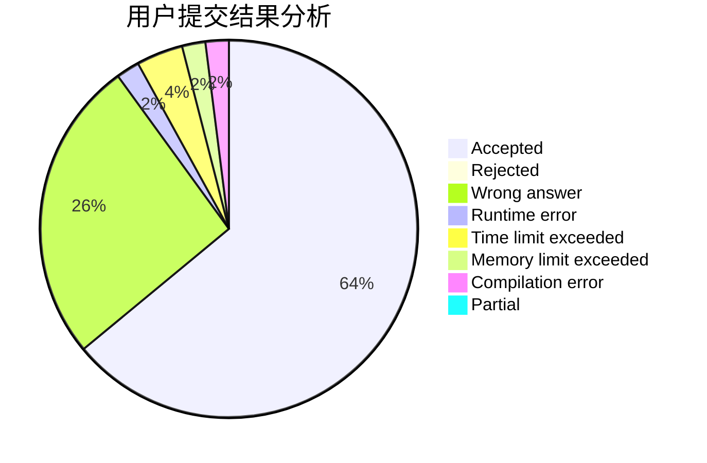
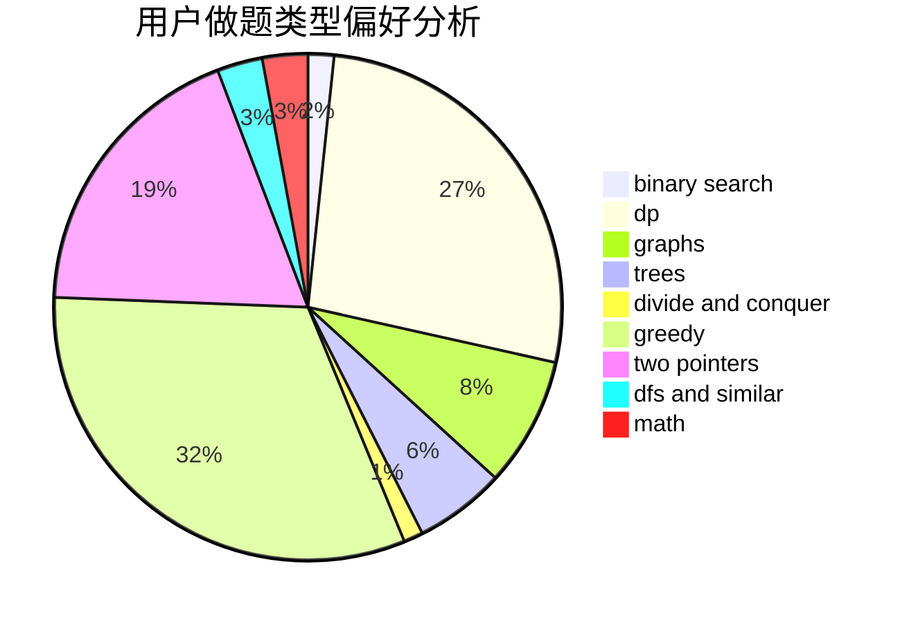

# Sfire

<!-- tabs:start -->

#### **用户提交结果分析**

#### **用户做题类型偏好分析**

<!-- tabs:end -->
# 推荐题目
[750F](https://codeforces.com/contest/750/problem/F)
[877B](https://codeforces.com/contest/877/problem/B)
[935F](https://codeforces.com/contest/935/problem/F)
[1081G](https://codeforces.com/contest/1081/problem/G)
[14C](https://codeforces.com/contest/14/problem/C)
[1019E](https://codeforces.com/contest/1019/problem/E)
[1037C](https://codeforces.com/contest/1037/problem/C)
[1234C](https://codeforces.com/contest/1234/problem/C)
[402A](https://codeforces.com/contest/402/problem/A)
[1033D](https://codeforces.com/contest/1033/problem/D)
