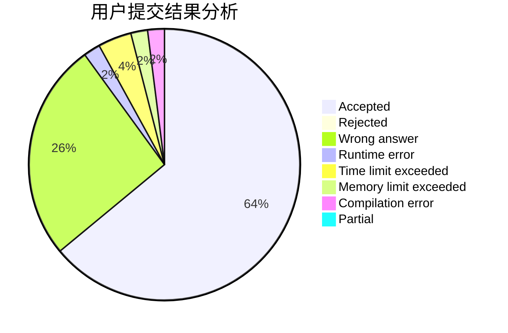
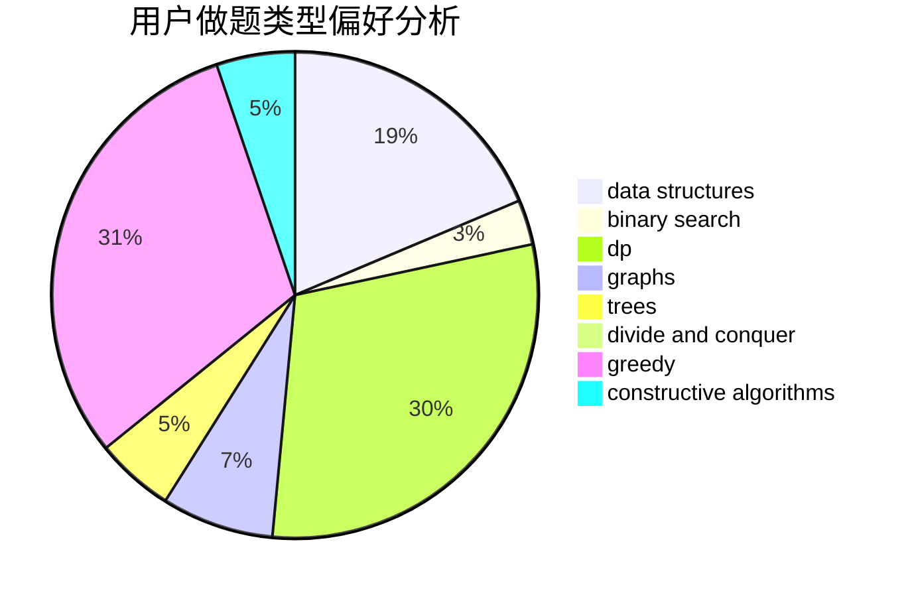

# Sfire

<!-- tabs:start -->

#### **用户提交结果分析**

#### **用户做题类型偏好分析**

#### **用户错题知识点分析**

<!-- tabs:end -->
# 推荐题目
[750F](https://codeforces.com/contest/750/problem/F)		constructive algorithms,
                        implementation,
                        interactive,
                        trees		  
[877B](https://codeforces.com/contest/877/problem/B)		brute force,
                        dp		  
[935F](https://codeforces.com/contest/935/problem/F)		data structures,
                        greedy		  
[1081G](https://codeforces.com/contest/1081/problem/G)		math,
                        probabilities		  
[14C](https://codeforces.com/contest/14/problem/C)		brute force,
                        constructive algorithms,
                        geometry,
                        implementation,
                        math		  
[1019E](https://codeforces.com/contest/1019/problem/E)		data structures,
                        divide and conquer,
                        trees		  
[1037C](https://codeforces.com/contest/1037/problem/C)		dp,
                        greedy,
                        strings		  
[1234C](https://codeforces.com/contest/1234/problem/C)		dp,
                        implementation		  
[402A](https://codeforces.com/contest/402/problem/A)		greedy,
                        math		  
[1033D](https://codeforces.com/contest/1033/problem/D)		interactive,
                        math,
                        number theory		  
