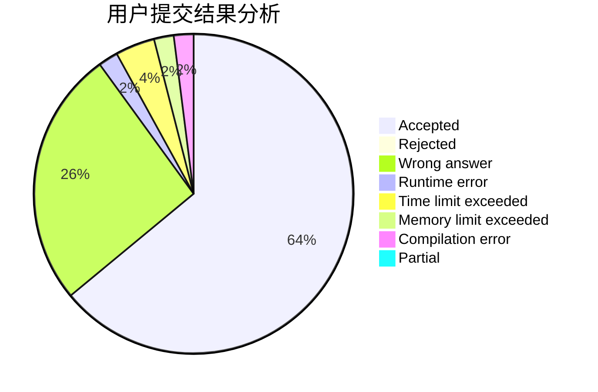
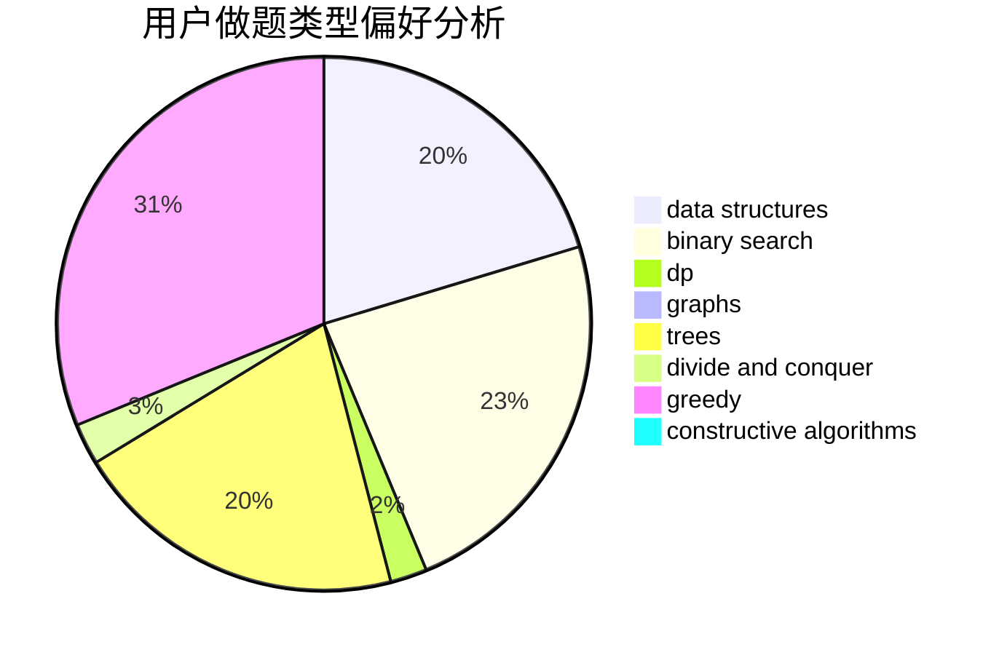

# Sfire

<!-- tabs:start -->

#### **用户提交结果分析**

#### **用户做题类型偏好分析**

#### **用户错题知识点分析**

<!-- tabs:end -->
# 推荐题目
[733A](https://codeforces.com/contest/733/problem/A)		implementation		  
[859E](https://codeforces.com/contest/859/problem/E)		combinatorics,
                        dfs and similar,
                        dsu,
                        graphs,
                        trees		  
[915G](https://codeforces.com/contest/915/problem/G)		math,
                        number theory		  
[1081D](https://codeforces.com/contest/1081/problem/D)		dsu,
                        graphs,
                        shortest paths,
                        sortings		  
[1491F](https://codeforces.com/contest/1491/problem/F)		binary search,
                        constructive algorithms,
                        interactive		  
[1019A](https://codeforces.com/contest/1019/problem/A)		brute force,
                        greedy		  
[1036F](https://codeforces.com/contest/1036/problem/F)		combinatorics,
                        math,
                        number theory		  
[1225F](https://codeforces.com/contest/1225/problem/F)		constructive algorithms,
                        greedy,
                        trees		  
[372A](https://codeforces.com/contest/372/problem/A)		binary search,
                        greedy,
                        sortings,
                        two pointers		  
[1033A](https://codeforces.com/contest/1033/problem/A)		dfs and similar,
                        graphs,
                        implementation		  
