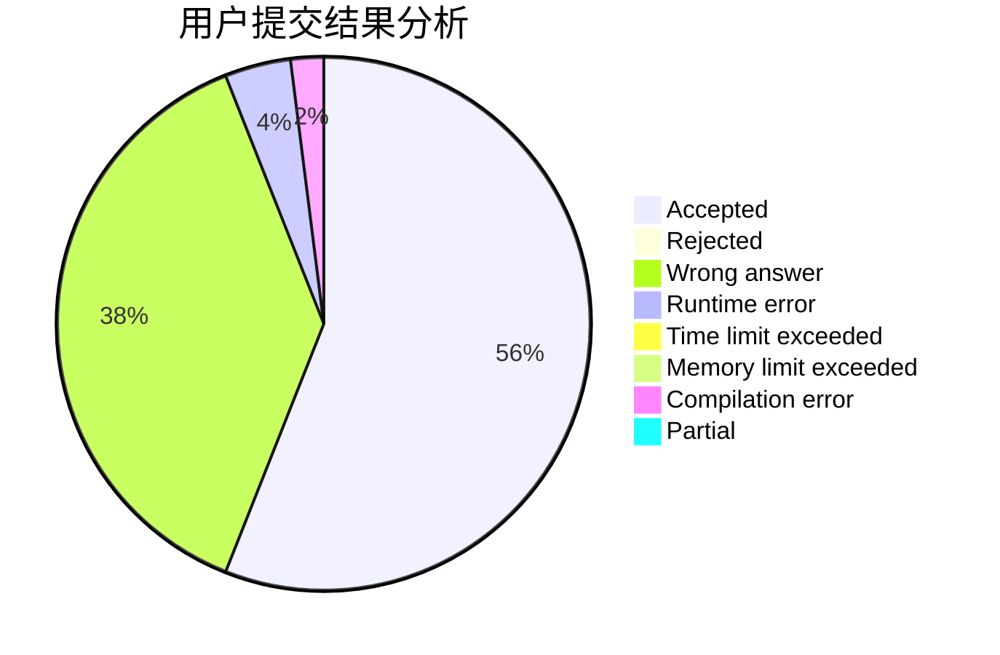
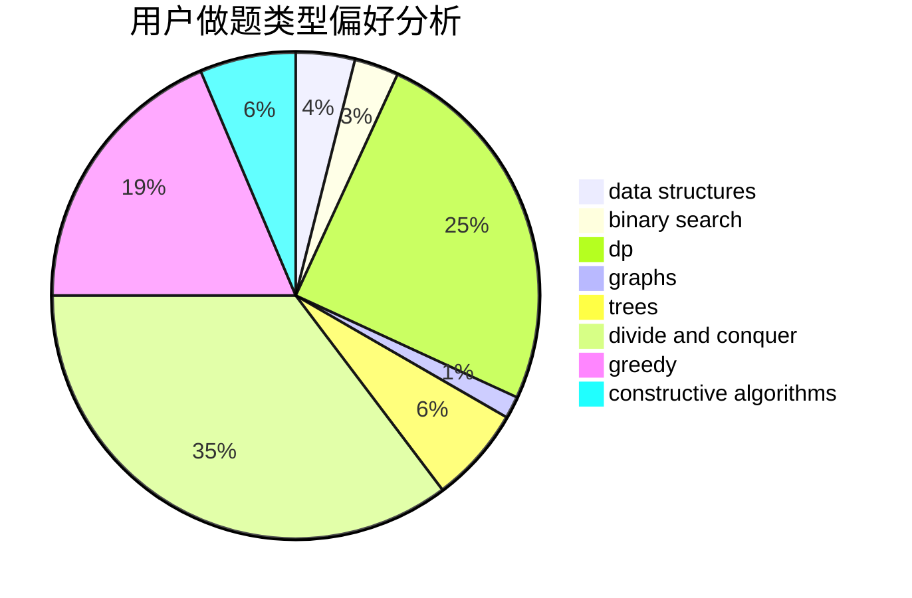
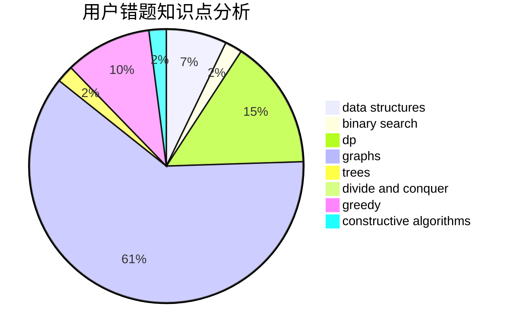

# Shallow_Kevin

<!-- tabs:start -->

#### **用户提交结果分析**

#### **用户做题类型偏好分析**

#### **用户错题知识点分析**

<!-- tabs:end -->
# 推荐题目
[747B](https://codeforces.com/contest/747/problem/B)		implementation,
                        strings		  
[626F](https://codeforces.com/contest/626/problem/F)		dp		  
[319A](https://codeforces.com/contest/319/problem/A)		combinatorics,
                        math		  
[960F](https://codeforces.com/contest/960/problem/F)		data structures,
                        dp,
                        graphs		  
[103B](https://codeforces.com/contest/103/problem/B)		dfs and similar,
                        dsu,
                        graphs		  
[1029D](https://codeforces.com/contest/1029/problem/D)		implementation,
                        math		  
[515C](https://codeforces.com/contest/515/problem/C)		greedy,
                        math,
                        sortings		  
[1076C](https://codeforces.com/contest/1076/problem/C)		binary search,
                        math		  
[505A](https://codeforces.com/contest/505/problem/A)		brute force,
                        implementation,
                        strings		  
[477C](https://codeforces.com/contest/477/problem/C)		dsu,graphs,sortings,trees		  
