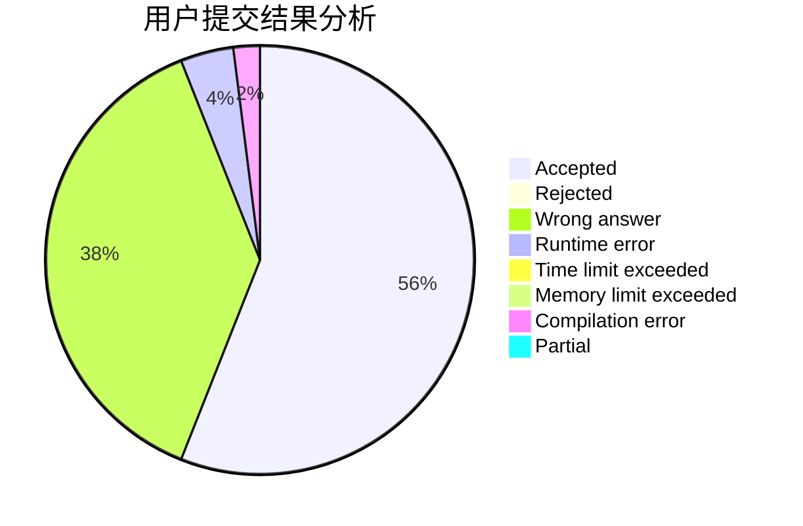
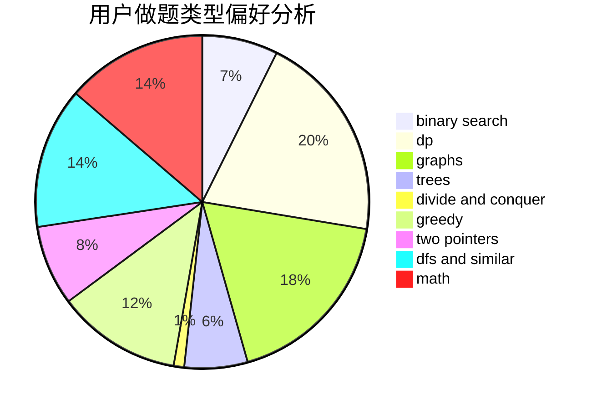

# Shallow_Kevin

<!-- tabs:start -->

#### **用户提交结果分析**

#### **用户做题类型偏好分析**

<!-- tabs:end -->
# 推荐题目
[766E](https://codeforces.com/contest/766/problem/E)
[653A](https://codeforces.com/contest/653/problem/A)
[349B](https://codeforces.com/contest/349/problem/B)
[982E](https://codeforces.com/contest/982/problem/E)
[103E](https://codeforces.com/contest/103/problem/E)
[102A](https://codeforces.com/contest/102/problem/A)
[542D](https://codeforces.com/contest/542/problem/D)
[1076F](https://codeforces.com/contest/1076/problem/F)
[525C](https://codeforces.com/contest/525/problem/C)
[497C](https://codeforces.com/contest/497/problem/C)
