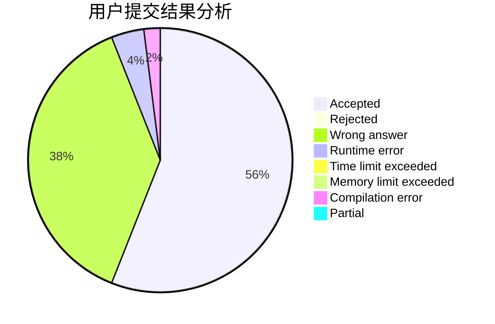
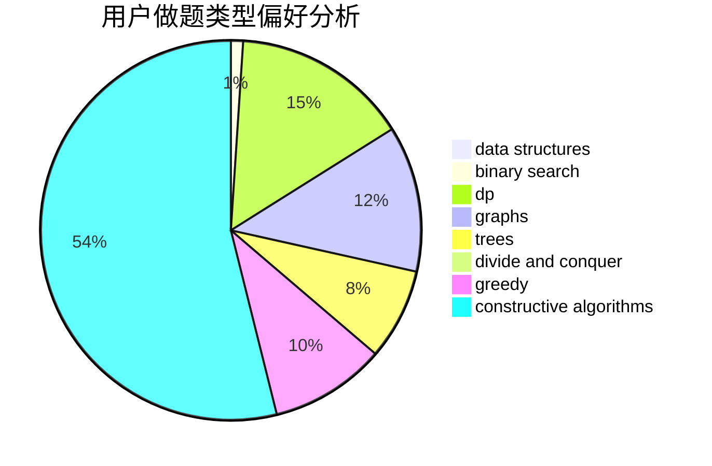
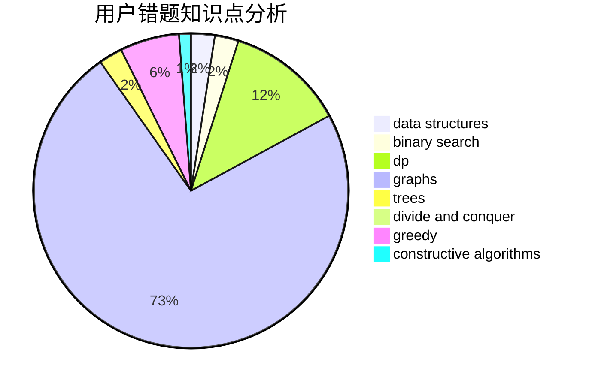

# Shallow_Kevin

<!-- tabs:start -->

#### **用户提交结果分析**

#### **用户做题类型偏好分析**

#### **用户错题知识点分析**

<!-- tabs:end -->
# 推荐题目
[766E](https://codeforces.com/contest/766/problem/E)		bitmasks,
                        constructive algorithms,
                        data structures,
                        dfs and similar,
                        dp,
                        math,
                        trees		  
[653A](https://codeforces.com/contest/653/problem/A)		brute force,
                        implementation,
                        sortings		  
[349B](https://codeforces.com/contest/349/problem/B)		data structures,
                        dp,
                        greedy,
                        implementation		  
[982E](https://codeforces.com/contest/982/problem/E)		geometry,
                        number theory		  
[103E](https://codeforces.com/contest/103/problem/E)		flows,
                        graph matchings		  
[102A](https://codeforces.com/contest/102/problem/A)		brute force		  
[542D](https://codeforces.com/contest/542/problem/D)		dfs and similar,
                        dp,
                        hashing,
                        math,
                        number theory		  
[1076F](https://codeforces.com/contest/1076/problem/F)		dp,
                        greedy		  
[525C](https://codeforces.com/contest/525/problem/C)		greedy,
                        math,
                        sortings		  
[497C](https://codeforces.com/contest/497/problem/C)		dsu,graphs,sortings,trees		  
