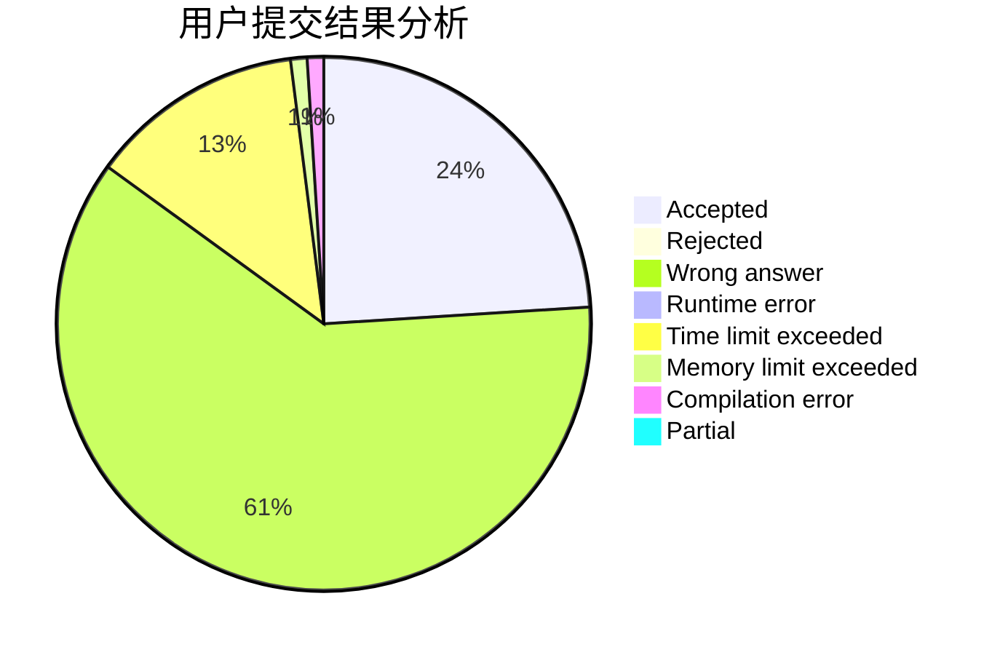
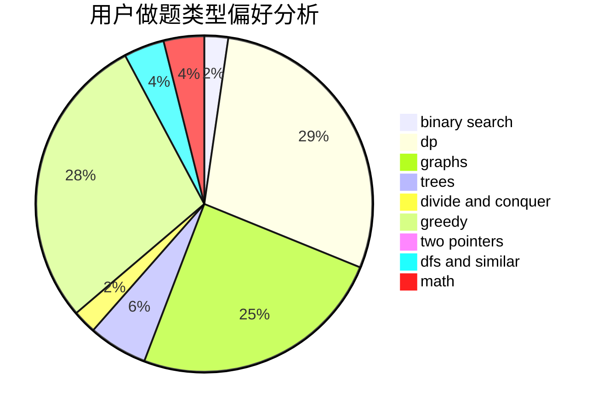

# Shameimaru_Aya

<!-- tabs:start -->

#### **用户提交结果分析**

#### **用户做题类型偏好分析**

<!-- tabs:end -->
# 推荐题目
[1131D](https://codeforces.com/contest/1131/problem/D)
[1020A](https://codeforces.com/contest/1020/problem/A)
[676A](https://codeforces.com/contest/676/problem/A)
[243C](https://codeforces.com/contest/243/problem/C)
[1237G](https://codeforces.com/contest/1237/problem/G)
[759B](https://codeforces.com/contest/759/problem/B)
[1439D](https://codeforces.com/contest/1439/problem/D)
[578A](https://codeforces.com/contest/578/problem/A)
[1133B](https://codeforces.com/contest/1133/problem/B)
[224B](https://codeforces.com/contest/224/problem/B)
