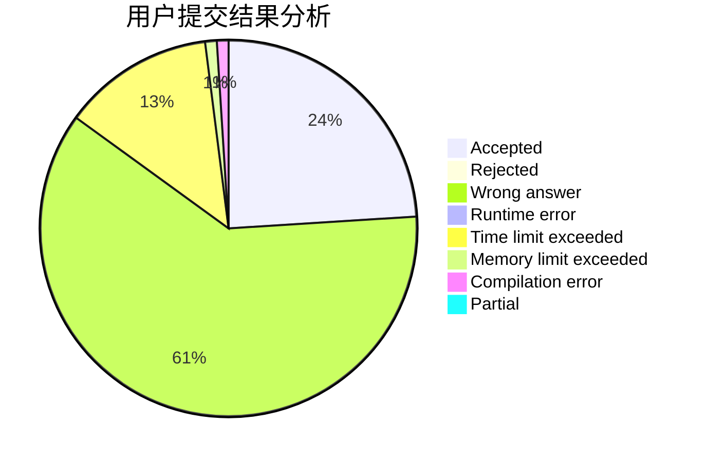
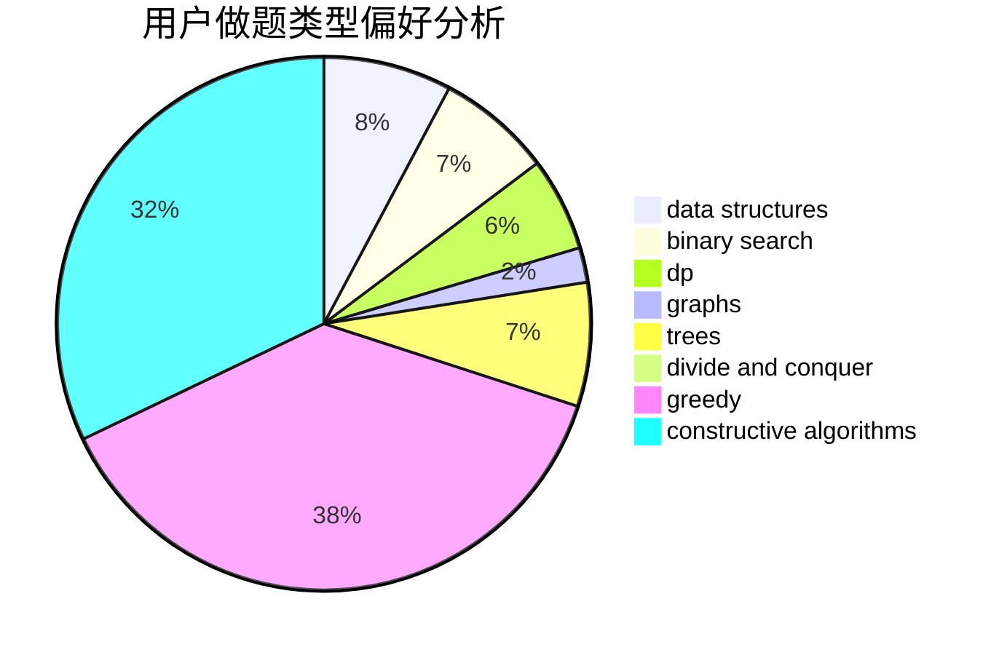
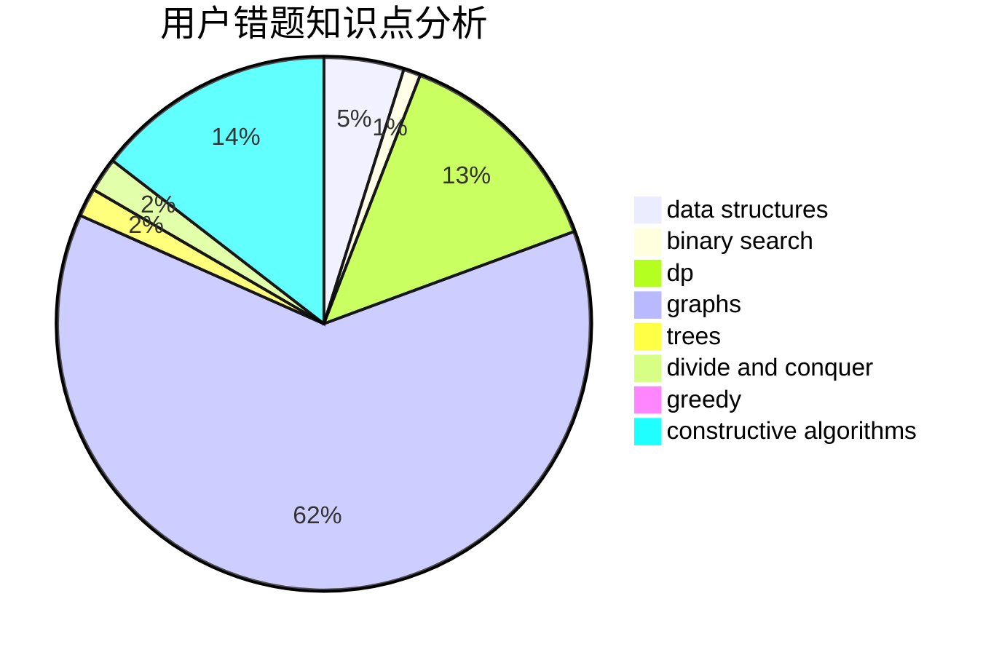

# Shameimaru_Aya

<!-- tabs:start -->

#### **用户提交结果分析**

#### **用户做题类型偏好分析**

#### **用户错题知识点分析**

<!-- tabs:end -->
# 推荐题目
[1129D](https://codeforces.com/contest/1129/problem/D)		data structures,
                        dp		  
[1019E](https://codeforces.com/contest/1019/problem/E)		data structures,
                        divide and conquer,
                        trees		  
[652B](https://codeforces.com/contest/652/problem/B)		sortings		  
[225C](https://codeforces.com/contest/225/problem/C)		dp,
                        matrices		  
[1229C](https://codeforces.com/contest/1229/problem/C)		dsu,graphs,sortings,trees		  
[737E](https://codeforces.com/contest/737/problem/E)		graph matchings,
                        graphs,
                        greedy,
                        schedules		  
[1430F](https://codeforces.com/contest/1430/problem/F)		dp,
                        greedy		  
[552D](https://codeforces.com/contest/552/problem/D)		brute force,
                        combinatorics,
                        data structures,
                        geometry,
                        math,
                        sortings		  
[1131E](https://codeforces.com/contest/1131/problem/E)		dp,
                        greedy,
                        strings		  
[1C](https://codeforces.com/contest/1/problem/C)		geometry,
                        math		  
