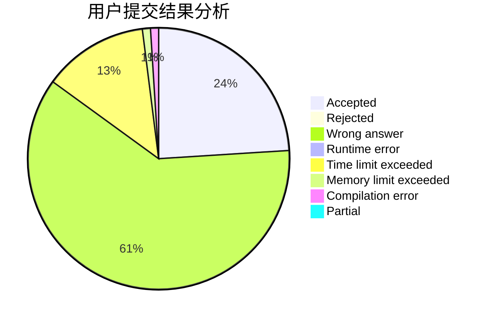
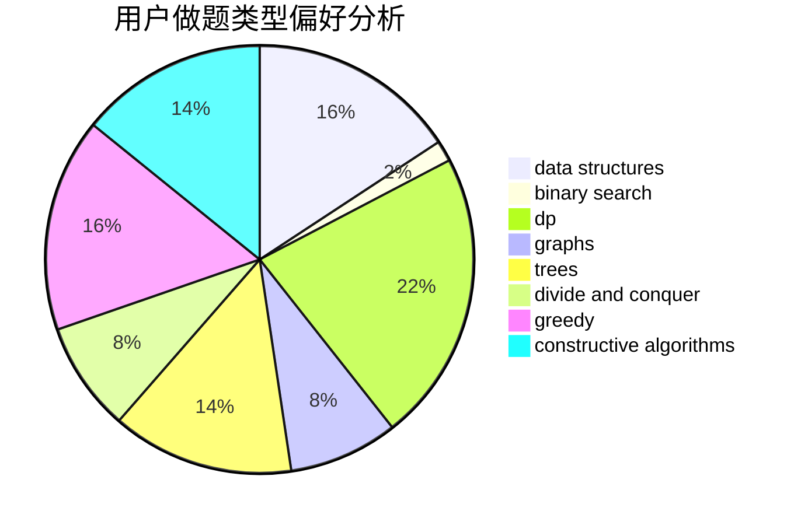
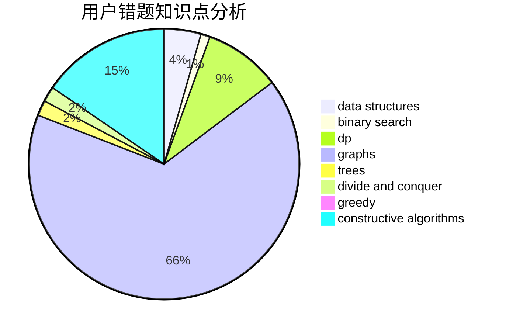

# Shameimaru_Aya

<!-- tabs:start -->

#### **用户提交结果分析**

#### **用户做题类型偏好分析**

#### **用户错题知识点分析**

<!-- tabs:end -->
# 推荐题目
[1131D](https://codeforces.com/contest/1131/problem/D)		dfs and similar,
                        dp,
                        dsu,
                        graphs,
                        greedy		  
[1020A](https://codeforces.com/contest/1020/problem/A)		math		  
[676A](https://codeforces.com/contest/676/problem/A)		constructive algorithms,
                        implementation		  
[243C](https://codeforces.com/contest/243/problem/C)		dfs and similar,
                        implementation		  
[1237G](https://codeforces.com/contest/1237/problem/G)		data structures,
                        dp,
                        greedy		  
[759B](https://codeforces.com/contest/759/problem/B)		dsu,graphs,sortings,trees		  
[1439D](https://codeforces.com/contest/1439/problem/D)		combinatorics,
                        dp,
                        fft		  
[578A](https://codeforces.com/contest/578/problem/A)		geometry,
                        math		  
[1133B](https://codeforces.com/contest/1133/problem/B)		math,
                        number theory		  
[224B](https://codeforces.com/contest/224/problem/B)		bitmasks,
                        implementation,
                        two pointers		  
