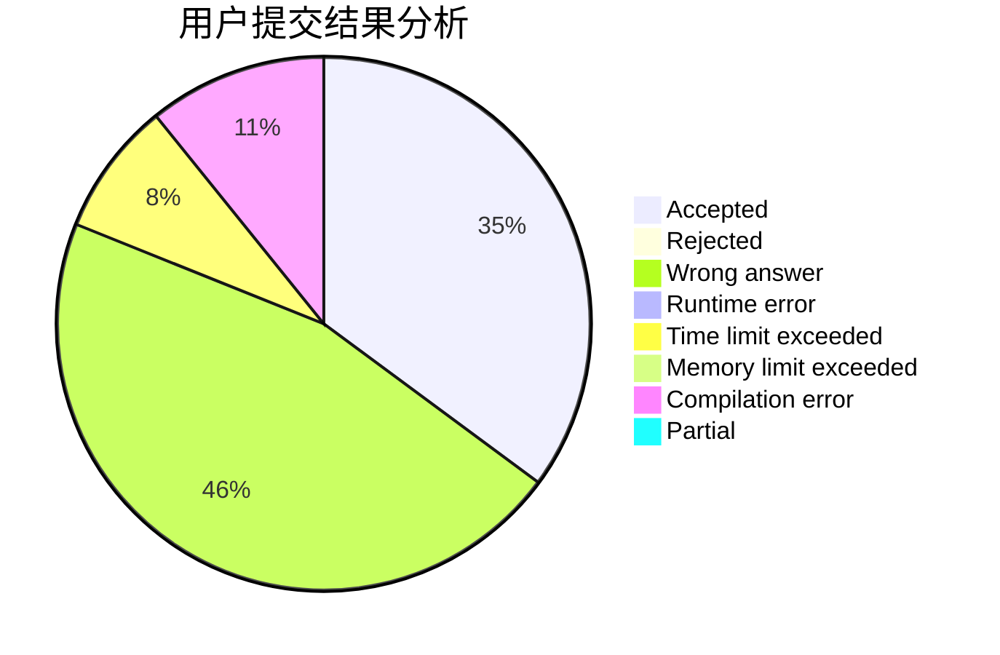
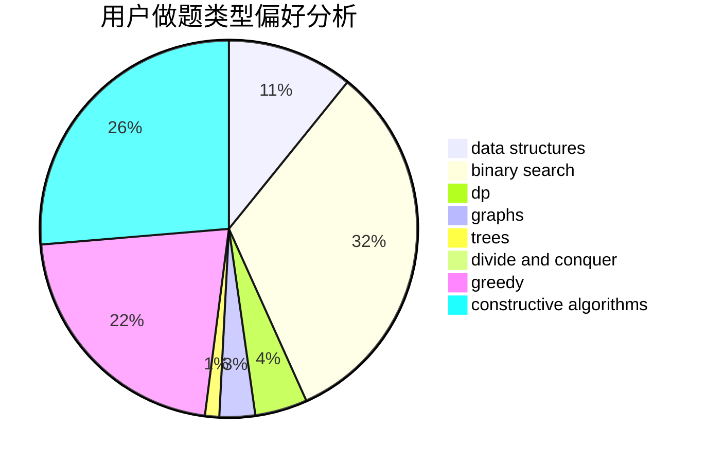

# A_Chinese_Juruo

<!-- tabs:start -->

#### **用户提交结果分析**

#### **用户做题类型偏好分析**

#### **用户错题知识点分析**

<!-- tabs:end -->
# 推荐题目
[1501D](https://codeforces.com/contest/1501/problem/D)		dsu,graphs,sortings,trees		  
[1209E2](https://codeforces.com/contest/1209E/problem/2)		bitmasks,
                        dp,
                        greedy,
                        sortings		  
[1060F](https://codeforces.com/contest/1060/problem/F)		combinatorics,
                        dp		  
[1073G](https://codeforces.com/contest/1073/problem/G)		data structures,
                        string suffix structures		  
[1334A](https://codeforces.com/contest/1334/problem/A)		implementation,
                        math		  
[1501E](https://codeforces.com/contest/1501/problem/E)		dsu,graphs,sortings,trees		  
[1311E](https://codeforces.com/contest/1311/problem/E)		brute force,
                        constructive algorithms,
                        trees		  
[1082G](https://codeforces.com/contest/1082/problem/G)		flows,
                        graphs		  
[1066A](https://codeforces.com/contest/1066/problem/A)		math		  
[1091A](https://codeforces.com/contest/1091/problem/A)		brute force,
                        implementation,
                        math		  
