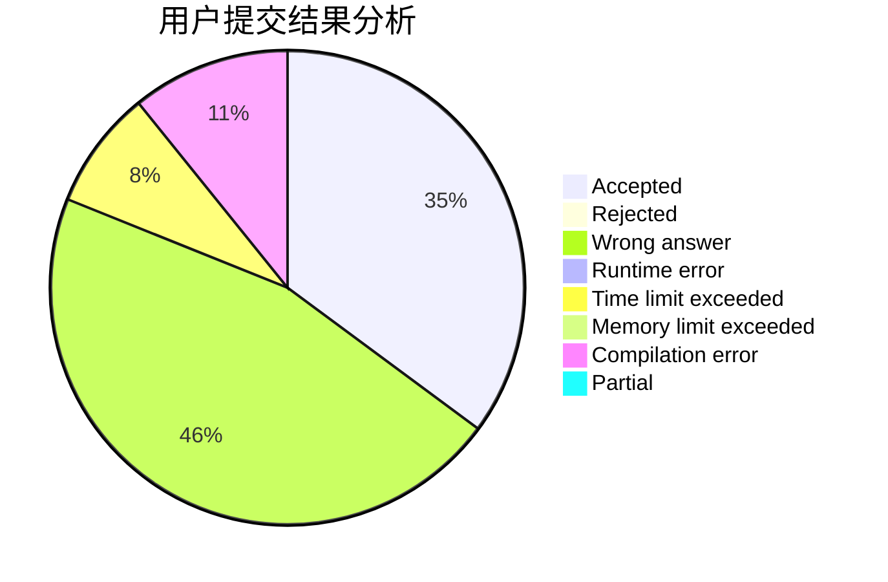
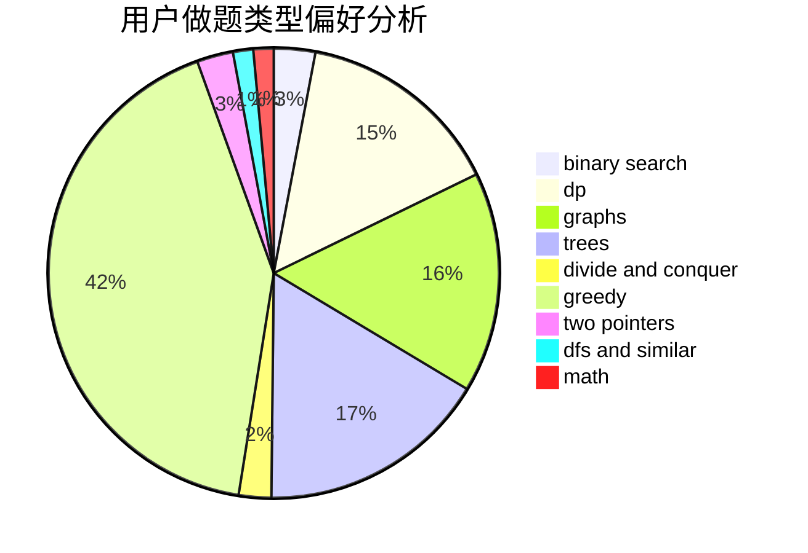

# A_Chinese_Juruo

<!-- tabs:start -->

#### **用户提交结果分析**

#### **用户做题类型偏好分析**

<!-- tabs:end -->
# 推荐题目
[1511E](https://codeforces.com/contest/1511/problem/E)
[1215B](https://codeforces.com/contest/1215/problem/B)
[1061B](https://codeforces.com/contest/1061/problem/B)
[1074C](https://codeforces.com/contest/1074/problem/C)
[1340F](https://codeforces.com/contest/1340/problem/F)
[1511F](https://codeforces.com/contest/1511/problem/F)
[1321A](https://codeforces.com/contest/1321/problem/A)
[1083C](https://codeforces.com/contest/1083/problem/C)
[1066D](https://codeforces.com/contest/1066/problem/D)
[1091D](https://codeforces.com/contest/1091/problem/D)
