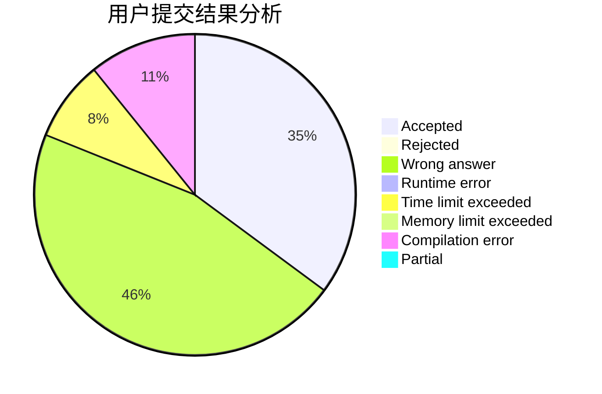
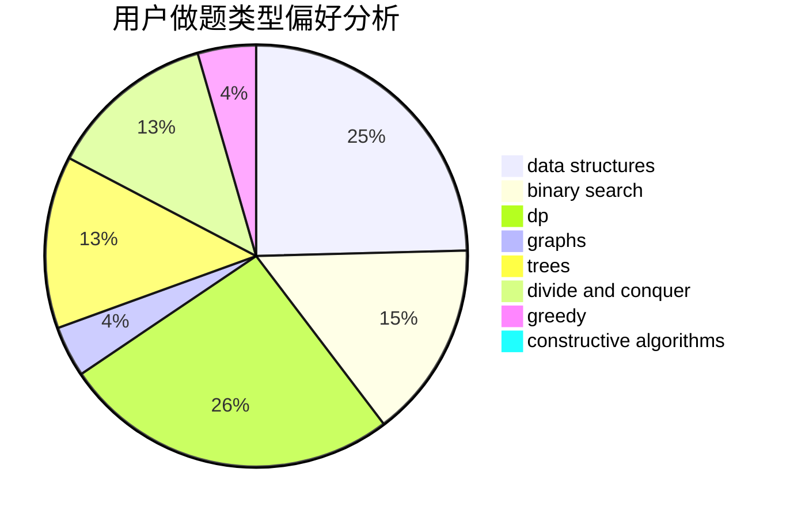

# A_Chinese_Juruo

<!-- tabs:start -->

#### **用户提交结果分析**

#### **用户做题类型偏好分析**

#### **用户错题知识点分析**

<!-- tabs:end -->
# 推荐题目
[1511E](https://codeforces.com/contest/1511/problem/E)		combinatorics,
                        dp,
                        greedy,
                        math		  
[1215B](https://codeforces.com/contest/1215/problem/B)		combinatorics,
                        dp,
                        implementation		  
[1061B](https://codeforces.com/contest/1061/problem/B)		greedy,
                        implementation,
                        sortings		  
[1074C](https://codeforces.com/contest/1074/problem/C)		dsu,graphs,sortings,trees		  
[1340F](https://codeforces.com/contest/1340/problem/F)		brute force,
                        data structures,
                        hashing		  
[1511F](https://codeforces.com/contest/1511/problem/F)		brute force,
                        data structures,
                        dp,
                        matrices,
                        string suffix structures,
                        strings		  
[1321A](https://codeforces.com/contest/1321/problem/A)		greedy		  
[1083C](https://codeforces.com/contest/1083/problem/C)		data structures,
                        trees		  
[1066D](https://codeforces.com/contest/1066/problem/D)		binary search,
                        implementation		  
[1091D](https://codeforces.com/contest/1091/problem/D)		combinatorics,
                        dp,
                        math		  
