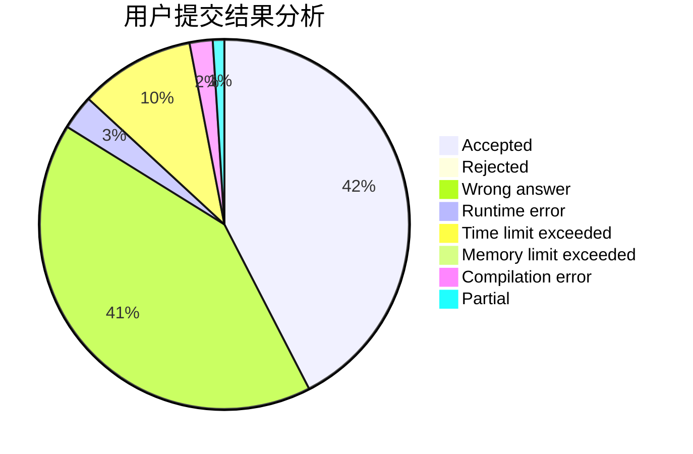
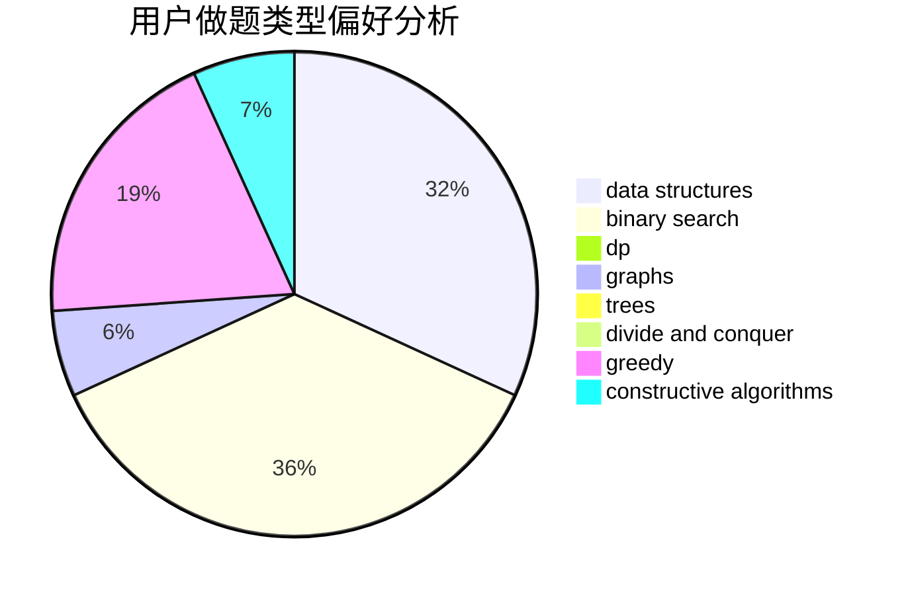
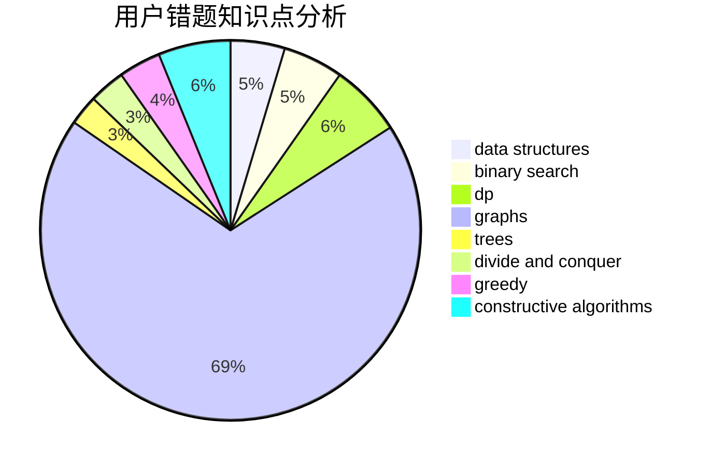

# Shedneryan

<!-- tabs:start -->

#### **用户提交结果分析**

#### **用户做题类型偏好分析**

#### **用户错题知识点分析**

<!-- tabs:end -->
# 推荐题目
[714B](https://codeforces.com/contest/714/problem/B)		implementation,
                        sortings		  
[1092F](https://codeforces.com/contest/1092/problem/F)		dfs and similar,
                        dp,
                        trees		  
[732A](https://codeforces.com/contest/732/problem/A)		brute force,
                        constructive algorithms,
                        implementation,
                        math		  
[430C](https://codeforces.com/contest/430/problem/C)		dsu,graphs,sortings,trees		  
[1330B](https://codeforces.com/contest/1330/problem/B)		implementation,
                        math		  
[1453D](https://codeforces.com/contest/1453/problem/D)		brute force,
                        constructive algorithms,
                        greedy,
                        math,
                        probabilities		  
[1487A](https://codeforces.com/contest/1487/problem/A)		implementation,
                        sortings		  
[1173F](https://codeforces.com/contest/1173/problem/F)		dsu,graphs,sortings,trees		  
[1335E1](https://codeforces.com/contest/1335E/problem/1)		binary search,
                        brute force,
                        data structures,
                        dp,
                        two pointers		  
[1482E](https://codeforces.com/contest/1482/problem/E)		data structures,
                        divide and conquer,
                        dp		  
