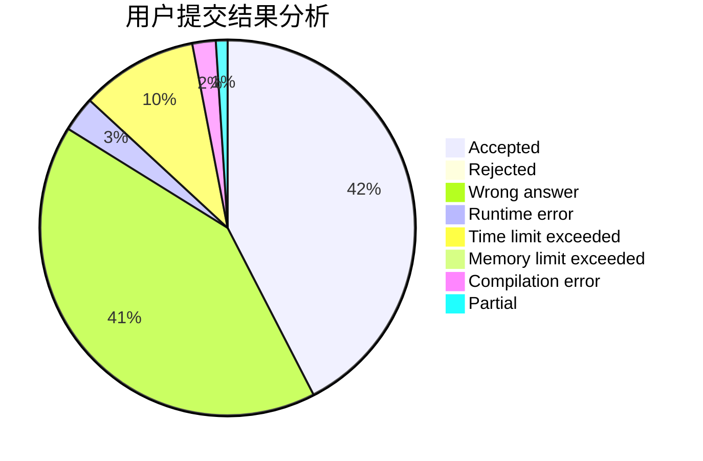
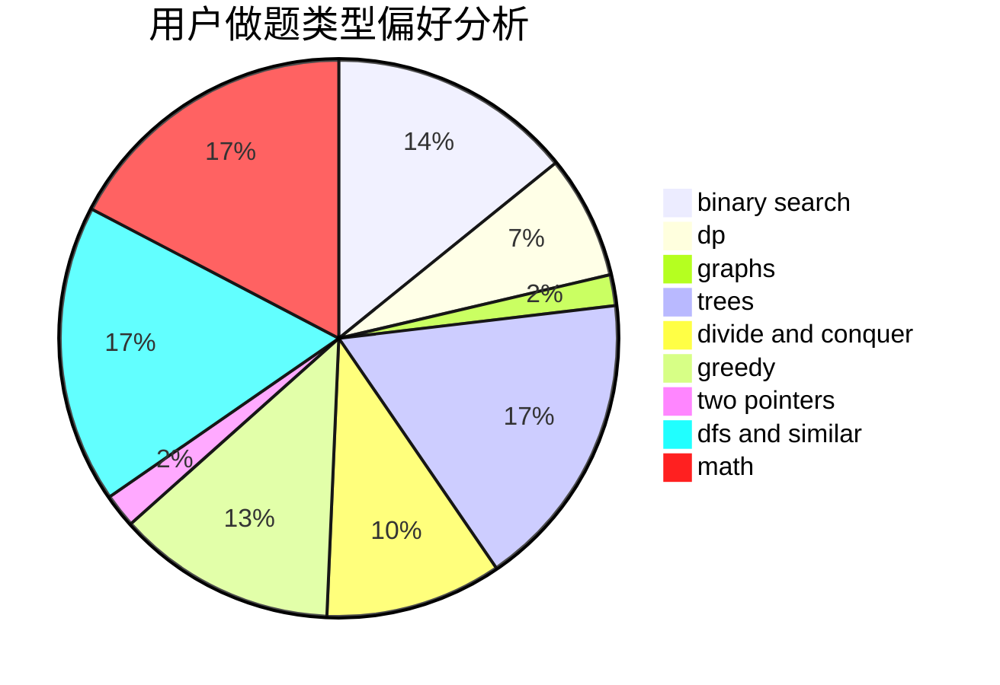

# Shedneryan

<!-- tabs:start -->

#### **用户提交结果分析**

#### **用户做题类型偏好分析**

<!-- tabs:end -->
# 推荐题目
[733A](https://codeforces.com/contest/733/problem/A)
[1093C](https://codeforces.com/contest/1093/problem/C)
[74B](https://codeforces.com/contest/74/problem/B)
[452E](https://codeforces.com/contest/452/problem/E)
[1336B](https://codeforces.com/contest/1336/problem/B)
[1463A](https://codeforces.com/contest/1463/problem/A)
[1494D](https://codeforces.com/contest/1494/problem/D)
[1176B](https://codeforces.com/contest/1176/problem/B)
[1342E](https://codeforces.com/contest/1342/problem/E)
[1490C](https://codeforces.com/contest/1490/problem/C)
