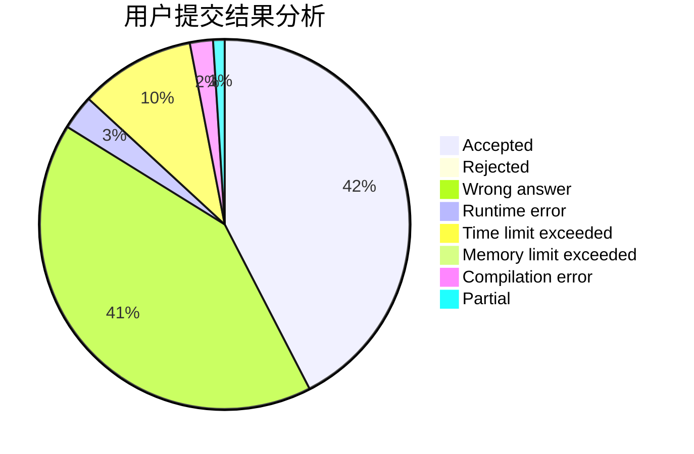
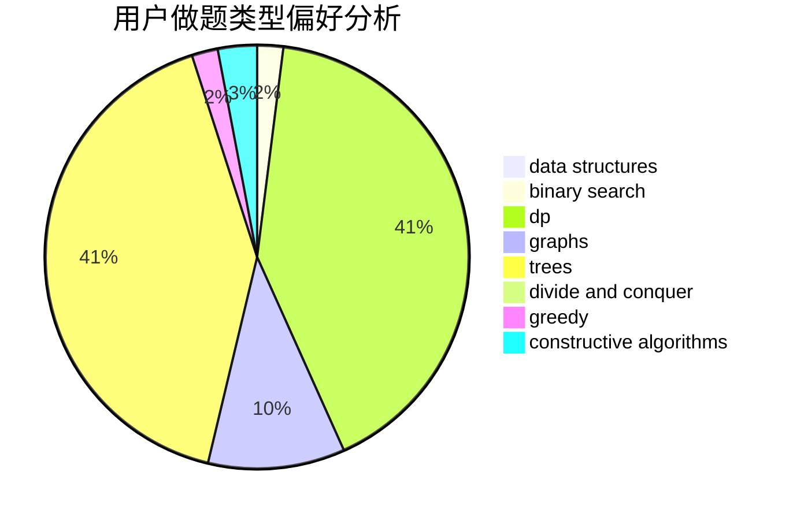
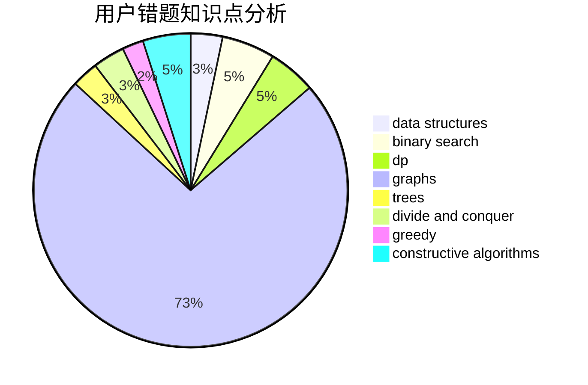

# Shedneryan

<!-- tabs:start -->

#### **用户提交结果分析**

#### **用户做题类型偏好分析**

#### **用户错题知识点分析**

<!-- tabs:end -->
# 推荐题目
[733A](https://codeforces.com/contest/733/problem/A)		implementation		  
[1093C](https://codeforces.com/contest/1093/problem/C)		greedy		  
[74B](https://codeforces.com/contest/74/problem/B)		dp,
                        games,
                        greedy		  
[452E](https://codeforces.com/contest/452/problem/E)		data structures,
                        dsu,
                        string suffix structures,
                        strings		  
[1336B](https://codeforces.com/contest/1336/problem/B)		binary search,
                        greedy,
                        math,
                        sortings,
                        two pointers		  
[1463A](https://codeforces.com/contest/1463/problem/A)		binary search,
                        math		  
[1494D](https://codeforces.com/contest/1494/problem/D)		constructive algorithms,
                        data structures,
                        dfs and similar,
                        divide and conquer,
                        dsu,
                        greedy,
                        sortings,
                        trees		  
[1176B](https://codeforces.com/contest/1176/problem/B)		math		  
[1342E](https://codeforces.com/contest/1342/problem/E)		combinatorics,
                        fft,
                        math		  
[1490C](https://codeforces.com/contest/1490/problem/C)		binary search,
                        brute force,
                        brute force,
                        math		  
