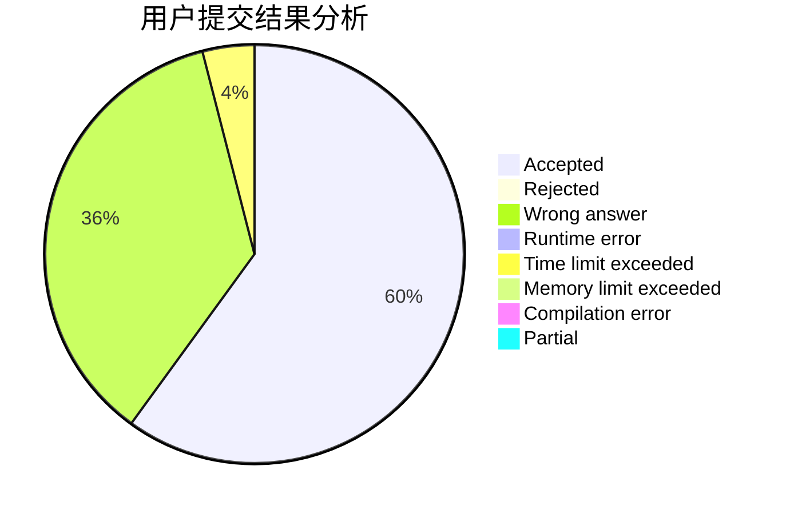
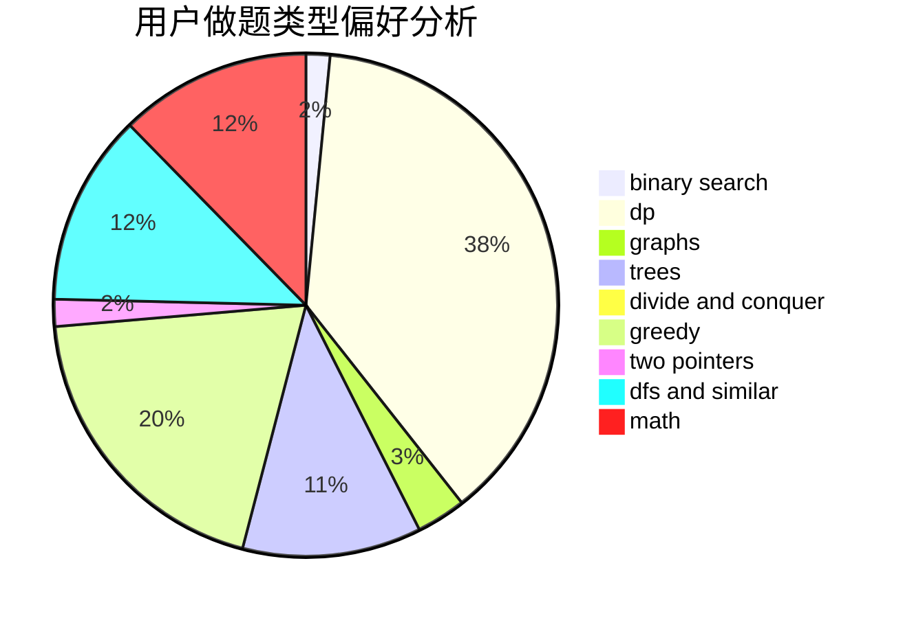

# ShiLuohe

<!-- tabs:start -->

#### **用户提交结果分析**

#### **用户做题类型偏好分析**

<!-- tabs:end -->
# 推荐题目
[963E](https://codeforces.com/contest/963/problem/E)
[97D](https://codeforces.com/contest/97/problem/D)
[317A](https://codeforces.com/contest/317/problem/A)
[788B](https://codeforces.com/contest/788/problem/B)
[1173A](https://codeforces.com/contest/1173/problem/A)
[1188E](https://codeforces.com/contest/1188/problem/E)
[845D](https://codeforces.com/contest/845/problem/D)
[1394E](https://codeforces.com/contest/1394/problem/E)
[977A](https://codeforces.com/contest/977/problem/A)
[1083F](https://codeforces.com/contest/1083/problem/F)
