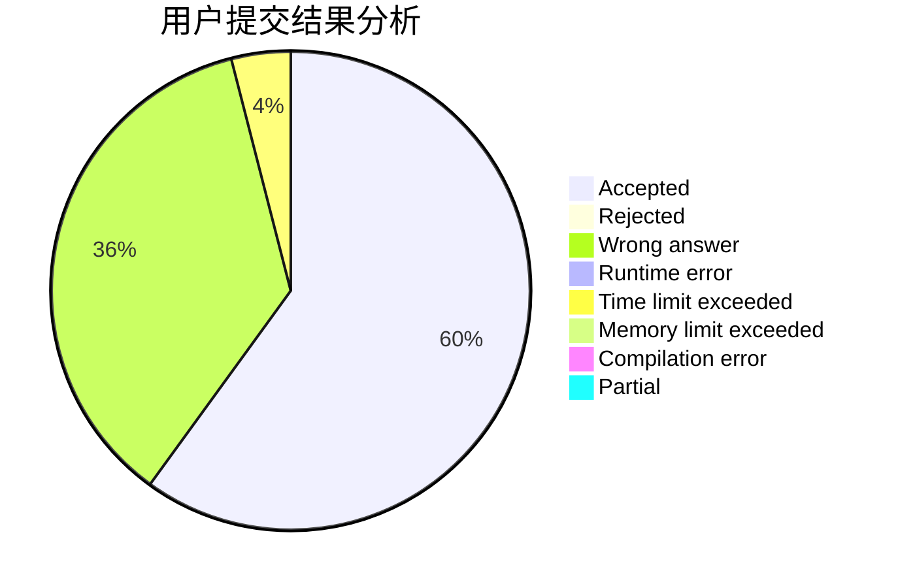
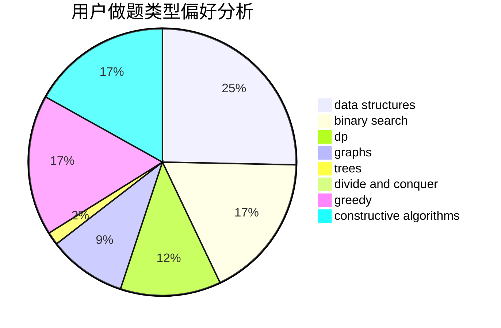

# ShiLuohe

<!-- tabs:start -->

#### **用户提交结果分析**

#### **用户做题类型偏好分析**

#### **用户错题知识点分析**

<!-- tabs:end -->
# 推荐题目
[947A](https://codeforces.com/contest/947/problem/A)		dsu,graphs,sortings,trees		  
[958D1](https://codeforces.com/contest/958D/problem/1)		expression parsing,
                        math		  
[29B](https://codeforces.com/contest/29/problem/B)		implementation		  
[768C](https://codeforces.com/contest/768/problem/C)		brute force,
                        dp,
                        implementation,
                        sortings		  
[1168E](https://codeforces.com/contest/1168/problem/E)		constructive algorithms,
                        math		  
[1184E3](https://codeforces.com/contest/1184E/problem/3)		data structures,
                        dsu,
                        graphs,
                        trees		  
[827A](https://codeforces.com/contest/827/problem/A)		data structures,
                        greedy,
                        sortings,
                        strings		  
[1384E](https://codeforces.com/contest/1384/problem/E)		dsu,graphs,sortings,trees		  
[955A](https://codeforces.com/contest/955/problem/A)		greedy,
                        math		  
[1083C](https://codeforces.com/contest/1083/problem/C)		data structures,
                        trees		  
