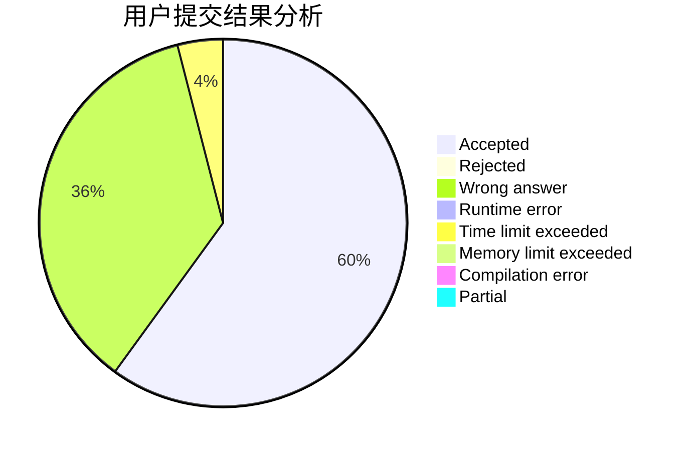
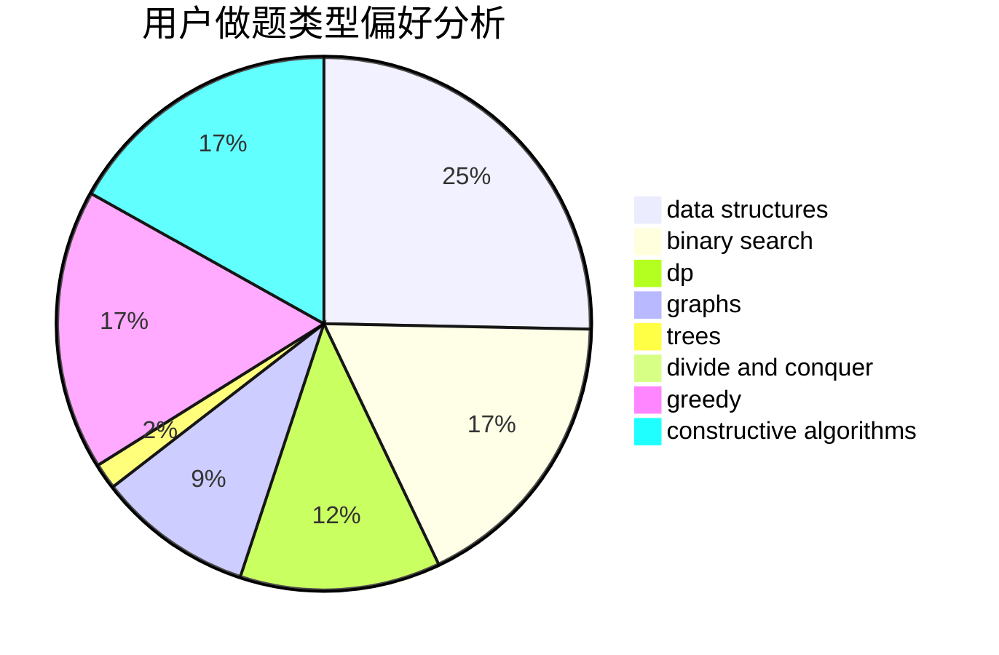

# ShiLuohe
<!-- tabs:start -->
#### **用户提交结果分析**

#### **用户做题类型偏好分析**

#### **用户错题知识点分析**

<!-- tabs:end -->
# 推荐题目
[Hyperspace Jump (easy)](http://codeforces.com/problemset/problem/958/D1)		expression parsing,
                        math		  
[Primal Sport](https://codeforces.com/contest/947/problem/A)		math,
                        number theory		  
[Traffic Lights](http://codeforces.com/problemset/problem/29/B)		implementation		  
[Anfisa the Monkey](http://codeforces.com/problemset/problem/44/E)		dp		  
[Max Mex](http://codeforces.com/problemset/problem/1083/C)		data structures,
                        trees		  
[Xor Permutations](http://codeforces.com/problemset/problem/1168/E)		constructive algorithms,
                        math		  
[Dirty Arkady's Kitchen](http://codeforces.com/problemset/problem/827/F)		data structures,
                        dp,
                        graphs,
                        shortest paths		  
[Jon Snow and his Favourite Number](http://codeforces.com/problemset/problem/768/C)		brute force,
                        dp,
                        implementation,
                        sortings		  
[Andryusha and Nervous Barriers](http://codeforces.com/problemset/problem/780/G)		data structures,
                        dp		  
[Daleks' Invasion (hard)](http://codeforces.com/problemset/problem/1184/E3)		data structures,
                        dsu,
                        graphs,
                        trees		  
<!-- tabs:start -->
#### **data structures**
[Hyperspace Jump (easy)](http://codeforces.com/problemset/problem/1083/C)		data structures,
                        trees		  
[Primal Sport](http://codeforces.com/problemset/problem/827/F)		data structures,
                        dp,
                        graphs,
                        shortest paths		  
[Traffic Lights](http://codeforces.com/problemset/problem/780/G)		data structures,
                        dp		  
[Anfisa the Monkey](http://codeforces.com/problemset/problem/1184/E3)		data structures,
                        dsu,
                        graphs,
                        trees		  
[Max Mex](http://codeforces.com/problemset/problem/827/A)		data structures,
                        greedy,
                        sortings,
                        strings		  
[Xor Permutations](http://codeforces.com/problemset/problem/1238/G)		data structures,
                        greedy,
                        sortings		  
[Dirty Arkady's Kitchen](http://codeforces.com/problemset/problem/1288/E)		data structures		  
[Jon Snow and his Favourite Number](http://codeforces.com/problemset/problem/1491/H)		data structures,
                        trees		  
[Andryusha and Nervous Barriers](http://codeforces.com/problemset/problem/817/E)		bitmasks,
                        data structures,
                        trees		  
[Daleks' Invasion (hard)](http://codeforces.com/problemset/problem/1492/C)		binary search,
                        data structures,
                        dp,
                        greedy,
                        two pointers		  
#### **binary search**
[Hyperspace Jump (easy)](http://codeforces.com/problemset/problem/1427/H)		binary search,
                        games,
                        geometry,
                        ternary search		  
[Primal Sport](http://codeforces.com/problemset/problem/301/B)		binary search,
                        graphs,
                        shortest paths		  
[Traffic Lights](http://codeforces.com/problemset/problem/883/D)		binary search,
                        dp,
                        math		  
[Anfisa the Monkey](http://codeforces.com/problemset/problem/1354/B)		binary search,
                        dp,
                        implementation,
                        two pointers		  
[Max Mex](http://codeforces.com/problemset/problem/1492/C)		binary search,
                        data structures,
                        dp,
                        greedy,
                        two pointers		  
[Xor Permutations](http://codeforces.com/problemset/problem/1463/D)		binary search,
                        constructive algorithms,
                        greedy,
                        two pointers		  
[Dirty Arkady's Kitchen](http://codeforces.com/problemset/problem/1490/G)		binary search,
                        data structures,
                        math		  
[Jon Snow and his Favourite Number](http://codeforces.com/problemset/problem/1479/D)		binary search,
                        bitmasks,
                        brute force,
                        data structures,
                        probabilities,
                        trees		  
[Andryusha and Nervous Barriers](http://codeforces.com/problemset/problem/1436/E)		binary search,
                        data structures,
                        two pointers		  
[Daleks' Invasion (hard)](http://codeforces.com/problemset/problem/1461/D)		binary search,
                        brute force,
                        data structures,
                        divide and conquer,
                        implementation,
                        sortings		  
#### **dp**
[Hyperspace Jump (easy)](http://codeforces.com/problemset/problem/44/E)		dp		  
[Primal Sport](http://codeforces.com/problemset/problem/827/F)		data structures,
                        dp,
                        graphs,
                        shortest paths		  
[Traffic Lights](http://codeforces.com/problemset/problem/768/C)		brute force,
                        dp,
                        implementation,
                        sortings		  
[Anfisa the Monkey](http://codeforces.com/problemset/problem/780/G)		data structures,
                        dp		  
[Max Mex](http://codeforces.com/problemset/problem/509/C)		dp,
                        greedy,
                        implementation		  
[Xor Permutations](http://codeforces.com/problemset/problem/386/C)		dp,
                        strings,
                        two pointers		  
[Dirty Arkady's Kitchen](https://codeforces.com/contest/1384/problem/E)		bitmasks,
                        dp,
                        graphs,
                        trees		  
[Jon Snow and his Favourite Number](https://codeforces.com/contest/604/problem/C)		dp,
                        greedy,
                        math		  
[Andryusha and Nervous Barriers](http://codeforces.com/problemset/problem/883/D)		binary search,
                        dp,
                        math		  
[Daleks' Invasion (hard)](http://codeforces.com/problemset/problem/1331/F)		brute force,
                        dp,
                        strings		  
#### **graph**
[Hyperspace Jump (easy)](http://codeforces.com/problemset/problem/827/F)		data structures,
                        dp,
                        graphs,
                        shortest paths		  
[Primal Sport](http://codeforces.com/problemset/problem/1184/E3)		data structures,
                        dsu,
                        graphs,
                        trees		  
[Traffic Lights](https://codeforces.com/contest/1384/problem/E)		bitmasks,
                        dp,
                        graphs,
                        trees		  
[Anfisa the Monkey](http://codeforces.com/problemset/problem/301/B)		binary search,
                        graphs,
                        shortest paths		  
[Max Mex](http://codeforces.com/problemset/problem/1454/E)		combinatorics,
                        dfs and similar,
                        graphs,
                        trees		  
[Xor Permutations](https://codeforces.com/contest/528/problem/C)		dfs and similar,
                        graphs		  
[Dirty Arkady's Kitchen](http://codeforces.com/problemset/problem/1450/E)		constructive algorithms,
                        dfs and similar,
                        graphs,
                        shortest paths		  
[Jon Snow and his Favourite Number](http://codeforces.com/problemset/problem/1487/C)		brute force,
                        constructive algorithms,
                        dfs and similar,
                        graphs,
                        greedy,
                        implementation,
                        math		  
[Andryusha and Nervous Barriers](http://codeforces.com/problemset/problem/1437/C)		dp,
                        flows,
                        graph matchings,
                        greedy,
                        math,
                        sortings		  
[Daleks' Invasion (hard)](http://codeforces.com/problemset/problem/1470/D)		constructive algorithms,
                        dfs and similar,
                        graph matchings,
                        graphs,
                        greedy		  
#### **trees**
[Hyperspace Jump (easy)](http://codeforces.com/problemset/problem/1083/C)		data structures,
                        trees		  
[Primal Sport](http://codeforces.com/problemset/problem/1184/E3)		data structures,
                        dsu,
                        graphs,
                        trees		  
[Traffic Lights](https://codeforces.com/contest/1384/problem/E)		bitmasks,
                        dp,
                        graphs,
                        trees		  
[Anfisa the Monkey](http://codeforces.com/problemset/problem/566/A)		dfs and similar,
                        strings,
                        trees		  
[Max Mex](http://codeforces.com/problemset/problem/1454/E)		combinatorics,
                        dfs and similar,
                        graphs,
                        trees		  
[Xor Permutations](http://codeforces.com/problemset/problem/1491/H)		data structures,
                        trees		  
[Dirty Arkady's Kitchen](http://codeforces.com/problemset/problem/817/E)		bitmasks,
                        data structures,
                        trees		  
[Jon Snow and his Favourite Number](http://codeforces.com/problemset/problem/1479/D)		binary search,
                        bitmasks,
                        brute force,
                        data structures,
                        probabilities,
                        trees		  
[Andryusha and Nervous Barriers](http://codeforces.com/problemset/problem/1511/C)		brute force,
                        data structures,
                        implementation,
                        trees		  
[Daleks' Invasion (hard)](http://codeforces.com/problemset/problem/1499/F)		combinatorics,
                        dfs and similar,
                        dp,
                        trees		  
#### **divide and conquer**
[Hyperspace Jump (easy)](http://codeforces.com/problemset/problem/1461/D)		binary search,
                        brute force,
                        data structures,
                        divide and conquer,
                        implementation,
                        sortings		  
[Primal Sport](http://codeforces.com/problemset/problem/1466/G)		combinatorics,
                        divide and conquer,
                        hashing,
                        math,
                        string suffix structures,
                        strings		  
[Traffic Lights](http://codeforces.com/problemset/problem/1490/D)		dfs and similar,
                        divide and conquer,
                        implementation		  
[Anfisa the Monkey](https://codeforces.com/contest/1483/problem/C)		data structures,
                        divide and conquer,
                        dp		  
[Max Mex](http://codeforces.com/problemset/problem/1491/E)		brute force,
                        dfs and similar,
                        divide and conquer,
                        number theory,
                        trees		  
[Xor Permutations](http://codeforces.com/problemset/problem/1303/G)		data structures,
                        divide and conquer,
                        geometry,
                        trees		  
[Dirty Arkady's Kitchen](http://codeforces.com/problemset/problem/1494/D)		constructive algorithms,
                        data structures,
                        dfs and similar,
                        divide and conquer,
                        dsu,
                        greedy,
                        sortings,
                        trees		  
[Jon Snow and his Favourite Number](http://codeforces.com/problemset/problem/1482/E)		data structures,
                        divide and conquer,
                        dp		  
[Andryusha and Nervous Barriers](http://codeforces.com/problemset/problem/566/C)		dfs and similar,
                        divide and conquer,
                        trees		  
[Daleks' Invasion (hard)](http://codeforces.com/problemset/problem/1428/F)		binary search,
                        data structures,
                        divide and conquer,
                        dp,
                        two pointers		  
#### **greedy**
[Hyperspace Jump (easy)](http://codeforces.com/problemset/problem/827/A)		data structures,
                        greedy,
                        sortings,
                        strings		  
[Primal Sport](https://codeforces.com/contest/860/problem/C)		greedy,
                        implementation		  
[Traffic Lights](http://codeforces.com/problemset/problem/509/C)		dp,
                        greedy,
                        implementation		  
[Anfisa the Monkey](http://codeforces.com/problemset/problem/955/A)		greedy,
                        math		  
[Max Mex](https://codeforces.com/contest/604/problem/C)		dp,
                        greedy,
                        math		  
[Xor Permutations](http://codeforces.com/problemset/problem/1238/G)		data structures,
                        greedy,
                        sortings		  
[Dirty Arkady's Kitchen](http://codeforces.com/problemset/problem/402/A)		greedy,
                        math		  
[Jon Snow and his Favourite Number](http://codeforces.com/problemset/problem/1383/B)		bitmasks,
                        constructive algorithms,
                        dp,
                        games,
                        greedy,
                        math		  
[Andryusha and Nervous Barriers](https://codeforces.com/contest/1330/problem/C)		constructive algorithms,
                        greedy,
                        implementation,
                        math		  
[Daleks' Invasion (hard)](http://codeforces.com/problemset/problem/717/B)		dp,
                        greedy		  
#### **constructive algorithms**
[Hyperspace Jump (easy)](http://codeforces.com/problemset/problem/1168/E)		constructive algorithms,
                        math		  
[Primal Sport](http://codeforces.com/problemset/problem/1157/G)		brute force,
                        constructive algorithms		  
[Traffic Lights](http://codeforces.com/problemset/problem/848/A)		constructive algorithms		  
[Anfisa the Monkey](http://codeforces.com/problemset/problem/1109/B)		constructive algorithms,
                        hashing,
                        strings		  
[Max Mex](http://codeforces.com/problemset/problem/1028/B)		constructive algorithms,
                        math		  
[Xor Permutations](http://codeforces.com/problemset/problem/1383/B)		bitmasks,
                        constructive algorithms,
                        dp,
                        games,
                        greedy,
                        math		  
[Dirty Arkady's Kitchen](https://codeforces.com/contest/1330/problem/C)		constructive algorithms,
                        greedy,
                        implementation,
                        math		  
[Jon Snow and his Favourite Number](http://codeforces.com/problemset/problem/1450/E)		constructive algorithms,
                        dfs and similar,
                        graphs,
                        shortest paths		  
[Andryusha and Nervous Barriers](http://codeforces.com/problemset/problem/578/E)		constructive algorithms,
                        greedy		  
[Daleks' Invasion (hard)](http://codeforces.com/problemset/problem/1493/A)		constructive algorithms,
                        greedy		  
#### **sortings**
[Hyperspace Jump (easy)](http://codeforces.com/problemset/problem/768/C)		brute force,
                        dp,
                        implementation,
                        sortings		  
[Primal Sport](http://codeforces.com/problemset/problem/827/A)		data structures,
                        greedy,
                        sortings,
                        strings		  
[Traffic Lights](http://codeforces.com/problemset/problem/1238/G)		data structures,
                        greedy,
                        sortings		  
[Anfisa the Monkey](https://codeforces.com/contest/1496/problem/C)		geometry,
                        greedy,
                        math,
                        sortings		  
[Max Mex](http://codeforces.com/problemset/problem/1495/A)		geometry,
                        greedy,
                        math,
                        sortings		  
[Xor Permutations](http://codeforces.com/problemset/problem/1497/A)		brute force,
                        data structures,
                        greedy,
                        sortings		  
[Dirty Arkady's Kitchen](http://codeforces.com/problemset/problem/1427/A)		math,
                        sortings		  
[Jon Snow and his Favourite Number](http://codeforces.com/problemset/problem/1461/D)		binary search,
                        brute force,
                        data structures,
                        divide and conquer,
                        implementation,
                        sortings		  
[Andryusha and Nervous Barriers](http://codeforces.com/problemset/problem/1437/C)		dp,
                        flows,
                        graph matchings,
                        greedy,
                        math,
                        sortings		  
[Daleks' Invasion (hard)](http://codeforces.com/problemset/problem/1473/A)		greedy,
                        implementation,
                        math,
                        sortings		  
<!-- tabs:end -->
