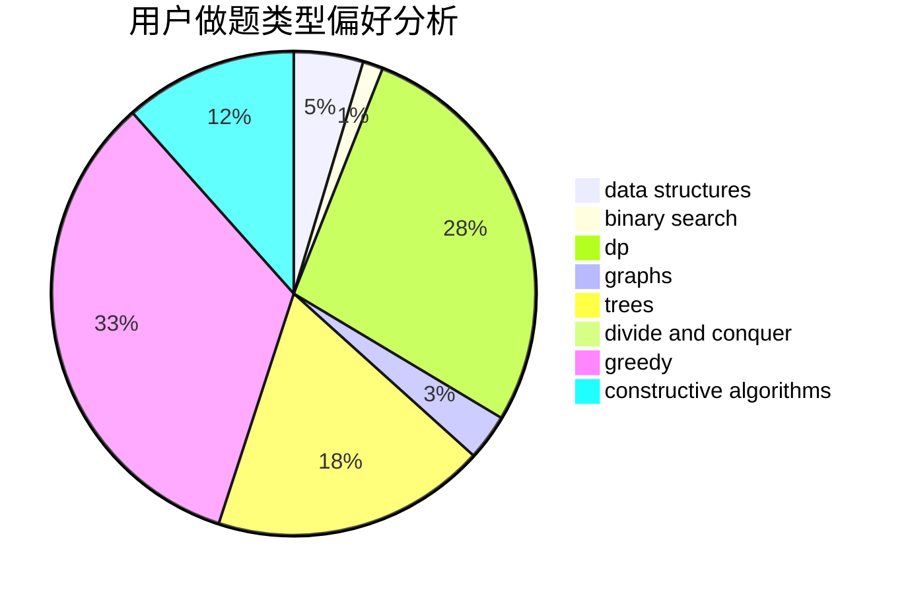

# ShiLuohe

<!-- tabs:start -->

#### **用户提交结果分析**

#### **用户做题类型偏好分析**

#### **用户错题知识点分析**

<!-- tabs:end -->
# 推荐题目
[963E](https://codeforces.com/contest/963/problem/E)		math		  
[97D](https://codeforces.com/contest/97/problem/D)		bitmasks,
                        brute force,
                        implementation		  
[317A](https://codeforces.com/contest/317/problem/A)		brute force		  
[788B](https://codeforces.com/contest/788/problem/B)		combinatorics,
                        constructive algorithms,
                        dfs and similar,
                        dsu,
                        graphs		  
[1173A](https://codeforces.com/contest/1173/problem/A)		greedy		  
[1188E](https://codeforces.com/contest/1188/problem/E)		combinatorics		  
[845D](https://codeforces.com/contest/845/problem/D)		data structures,
                        dp,
                        greedy		  
[1394E](https://codeforces.com/contest/1394/problem/E)		strings		  
[977A](https://codeforces.com/contest/977/problem/A)		implementation		  
[1083F](https://codeforces.com/contest/1083/problem/F)		data structures		  
