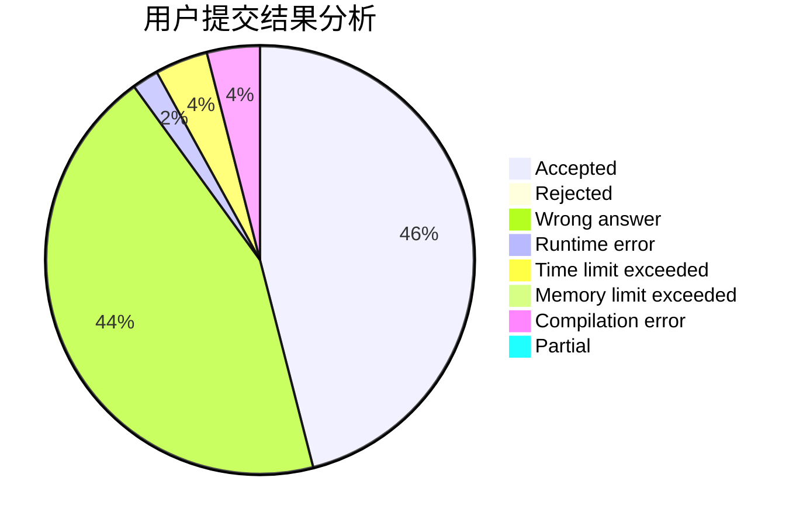
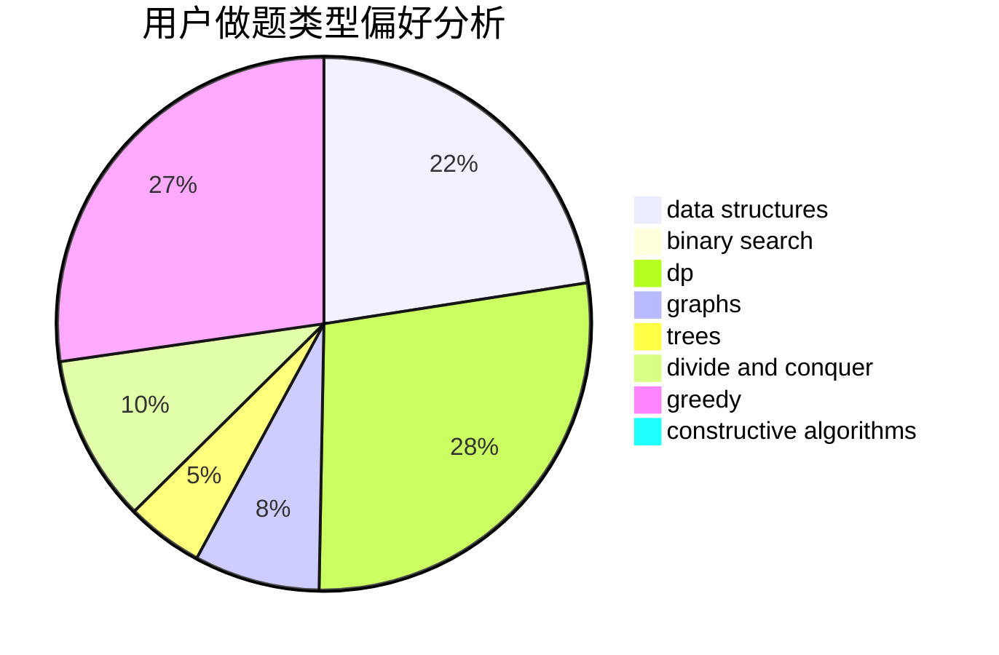
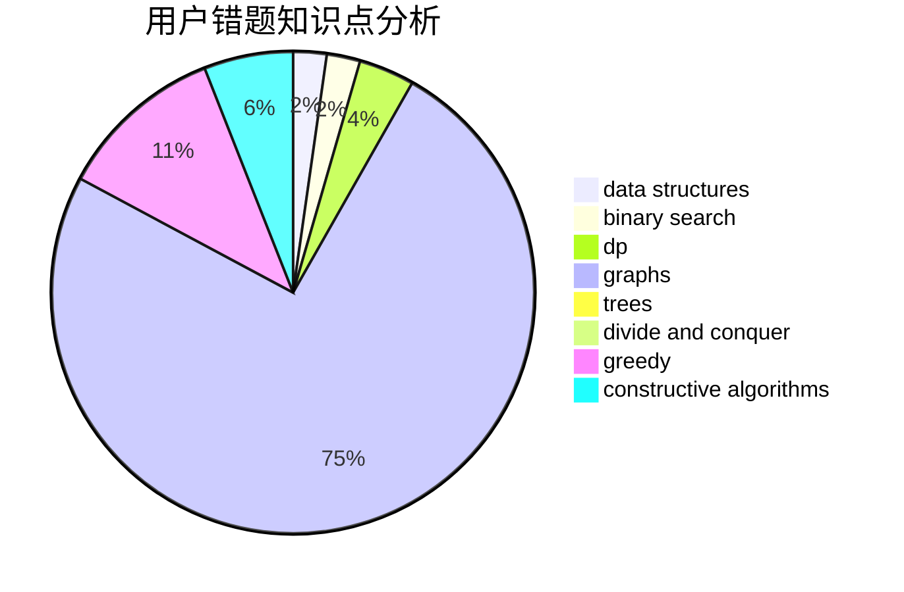

# ShirohaIsMyWife

<!-- tabs:start -->

#### **用户提交结果分析**

#### **用户做题类型偏好分析**

#### **用户错题知识点分析**

<!-- tabs:end -->
# 推荐题目
[1435D](https://codeforces.com/contest/1435/problem/D)		dsu,graphs,sortings,trees		  
[716B](https://codeforces.com/contest/716/problem/B)		greedy,
                        two pointers		  
[1158B](https://codeforces.com/contest/1158/problem/B)		constructive algorithms,
                        math,
                        strings		  
[1321B](https://codeforces.com/contest/1321/problem/B)		dsu,graphs,sortings,trees		  
[1062C](https://codeforces.com/contest/1062/problem/C)		greedy,
                        implementation,
                        math		  
[780E](https://codeforces.com/contest/780/problem/E)		constructive algorithms,
                        dfs and similar,
                        graphs		  
[771D](https://codeforces.com/contest/771/problem/D)		dp		  
[962G](https://codeforces.com/contest/962/problem/G)		data structures,
                        dsu,
                        geometry,
                        trees		  
[584E](https://codeforces.com/contest/584/problem/E)		constructive algorithms,
                        greedy,
                        math		  
[549C](https://codeforces.com/contest/549/problem/C)		games		  
