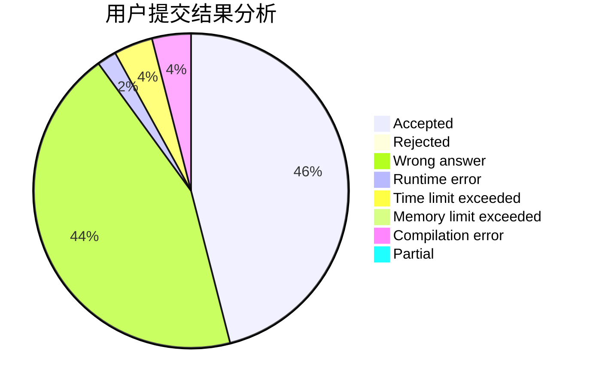
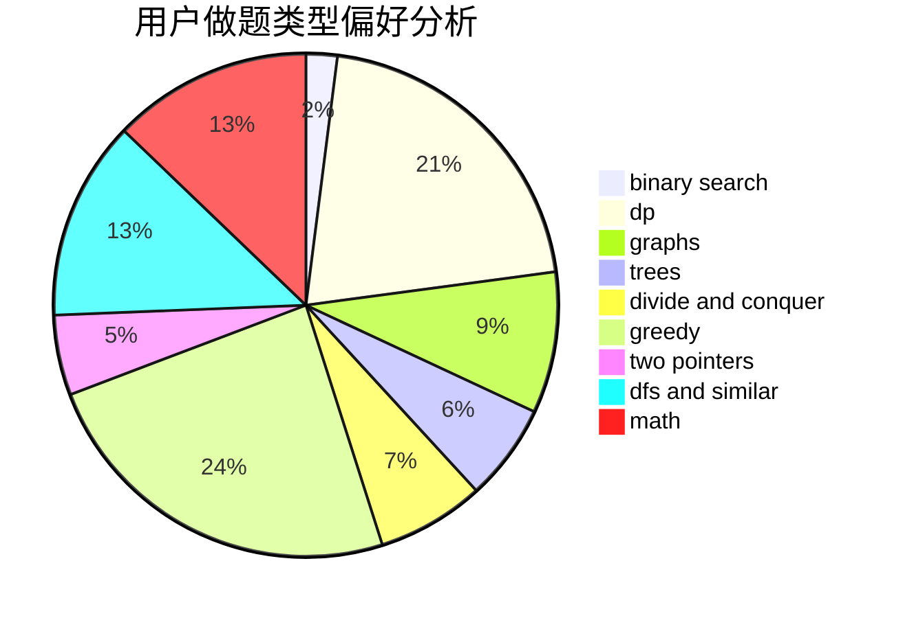

# ShirohaIsMyWife

<!-- tabs:start -->

#### **用户提交结果分析**

#### **用户做题类型偏好分析**

<!-- tabs:end -->
# 推荐题目
[1435D](https://codeforces.com/contest/1435/problem/D)
[716B](https://codeforces.com/contest/716/problem/B)
[1158B](https://codeforces.com/contest/1158/problem/B)
[1321B](https://codeforces.com/contest/1321/problem/B)
[1062C](https://codeforces.com/contest/1062/problem/C)
[780E](https://codeforces.com/contest/780/problem/E)
[771D](https://codeforces.com/contest/771/problem/D)
[962G](https://codeforces.com/contest/962/problem/G)
[584E](https://codeforces.com/contest/584/problem/E)
[549C](https://codeforces.com/contest/549/problem/C)
