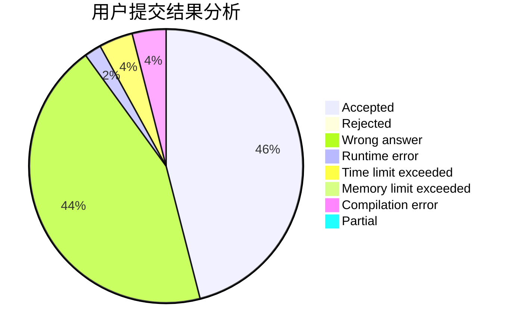
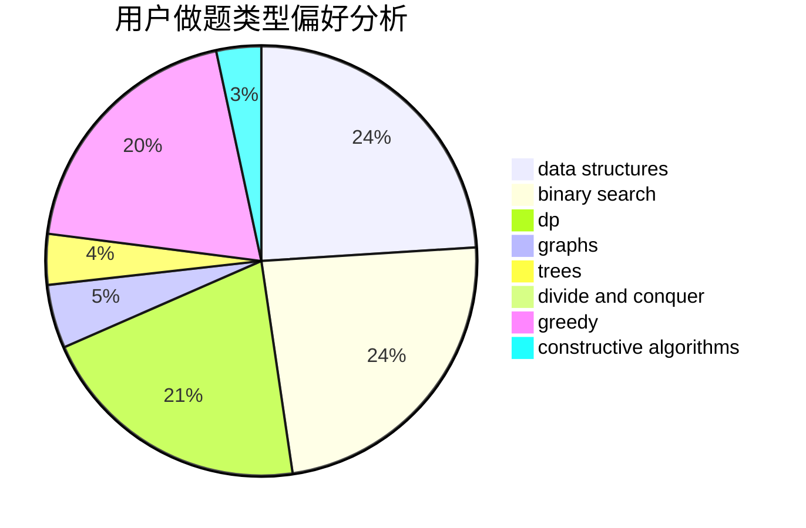
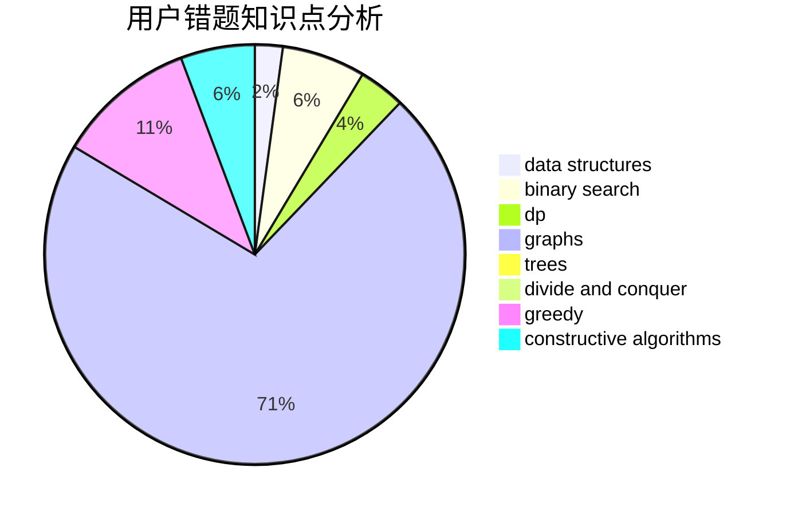

# ShirohaIsMyWife

<!-- tabs:start -->

#### **用户提交结果分析**

#### **用户做题类型偏好分析**

#### **用户错题知识点分析**

<!-- tabs:end -->
# 推荐题目
[1427A](https://codeforces.com/contest/1427/problem/A)		math,
                        sortings		  
[699C](https://codeforces.com/contest/699/problem/C)		dsu,graphs,sortings,trees		  
[1156D](https://codeforces.com/contest/1156/problem/D)		dfs and similar,
                        divide and conquer,
                        dp,
                        dsu,
                        trees		  
[1311F](https://codeforces.com/contest/1311/problem/F)		data structures,
                        divide and conquer,
                        implementation,
                        sortings		  
[1061F](https://codeforces.com/contest/1061/problem/F)		interactive,
                        probabilities		  
[762A](https://codeforces.com/contest/762/problem/A)		math,
                        number theory		  
[750H](https://codeforces.com/contest/750/problem/H)		dfs and similar,
                        dsu,
                        graphs,
                        interactive		  
[946C](https://codeforces.com/contest/946/problem/C)		greedy,
                        strings		  
[566A](https://codeforces.com/contest/566/problem/A)		dfs and similar,
                        strings,
                        trees		  
[524F](https://codeforces.com/contest/524/problem/F)		data structures,
                        greedy,
                        hashing,
                        string suffix structures,
                        strings		  
