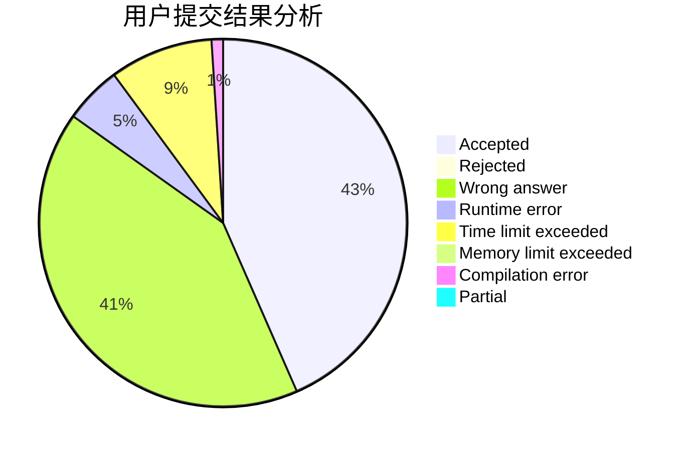
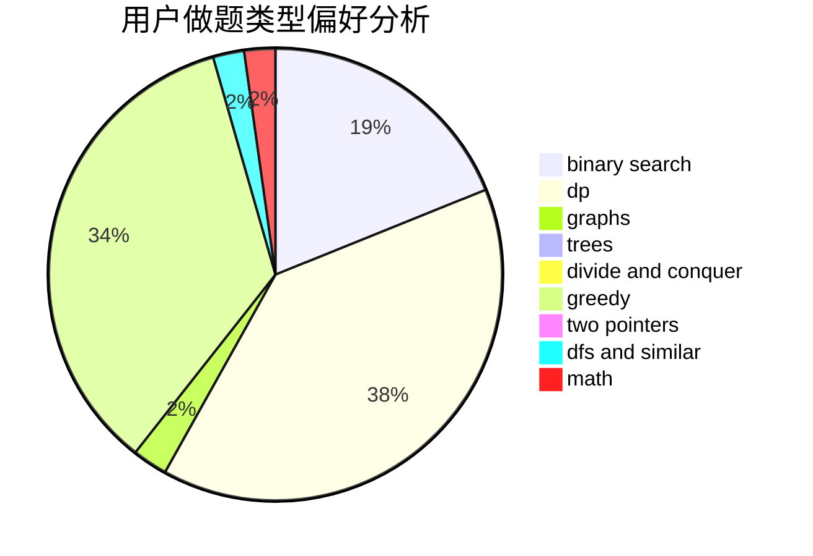

# ShmilyTY

<!-- tabs:start -->

#### **用户提交结果分析**

#### **用户做题类型偏好分析**

<!-- tabs:end -->
# 推荐题目
[828C](https://codeforces.com/contest/828/problem/C)
[421B](https://codeforces.com/contest/421/problem/B)
[1039A](https://codeforces.com/contest/1039/problem/A)
[1152A](https://codeforces.com/contest/1152/problem/A)
[681B](https://codeforces.com/contest/681/problem/B)
[152B](https://codeforces.com/contest/152/problem/B)
[670F](https://codeforces.com/contest/670/problem/F)
[845A](https://codeforces.com/contest/845/problem/A)
[1216F](https://codeforces.com/contest/1216/problem/F)
[1242D](https://codeforces.com/contest/1242/problem/D)
