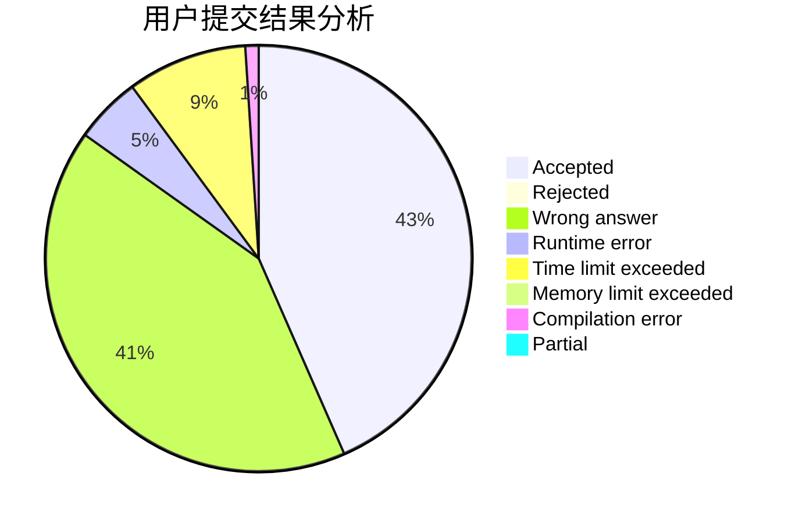
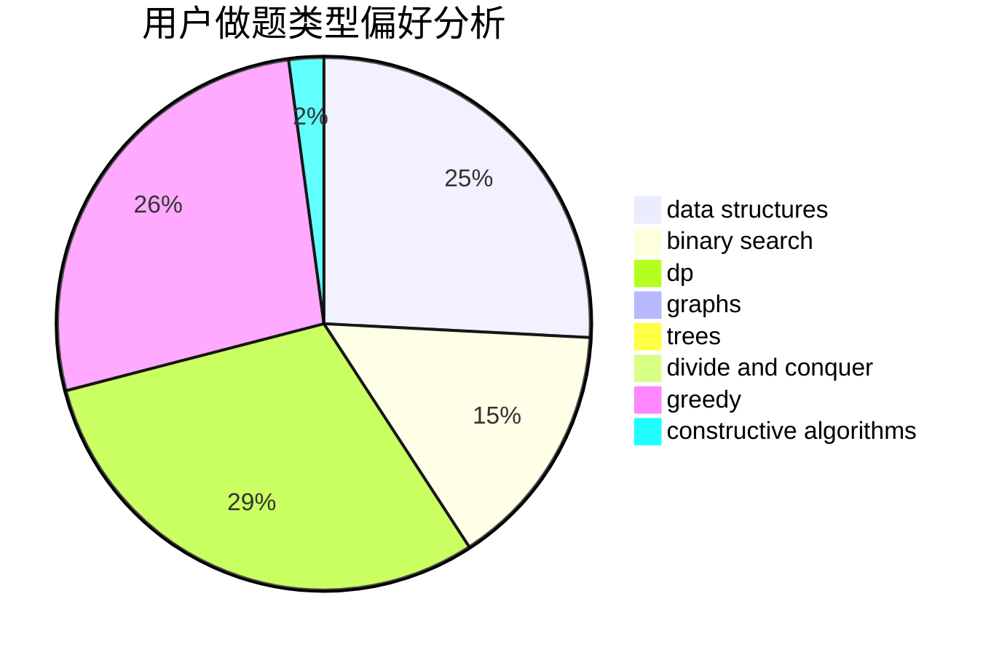
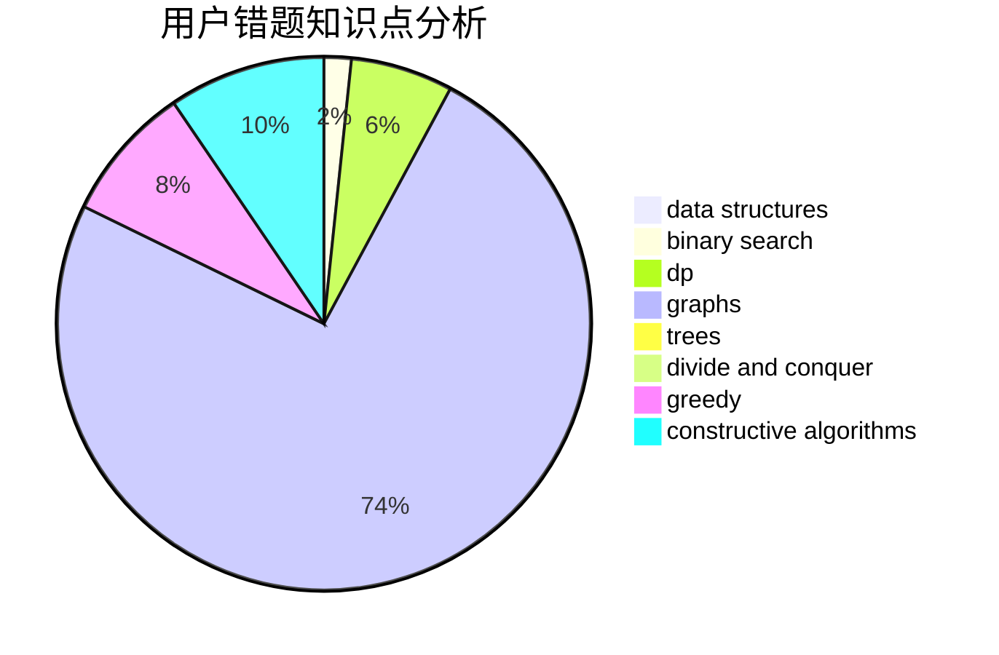

# ShmilyTY

<!-- tabs:start -->

#### **用户提交结果分析**

#### **用户做题类型偏好分析**

#### **用户错题知识点分析**

<!-- tabs:end -->
# 推荐题目
[828C](https://codeforces.com/contest/828/problem/C)		dsu,graphs,sortings,trees		  
[421B](https://codeforces.com/contest/421/problem/B)		dsu,graphs,sortings,trees		  
[1039A](https://codeforces.com/contest/1039/problem/A)		constructive algorithms,
                        data structures,
                        greedy,
                        math		  
[1152A](https://codeforces.com/contest/1152/problem/A)		greedy,
                        implementation,
                        math		  
[681B](https://codeforces.com/contest/681/problem/B)		brute force		  
[152B](https://codeforces.com/contest/152/problem/B)		binary search,
                        implementation		  
[670F](https://codeforces.com/contest/670/problem/F)		brute force,
                        constructive algorithms,
                        strings		  
[845A](https://codeforces.com/contest/845/problem/A)		implementation,
                        sortings		  
[1216F](https://codeforces.com/contest/1216/problem/F)		data structures,
                        dp,
                        greedy		  
[1242D](https://codeforces.com/contest/1242/problem/D)		math		  
