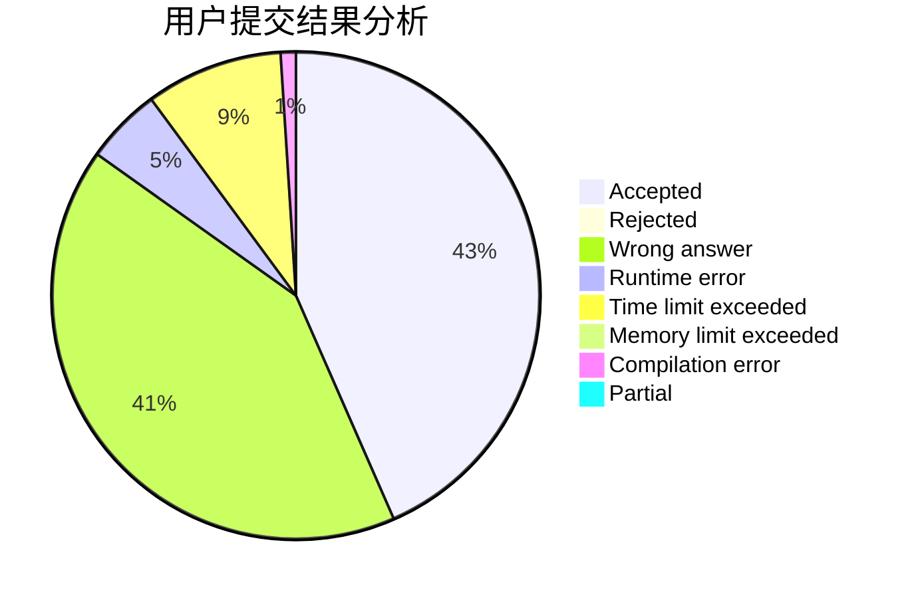
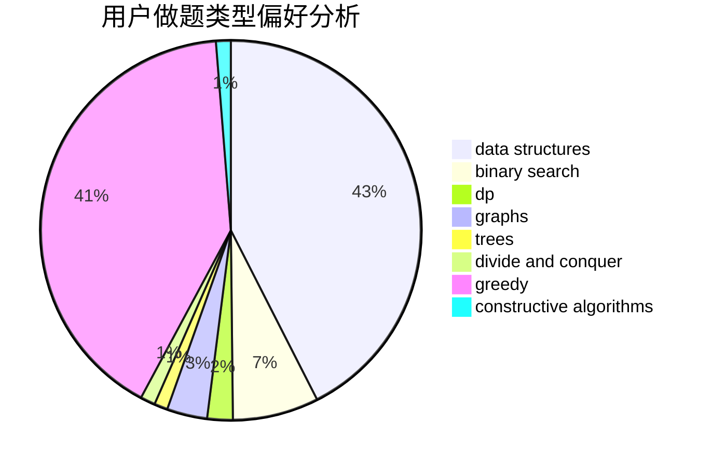
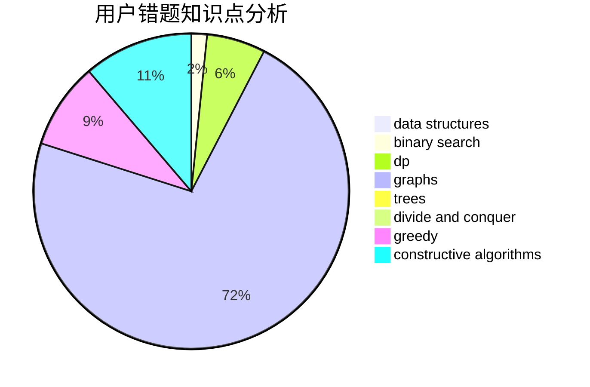

# ShmilyTY

<!-- tabs:start -->

#### **用户提交结果分析**

#### **用户做题类型偏好分析**

#### **用户错题知识点分析**

<!-- tabs:end -->
# 推荐题目
[810C](https://codeforces.com/contest/810/problem/C)		dsu,graphs,sortings,trees		  
[393C](https://codeforces.com/contest/393/problem/C)		dsu,graphs,sortings,trees		  
[1038C](https://codeforces.com/contest/1038/problem/C)		greedy,
                        sortings		  
[1150A](https://codeforces.com/contest/1150/problem/A)		greedy,
                        implementation		  
[660D](https://codeforces.com/contest/660/problem/D)		geometry		  
[1505B](https://codeforces.com/contest/1505/problem/B)		implementation,
                        number theory		  
[643F](https://codeforces.com/contest/643/problem/F)		dp,
                        math,
                        meet-in-the-middle		  
[825E](https://codeforces.com/contest/825/problem/E)		data structures,
                        dfs and similar,
                        graphs,
                        greedy		  
[1210F2](https://codeforces.com/contest/1210F/problem/2)		brute force,
                        probabilities		  
[1237F](https://codeforces.com/contest/1237/problem/F)		combinatorics,
                        dp		  
