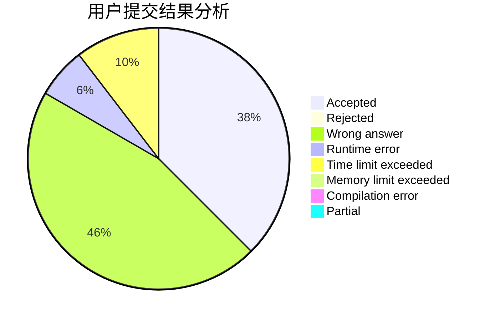
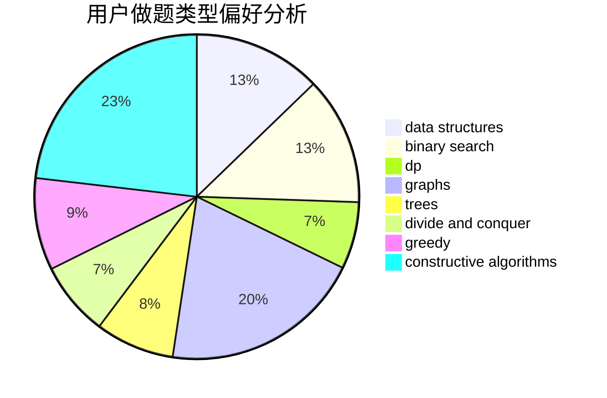

# ShuiGou

<!-- tabs:start -->

#### **用户提交结果分析**

#### **用户做题类型偏好分析**

#### **用户错题知识点分析**

<!-- tabs:end -->
# 推荐题目
[894D](https://codeforces.com/contest/894/problem/D)		brute force,
                        data structures,
                        trees		  
[1085A](https://codeforces.com/contest/1085/problem/A)		implementation,
                        strings		  
[813C](https://codeforces.com/contest/813/problem/C)		dfs and similar,
                        graphs		  
[38A](https://codeforces.com/contest/38/problem/A)		implementation		  
[201E](https://codeforces.com/contest/201/problem/E)		binary search,
                        combinatorics		  
[914F](https://codeforces.com/contest/914/problem/F)		bitmasks,
                        brute force,
                        data structures,
                        string suffix structures,
                        strings		  
[37B](https://codeforces.com/contest/37/problem/B)		greedy,
                        implementation		  
[1220C](https://codeforces.com/contest/1220/problem/C)		games,
                        greedy,
                        strings		  
[1276A](https://codeforces.com/contest/1276/problem/A)		dp,
                        greedy		  
[1015C](https://codeforces.com/contest/1015/problem/C)		sortings		  
