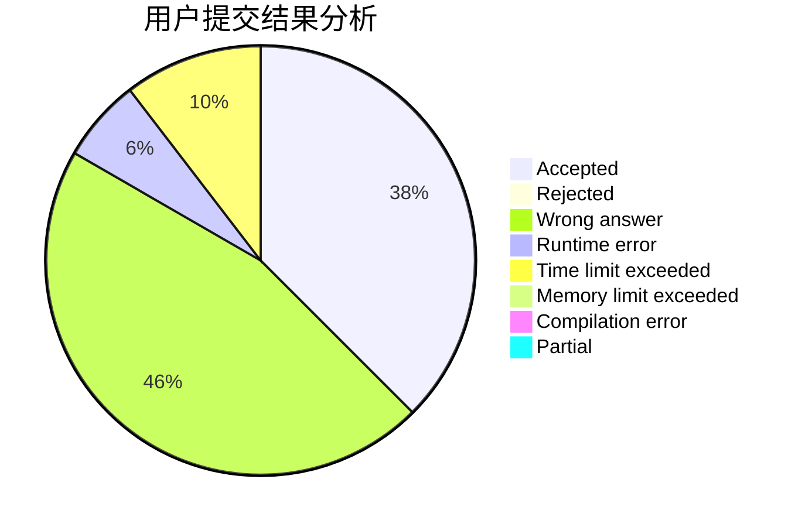
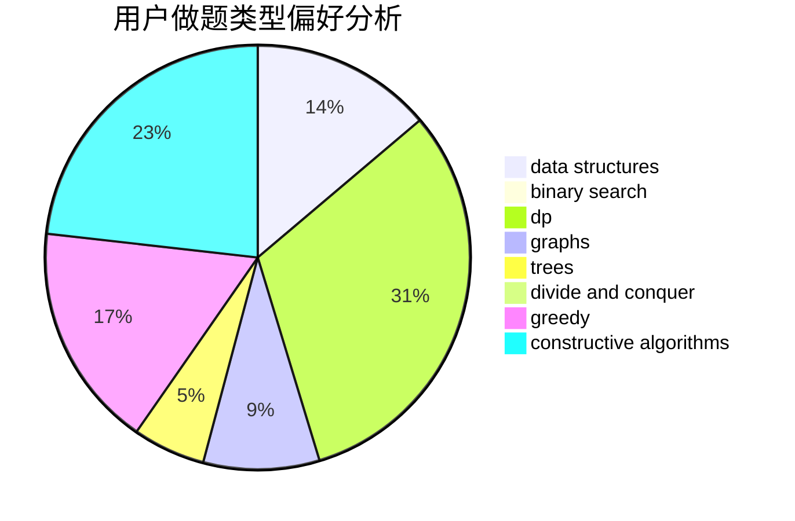

# ShuiGou

<!-- tabs:start -->

#### **用户提交结果分析**

#### **用户做题类型偏好分析**

#### **用户错题知识点分析**

<!-- tabs:end -->
# 推荐题目
[912C](https://codeforces.com/contest/912/problem/C)		brute force,
                        greedy,
                        sortings		  
[1085F](https://codeforces.com/contest/1085/problem/F)		nan		  
[831E](https://codeforces.com/contest/831/problem/E)		dsu,graphs,sortings,trees		  
[418E](https://codeforces.com/contest/418/problem/E)		data structures		  
[226E](https://codeforces.com/contest/226/problem/E)		data structures,
                        trees		  
[934B](https://codeforces.com/contest/934/problem/B)		constructive algorithms,
                        implementation		  
[409G](https://codeforces.com/contest/409/problem/G)		*special problem,
                        geometry		  
[1228C](https://codeforces.com/contest/1228/problem/C)		math,
                        number theory		  
[1282A](https://codeforces.com/contest/1282/problem/A)		implementation,
                        math		  
[1015D](https://codeforces.com/contest/1015/problem/D)		constructive algorithms,
                        greedy		  
