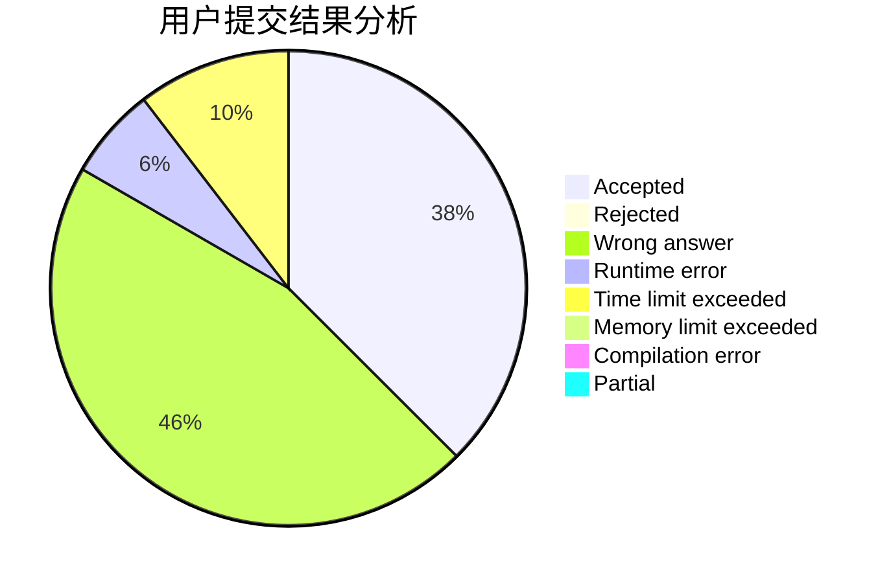
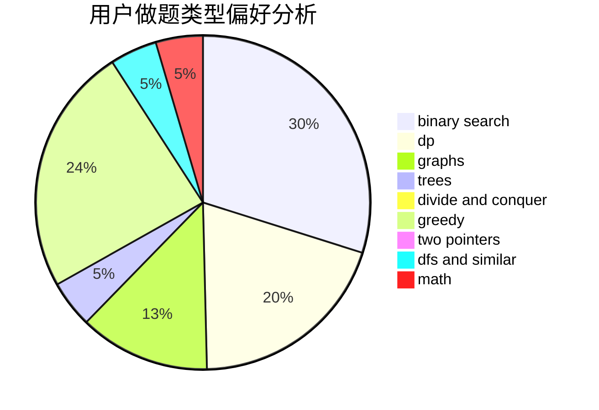

# ShuiGou

<!-- tabs:start -->

#### **用户提交结果分析**

#### **用户做题类型偏好分析**

<!-- tabs:end -->
# 推荐题目
[912C](https://codeforces.com/contest/912/problem/C)
[1085F](https://codeforces.com/contest/1085/problem/F)
[831E](https://codeforces.com/contest/831/problem/E)
[418E](https://codeforces.com/contest/418/problem/E)
[226E](https://codeforces.com/contest/226/problem/E)
[934B](https://codeforces.com/contest/934/problem/B)
[409G](https://codeforces.com/contest/409/problem/G)
[1228C](https://codeforces.com/contest/1228/problem/C)
[1282A](https://codeforces.com/contest/1282/problem/A)
[1015D](https://codeforces.com/contest/1015/problem/D)
