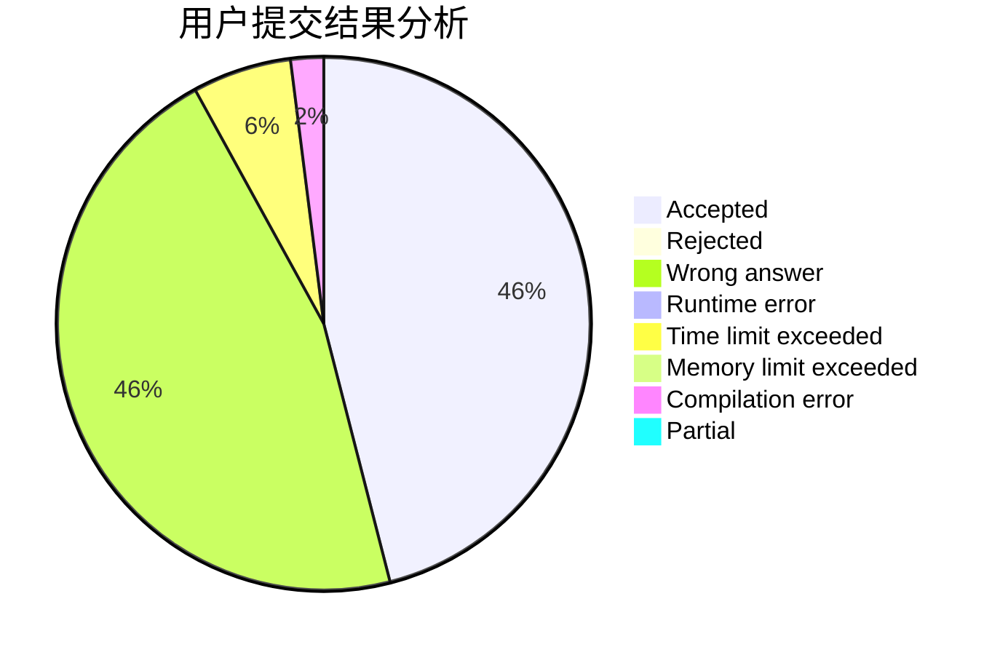
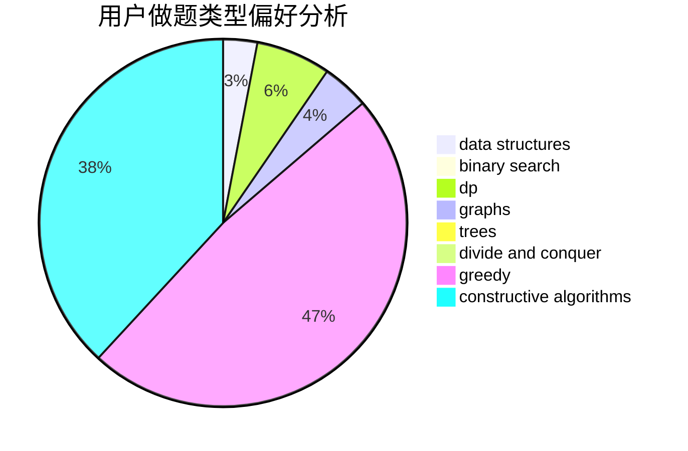
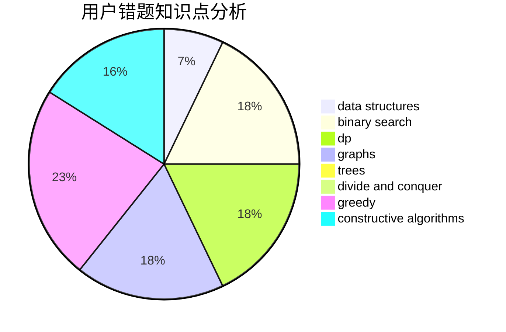

# Silicone

<!-- tabs:start -->

#### **用户提交结果分析**

#### **用户做题类型偏好分析**

#### **用户错题知识点分析**

<!-- tabs:end -->
# 推荐题目
[822D](https://codeforces.com/contest/822/problem/D)		brute force,
                        dp,
                        greedy,
                        math,
                        number theory		  
[1220C](https://codeforces.com/contest/1220/problem/C)		games,
                        greedy,
                        strings		  
[1491F](https://codeforces.com/contest/1491/problem/F)		binary search,
                        constructive algorithms,
                        interactive		  
[1430F](https://codeforces.com/contest/1430/problem/F)		dp,
                        greedy		  
[815C](https://codeforces.com/contest/815/problem/C)		brute force,
                        dp,
                        trees		  
[1480A](https://codeforces.com/contest/1480/problem/A)		games,
                        greedy,
                        strings		  
[868G](https://codeforces.com/contest/868/problem/G)		math		  
[656F](https://codeforces.com/contest/656/problem/F)		*special problem		  
[1305D](https://codeforces.com/contest/1305/problem/D)		constructive algorithms,
                        dfs and similar,
                        interactive,
                        trees		  
[594E](https://codeforces.com/contest/594/problem/E)		string suffix structures,
                        strings		  
